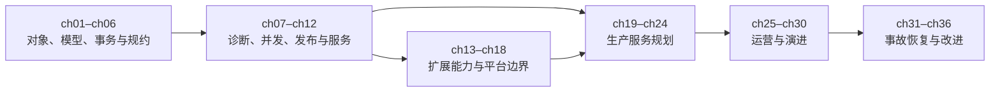

## D.1 本书解决什么问题

- 从“会写 SQL”走到“能交付 PostgreSQL 应用”；
- 从“装好了数据库”走到“能运营 PostgreSQL 服务”；
- 从“看见告警”走到“能安全恢复并防止复发”；
- 用 Pigsty 把分散的 PostgreSQL 能力组合成可重复、可观察的生产实践。

## D.2 读者假设与知识边界

正文默认读者已经掌握：

- Linux、Shell、SSH、文件与进程的基本操作；
- DDL、CRUD、连接、聚合、子查询、CTE 与基础事务；
- 至少一种后端编程语言；
- 基本的软件工程、版本控制与测试概念。

本书会解释 PostgreSQL 特有的语义与工程方法，但不系统补授 Linux、通用 SQL 或编程基础。第 0 章只解决实验环境，不承担基础课职能。

## D.3 PostgreSQL 与 Pigsty 的关系

- PostgreSQL 是全书的核心知识对象；
- Pigsty 是全书统一的实验载体、观察窗口与生产参考实现；
- `[PG]` 表示可由 PostgreSQL 原生接口验证的能力；
- `[平台]` 表示任何生产数据库平台都必须承担的职责；
- `[Pigsty]` 表示 Pigsty 对这些职责的具体组合与实现；
- Pigsty 特有操作若容易被误解为 PostgreSQL 通用行为，会附一行跨平台职责映射，但不扩写成其他平台教程。

作者在序言中披露与 Pigsty 的关系。“36 计”只代表 36 个递进的实战单元，不把每章强行附会为古代计策。

## D.4 安全公约与风险标记

- `R0·观察`：只读查询、状态采样、计划分析，可在明确授权的环境中执行；
- `R1·可逆变更`：会改变对象、配置或流量，但有经过验证的回退路径；
- `R2·破坏性演练`：故障注入、切换、恢复、数据损坏，只能在可销毁的隔离环境执行；
- 全书示例使用专用实验凭据，不公开真实密码，不把数据库或管理入口裸露到公网；
- AI 辅助操作遵循最小权限、先预览、再验证原则，不允许“自动批准一切”；
- 任何生产命令都必须结合版本、拓扑、数据量和组织授权重新评估。

## D.5 版本契约与勘误机制

正式写作开始时冻结并公布一组可复现基线：

- PostgreSQL 大版本与小版本范围；
- Pigsty 版本与配置模板；
- 操作系统、内核与关键系统参数；
- Patroni、PgBouncer、HAProxy、备份工具及核心扩展版本；
- L1/L2/L3 实验拓扑的最低与推荐资源规格。

所有容易随版本变化的结论必须标注适用范围。面板讲指标语义，不依赖易漂移的点击路径；Pigsty 结论尽量回到 SQL、配置或原生组件验证。定稿前执行一次“版本增量通过”，出版后用在线勘误与版本矩阵维护差异。

## D.6 实验契约

每章按需提供以下产物，而不是机械凑齐固定数量：

- `setup`：建立确定的实验起点；
- `exercise`：主实验或故障注入；
- `verify:state`：机器验证系统是否达到预期状态；
- `checklist:evidence`：验证是否收集了足够决策证据；
- `expected`：关键输出及解释；
- `reset:sql`：重置数据库对象与数据；
- `reset:cluster`：恢复集群、服务与配置；
- `reset:host`：重建或回滚主机级环境。

实验数据生成器固定随机种子、规模档位与校验和。小规格虚拟机用于证明方法，不用于宣称绝对性能数字。

## D.7 贯穿案例与四个阶段

主线案例统一为 `pg36_shop`：

1. ch01–ch12：持续演进、可运行的电商与支付应用；
2. ch13–ch18：复用核心模式的独立能力场景，不强迫一个后端服务承载所有扩展；
3. ch19–ch30：复用确定性数据与工作负载，把应用建设成生产服务；
4. ch31–ch35：从快照克隆独立事故现场，避免演练相互污染；
5. ch36：将事故证据重新汇总到治理与平台演进。

## D.8 三层实验拓扑

- `L1`：单节点 Pigsty 开发沙箱，用于 ch01–ch18；
- `L2`：三节点、可销毁的生产仿真环境，用于 ch19–ch30；
- `L3`：由已知快照克隆的故障演练环境，用于 ch31–ch35。

L1/L2/L3 的精确规格由 ch08、ch20、ch32 三种样章实测后冻结。性能章节同时记录硬件、数据量、并发、缓存状态与噪声，避免把玩具环境结果外推到生产。

## D.9 推荐阅读路线

- 完整路线：ch01 → ch36；
- 应用开发：ch01–ch18，再读 ch22、ch23、ch25；
- DBA/SRE：ch01、ch02、ch05–ch10，再读 ch19–ch36；
- 架构与平台：ch01、ch06、ch12、ch14、ch17–ch24、ch36；
- 故障处置：先读 ch31，再按症状索引进入 ch32–ch35，不建议脱离前置知识直接照抄命令。

核心依赖关系：

## D.10 按任务查找

| 任务 | 首选章节 | 必要前置 |
|---|---|---|
| 设计可靠模式 | ch03–ch04 | ch01–ch02 |
| 查慢 SQL / 设计索引 | ch07–ch09 | ch05 |
| 处理并发错误 | ch10 | ch05 |
| 安全改表与发布 | ch11–ch12 | ch06–ch10 |
| 选择扩展 | ch14–ch18 | ch07–ch12 |
| 建设高可用与备份 | ch19–ch22 | ch01、ch05 |
| 建立安全与治理 | ch23–ch25 | ch19–ch22 |
| 压测、调优与维护 | ch26–ch30 | ch07–ch11、ch25 |
| 误操作恢复 | ch31–ch32 | ch21 |
| 主库或 DCS 故障 | ch31、ch33 | ch20 |
| 连接风暴与资源耗尽 | ch31、ch34 | ch22、ch25–ch28 |
| 数据损坏与抢救 | ch31、ch35 | ch21、ch28、ch30 |
