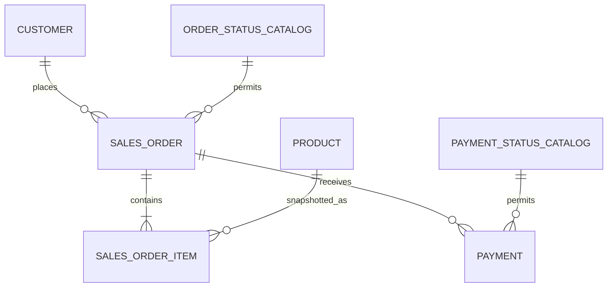

本实验不是在空白数据库重抄一遍最终 `CREATE TABLE`，而是从 ch03-v0 的真实行与约束出发，先证明旧值可无损表示，再在一个事务中升级，最后用应用角色、反例和目录状态证明结果。新环境入口也复用同一迁移链，避免“新装 DDL”和“升级 DDL”长期分叉。

风险分级：

- `verify`：`R0·观察`，只读目录与数据；
- `migrate`：`R2·受控迁移演练`，持表锁、删除 v0 money columns、重建 view；
- `negative` / `constraints`：`R2·破坏性演练`，事务内写入后强制回滚；
- `seed`：`R2·破坏性演练`，TRUNCATE 五表并重建固定 fixture；
- `reset`：`R2·破坏性演练`，删除全部 ch03/ch04 模型对象，要求双重令牌。

本章 `migrate/seed/reset` 只在已确认可销毁的 Pigsty L1 教学库执行。生产迁移必须增加兼容发布、备份/PITR、锁时长、容量和回退评审。

## 4.7.1 闭合金额与时间表达 {#item-4-7-1}

先确认上下文，不把“连得上”误当“目标正确”：

```bash
export PGSERVICEFILE="$PWD/pg_service.conf"
export PGSERVICE=pg36-admin

psql -X -w "service=$PGSERVICE" \
  -c '\conninfo' \
  -c "SELECT current_database(), pg_is_in_recovery();"
```

预期 database=`pg36_shop`、`pg_is_in_recovery=false`。再运行 ch03 verify，确认 v0 checksum：

```text
cd static/labs/ch03
./task.sh verify
relation_checksum=cd7daa66543a6b5e0a5d7fc269558a6c
```

回到 ch04 资产目录：

```bash
cd ../ch04
export PG36_EVIDENCE_DIR="$PWD/evidence/ch04/migrate-$(date -u +%Y%m%dT%H%M%SZ)"
./task.sh all
```

`all` 顺序是：

```text
manifest → migrate-v0-to-v1 → verify-v1
         → negative-cases   → constraint-lab
```

### 迁移前门

[`migrate-v0-to-v1.sql`](/labs/ch04/migrate-v0-to-v1.sql)先确认六个 v0 relation/view 存在、旧 money columns 仍是 v0 形状，然后拒绝：

- numeric `NaN` / `Infinity`；
- `value * 100` 仍有小数残余；
- 转换后超出批准 bigint bounds；
- quantity 使行金额越界；
- 非规范 email；
- 不在 v1 catalog 的旧状态；
- paid order 找不到 captured payment 时间。

这些检查发生在事务内、DROP VIEW 之前。任一失败会回滚全部 DDL。已实测把商品价格改为 `88.001` 时，psql 状态为 `3`，v0 view 仍存在且 v1 marker 不存在。

### expand、convert、constrain、contract

成功路径按顺序：

1. 创建 private schema version、status catalog 与 transition graph；
2. 添加 nullable `currency_code` / `*_minor`；
3. 用旧 numeric 精确换算并回填；
4. 改为 NOT NULL，增加 bounds/currency/复合 FK；
5. 删除旧 numeric columns；
6. 把事件列改为 `timestamptz(3)`，补 paid/cancelled time；
7. 重建 `shop_api.order_summary`；
8. 写入 version marker 后 COMMIT。

DDL 事务设置：

```sql
SET LOCAL lock_timeout = '5s';
SET LOCAL statement_timeout = '30s';
```

它让 L1 演练不会无限等待；不是生产通用值。ALTER TABLE 会取锁，数据回填会产生写入/WAL，DROP old column 会打破仍在读取旧列的应用。真正在线发布应拆成多次兼容迁移：先新增+双写/回填，发布新读路径，观察，再删除旧列。这里单事务 contract 是为了在隔离环境展示完整物理决定。

### 时间闭合

迁移把所有事件列显式改为毫秒精度。paid order 的 `paid_at` 从现有 captured payment 最早 `occurred_at` 推导；若缺失就拒绝，而不是用当前时间编造历史。验证固定 UTC，反例另外检查：

```text
2026-11-01 01:30-04
2026-11-01 01:30-05
```

是相差一小时的两个瞬间，并确认 `09:00+00 AT TIME ZONE Asia/Shanghai = 17:00`。

## 4.7.2 闭合状态与标识生成 {#item-4-7-2}

物理决定的可下载记录是 [`physical-decisions.md`](/labs/ch04/physical-decisions.md)，v1 图源是 [`model-v1.mmd`](/labs/ch04/model-v1.mmd)：



### identity 关闭生成责任

四个内部键变为：

```text
customer.customer_id
product.product_id
sales_order.order_id
payment.payment_id
    bigint GENERATED BY DEFAULT AS IDENTITY
```

迁移通过 `pg_get_serial_sequence` 找到隐式 sequence，空表设置 `(1,false)`，非空表设置 `(max_id,true)`；随后授权 app `USAGE, SELECT`。verify 从 `pg_attribute.attidentity='d'` 和 sequence privilege 双重检查。

固定 ID 的历史/fixture 仍可导入，普通 app INSERT 省略 ID。反例脚本以 `pg36_app` 新建 order/payment，实际证明 sequence 不碰撞。不要用 owner 成功代替 runtime 成功。

### 状态关闭值、边与伴随事实

列外键到 owner-only catalog：

```sql
FOREIGN KEY (order_status)
REFERENCES shop_private.order_status_catalog(status_code)
```

transition trigger 对 UPDATE 的 old/new 查表，图外边抛 `23514` 并设置稳定 constraint identity。行级 CHECK 再要求 paid/cancelled/failure 字段与状态一致。

查看图：

```sql
SELECT from_status, to_status
FROM shop_private.order_status_transition
ORDER BY from_status, to_status;
```

预期：

```text
draft|cancelled
draft|placed
placed|cancelled
placed|paid
```

函数为 definer 是因为 app 无权使用 private schema。验证要求：

```text
prosecdef = true
proconfig contains "search_path=pg_catalog, shop_private"
PUBLIC direct EXECUTE revoked
trigger tgenabled = O
```

然后 app 实走 `draft→placed→paid`。安全不是静态 DDL 扫描和动态测试二选一，两者都要。

### 新装入口不复制 DDL

[`schema-v1.sql`](/labs/ch04/schema-v1.sql)是 canonical fresh-install entrypoint：

- 已是 v1：幂等跳过；
- 有完整 v0：走同一 migration；
- 无模型：先建立空 ch03-v0，再走同一 migration。

这样 constraint/function/view 只有一条权威升级定义。随后 [`seed-v1.sql`](/labs/ch04/seed-v1.sql)加载最终列形状的 fixture。新环境完整验证：

```bash
export PG36_EVIDENCE_DIR="$PWD/evidence/ch04/install-$(date -u +%Y%m%dT%H%M%SZ)"
./task.sh install
```

fresh install 与 v0 upgrade 必须产生相同 checksum；只验证“两个脚本各自不报错”不足以证明收敛。

## 4.7.3 用反例验证类型、约束与错误语义 {#item-4-7-3}

正向 seed 只能说明某些合法值能写入，不能证明边界存在。[`negative-cases.sql`](/labs/ch04/negative-cases.sql)在一个事务里逐项制造：

| 反例 | 预期 condition / constraint |
|---|---|
| product currency=`USD` | `23514 product_currency_supported` |
| 大写 email | `23514 customer_email_canonical` |
| order `placed→draft` | `23514 sales_order_status_transition` |
| `placed→paid` 但无 paid_at | `23514 sales_order_state_time_consistent` |
| 重复 order_no | `23505 sales_order_order_no_key` |
| 显式写 generated line total | `428C9 generated_always` |

PL/pgSQL block 只捕获预期 condition，并用 `GET STACKED DIAGNOSTICS ... CONSTRAINT_NAME` 比较。若写入意外成功、SQLSTATE 类别不对或另一个约束先失败，review 整体失败。

随后是正向边界：

- 省略 customer ID，identity 值必须大于历史 max；
- pending payment 合法转 captured；
- placed order 同一 UPDATE 带 paid_at 转 paid；
- `shop_api.order_summary` captured minor total正确；
- 切换成 `pg36_app` 再完整走一次 identity + 状态路径；
- 两个显式 offset 的 DST 瞬间保持一小时差。

所有写入最后：

```sql
ROLLBACK;
```

再次 `verify` 的行数与 checksum 不变。

### 排他与延迟约束独立实验

[`constraint-lab.sql`](/labs/ch04/constraint-lab.sql)也完全在事务/temporary tables 内：

1. `tstzrange EXCLUDE USING gist (slot WITH &&)` 拒绝 overlap；
2. `UNIQUE(slot_no) DEFERRABLE` 在事务中交换 1/2；
3. `pg_constraint` 证明 unique 可延迟而 CHECK 不可；
4. 只探测 `btree_gist` availability，不创建 extension；
5. ROLLBACK。

预期摘要：

```text
exclusion_overlap_rejected=ok
deferrable_unique_swap=ok
btree_gist_available=true
```

最后一项依赖安装环境；如果是 false，单列 range lab 仍应通过，多资源 example 则要先交付 extension package。不要把“扩展不可用”混成 exclusion 语义失败。

分步运行并保存独立现场：

```bash
./task.sh verify
./task.sh negative
./task.sh constraints
./task.sh review
```

`negative` 会先 verify；`review` 执行 verify + 两类实验。stderr 为空是本章脚本的期望，预期异常已经在 SQL 内精确捕获。

## 4.7.4 在 Pigsty L1 输出可靠 DDL、分区决策与 `verify:state` {#item-4-7-4}

Pigsty 在本章提供：

- PostgreSQL 18.4 主库和统一 service endpoint；
- owner/app/readonly 运行角色与后续可观测环境；
- contrib/扩展软件交付能力；
- L1 可复现的实验边界。

类型、表、约束、trigger 和应用 migration 仍属于 PostgreSQL/应用模式发布。不要把业务 DDL塞进 Pigsty cluster topology，也不要因为 Pigsty 有 HA/PITR 就省略应用迁移的兼容性设计。

### 证据目录

`task.sh` 要求 private `PGSERVICEFILE`，使用 `psql -X -w` 避免个人 rc 和交互密码影响。manifest 记录：

- UTC capture time、action、service；
- psql client/server version、database、session user、recovery state；
- 12 个输入资产与 task script 的 SHA-256。

动作输出分别进入：

```text
migrate.stdout / migrate.stderr
schema.stdout  / schema.stderr
seed.stdout    / seed.stderr
verify.txt     / verify.stderr
negative.txt   / negative.stderr
constraints.txt / constraints.stderr
```

最终 `verify:state`：

```text
status=ok
model_version=ch04-v1
money_unit=CNY-fen
session_timezone=UTC
customer_count=2
product_count=3
order_count=2
item_count=3
payment_count=2
order_transition_count=4
partition_decision=not-now
relation_checksum=f8a7bfae59c6d16cd323abecfefe1014
```

该 checksum覆盖三条 order line 的 order/line/product/currency/unit price/quantity/generated total。它不是数据库备份校验和，只是固定 fixture 的快速漂移信号。

### 可重入与失败原子性

连续再执行：

```bash
export PG36_EVIDENCE_DIR="$PWD/evidence/ch04/rerun-$(date -u +%Y%m%dT%H%M%SZ)"
./task.sh all
```

migration 应输出：

```text
ch04 physical model v1 is already installed
```

verify/negative/constraints 仍通过、checksum 相同。若 version marker 存在但对象漂移，migration 会跳过，严格 verify 必须失败；marker 不是“相信我已经正确”的免检标签。

### reset 与重建

无令牌：

```bash
./task.sh reset
```

必须返回 64。确认要删除整个模型：

```bash
export PG36_RESET_TOKEN=RESET_CH04_MODEL
export PG36_EVIDENCE_DIR="$PWD/evidence/ch04/reset-$(date -u +%Y%m%dT%H%M%SZ)"
./task.sh reset
unset PG36_RESET_TOKEN
```

SQL 内还验证 `confirm_reset`。它显式删除五表、view、两个 transition function、五个 private tables 和空的 `shop_api/shop_private` schema；保留 database、roles、`shop` schema 和 Pigsty 集群。schema drop 使用默认 RESTRICT：若出现未知对象，事务整体失败，不会 CASCADE 带走。

复位后可以：

```bash
# 重演升级
../ch03/task.sh all
./task.sh all

# 或重演新装
./task.sh install
```

两条路径都应回到同一 `f8a...` checksum。

### 生产前不能省略

本章迁移在 L1 真实通过，不等于可直接复制到繁忙生产。至少补齐：

- 当前 PG/Pigsty 版本与 extension/collation inventory；
- 可用 PITR/backup 与实际 restore drill；
- 表大小、回填 WAL、replica lag 和锁等待预算；
- old/new application 双向兼容矩阵；
- expand/backfill/validate/switch/contract 分阶段脚本；
- 对 `ALTER TABLE` lock 的预演与 kill/timeout 策略；
- checksum、业务对账、监控与明确 rollback/forward-only 决定；
- 变更窗口、owner、审批与终止条件。

在生产删旧列通常是最后一个独立发布，不与第一次回填放在同一事务中。L1 的单事务脚本证明语义与原子性，生产 choreography 证明可用性；二者问题不同。

### 本章最终验收

- [ ] v0 checksum 与 prerequisite 正确；
- [ ] 不可表示金额在任何 contract DDL 前被拒绝且完整回滚；
- [ ] 成功迁移输出 v1 checksum；
- [ ] fresh install 与 upgrade 收敛到同一状态；
- [ ] migration/install 重跑稳定；
- [ ] identity catalog、sequence 对齐和 app privilege 均通过；
- [ ] 非法值、非法边、缺伴随时间分别失败；
- [ ] app 无 private USAGE 仍可安全走合法 transition；
- [ ] generated value 不能由应用覆盖；
- [ ] DST、range exclusion、deferrable unique 都有反例；
- [ ] partition ADR 与数据库实际状态一致；
- [ ] reset 无令牌拒绝、有令牌只删除声明范围；
- [ ] 清楚记录跨表金额不变量与生产在线迁移仍属后续工作。

通过后进入 [ch05《运筹帷幄：查询、事务与锁的核心心智模型》](/query-transaction-locks/)。

## 参考资料

- [PostgreSQL 18：ALTER TABLE](https://www.postgresql.org/docs/18/sql-altertable.html)
- [PostgreSQL 18：information functions 与权限探测](https://www.postgresql.org/docs/18/functions-info.html)
- [PostgreSQL 18：系统目录](https://www.postgresql.org/docs/18/catalogs.html)
- [Pigsty v4.4：默认 meta 模板](https://pigsty.io/docs/conf/meta/)
- [Pigsty v4.4：PostgreSQL 服务](https://pigsty.io/docs/pgsql/service/)
- [Pigsty v4.4：extension create](https://pigsty.io/docs/pgsql/ext/create/)

---

[上一节：分区决策门](../06/) · [返回本章目录](../) · [下一章：运筹帷幄：查询、事务与锁的核心心智模型](/query-transaction-locks/) ·
[查看全书目录](/toc/) · [查看索引中心](/indexes/)
