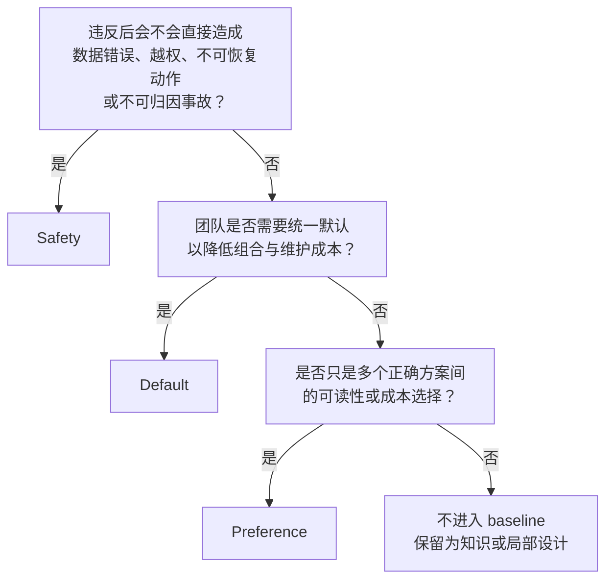

数据库规约最容易写，也最容易失效。“SQL 必须高效”“事务尽量短”“禁止复杂查询”都很像正确的话，却没有告诉执行者：什么叫高效，什么情况下必须阻断，怎样证明事务已经足够短，复杂是语法复杂还是计划代价高。这样的句子不能被机器检查，评审者之间也无法稳定复现判断，最后只剩资历和语气在决定结果。

可执行规约必须把判断过程显式化。本节先不急着罗列 PostgreSQL 技巧，而是定义规则本身的工程合同。

## 6.1.1 从事故、评审和测量中形成规则 {#item-6-1-1}

一条规则应当从可描述的失败机制出发。输入通常来自三类渠道：

| 输入 | 它提供什么 | 常见误区 |
|---|---|---|
| 事故与险情 | 真实损失、传播路径、原有控制为何失效 | 用一次事故无限外推所有场景 |
| 代码/变更评审 | 重复争议、接口漂移、维护成本 | 把 reviewer 个人风格写成安全要求 |
| 测量与实验 | 计划、等待、WAL、容量、错误码、耗时分布 | 用一次样本或单一环境宣称普遍规律 |

例如，“脚本连接数据库后应先做 context guard”不是因为显式检查看起来严谨，而是因为 ch02 已经展示：同一组合法 SQL 可以成功连接到错误 database、错误 role 或 standby。失败机制是**目标身份未被证明**，后果是对错误对象执行正确动作，检测信号则是 `current_database()`、`current_user`、`pg_is_in_recovery()` 与预期不符。由此才能形成 `SAFE-CONN-001`：

```text
statement:
  自动化在执行 SQL 前验证 database、effective role、
  read/write 状态与预期 search_path

scope:
  scripts, migrations, operations

failure:
  wrong-target execution

check:
  wrong-target probe 必须非零退出；运行证据保存连接事实
```

反过来，若团队只是觉得 `text` 比 `varchar(n)` 更“PostgreSQL”，它最多是候选偏好。第 4 章给出的证据是：没有长度业务合同的时候，`varchar(n)` 多引入一个并不属于模型的不变量；但若字段协议确实规定最大长度，或者跨系统交换需要在数据库边界拒绝超长值，`varchar(n)` 或显式 `CHECK` 都可能合理。因此本章把它记为 `PREF-TEXT-001`，而不是 safety。

### 从现象到规则的六步推导

遇到一个值得写进规范的现象时，依次问：

1. **现象是什么**：保存 query、SQLSTATE、catalog snapshot、时间窗和输入，而不是只写“数据库异常”；
2. **失败机制是什么**：名称解析、权限、快照、锁、计划估算、资源耗尽，还是外部系统语义；
3. **影响是什么**：数据错误、越权、不可用、性能退化，还是可读性成本；
4. **范围在哪里**：只约束 migration，还是所有 application query；只适用于 OLTP，还是也适用于批处理；
5. **可检查信号是什么**：source pattern、catalog fact、负向测试、运行指标或人工证明；
6. **反例和例外是什么**：在哪些前提下原失败机制不存在，偏离时用什么补偿控制。

只有完成这六步，候选规则才值得进入试行。一次事故可以提高优先级，却不能跳过适用范围；一次 benchmark 可以提供证据，却不能自动把结论变成组织底线。

### 证据有层次，但没有“万能证据”

本书按问题选择证据：

- SQL 语义与数据库行为优先用 PostgreSQL 官方文档、SQLSTATE、catalog 和可重复实验；
- 性能判断需要 `EXPLAIN (ANALYZE, BUFFERS, WAL, SETTINGS)`、数据分布和多次测量，不能只贴计划节点名；
- Pigsty 声明参考版本化配置文档，生效状态再回到 inventory、playbook 输出、service 路由和 PostgreSQL 运行事实；
- 业务不变量由领域 owner 说明，数据库证据只能证明它怎样被实现，不能替业务定义真相。

证据也有有效期。数据规模、统计分布、PostgreSQL 大版本、扩展和 Pigsty 配置变更后，原测量需要重跑。baseline 的 `evidence` 因此记录 chapter、artifact 和 observation，而不是只保存一个“已验证”布尔值。

## 6.1.2 每条规则记录动机、证据、例外和检查方式 {#item-6-1-2}

本章 registry 的每条 rule 使用同一最小结构：

| 字段 | 必须回答的问题 |
|---|---|
| `id` / `title` | 怎样稳定引用，标题能否准确概括 |
| `level` / `status` | 风险等级是什么，当前处于什么生命周期 |
| `owner` | 谁解释、修订并承担误报/漏报 |
| `scope` | 约束哪些代码、对象、环境与动作 |
| `statement` | 执行者必须做什么或证明什么 |
| `rationale` | 试图阻止哪条失败链 |
| `evidence` | 哪个可复核产物支持判断 |
| `exception` | 如何合法偏离，需要哪些补偿控制 |
| `checks` | 由 automation、runtime 还是 review 验收 |

可在 [`baseline-v0.1.json`](/labs/ch06/baseline-v0.1.json) 中查看完整记录，并由 [`baseline-schema.json`](/labs/ch06/baseline-schema.json) 约束结构。JSON 是权威机器源；[`baseline-guide.md`](/labs/ch06/baseline-guide.md) 面向人类阅读，但其 25 个 Rule ID 必须与 registry 恰好一一对应。`check_baseline.py` 会拒绝 ID 缺失、重复或悄悄新增。

### statement 要可执行，rationale 要可反驳

比较两种写法：

```text
坏：所有查询都要设置超时。

可执行：
所有 application/migration session 必须声明 statement_timeout、
lock_timeout 和 idle_in_transaction_session_timeout；
预算由调用场景给出，禁止依赖服务器无限默认值。
```

第二句仍不替团队决定“所有查询必须 30 秒”，但给出了受约束对象、需要声明的参数和禁止状态。它允许批处理用更长 `statement_timeout`，同时要求批处理 owner 对更长预算负责。

`rationale` 也不能写成“这是最佳实践”。应该写出可被证伪的机制：没有 `lock_timeout` 时，一个本应毫秒完成的 DDL 可能无限等待兼容锁；没有 `idle_in_transaction_session_timeout` 时，遗忘事务可能长期持有 snapshot/lock；没有 `application_name` 时，同一 user/database 的会话难以归因。如果后续证明某个环境已经用等价机制完全消除风险，就有讨论例外的基础。

### exception 不是后门

四种例外模式对应不同风险：

| 模式 | 含义 | 最低要求 |
|---|---|---|
| `none` | 不允许在当前设计内偏离 | 改变设计，或提出规则修订 |
| `breakglass` | 紧急、限时地跨过 safety control | 精确身份、owner、时间窗、补偿控制、撤销和事后复核 |
| `waiver` | 有证据地偏离团队默认 | 原因、范围、owner、expiry、验证与回归条件 |
| `review` | 本来就是场景偏好 | reviewer 记录为什么该场景选择此方案 |

例外必须是显式对象，而不是聊天里的一句“这次特殊”。[`waiver-template.md`](/labs/ch06/waiver-template.md) 要求记录补偿控制、到期时间与关闭条件。过期 waiver 没有自动变成永久例外；它应阻断下一次相关变更，直到回归默认或续期。

### check 要证明风险被控制

检查方式分三层：

- `automated`：不依赖人类解释的结构、source 或确定性输出，例如 Rule ID、JSON shape、禁止 secret pattern；
- `runtime`：连接目标后读取 session、catalog、SQLSTATE、checksum 或真实查询行为；
- `review`：领域语义、代价取舍、外部副作用等目前不能可靠自动判断的证明。

自动化覆盖率高不等于规则正确。一个错误的正则可以稳定地产生误报；一个 catalog check 只能证明检查时刻的数据库状态。相反，只有 review 也不等于“无法改进”：重复评审结论应推动 fixture、lint、catalog assertion 或运行指标出现。

### owner 对规则本身负责

owner 不只是审批人，还要持续回答：

- 这条规则最近阻止了什么真实问题；
- false positive 是否让团队开始绕过 gate；
- 哪类 incident 暴露了 false negative；
- 检查成本是否与风险相称；
- PostgreSQL/Pigsty 升级后证据是否仍有效；
- 例外是否按时关闭；
- 规则应该收紧、降级还是废弃。

没有 owner 的规则只会不断累积。没人有权修改，就意味着没人对错误负责。

## 6.1.3 区分安全底线、团队默认与场景偏好 {#item-6-1-3}

规则等级不是“强烈推荐、推荐、可选”的措辞游戏，而是由**失败后果与可接受处置**决定：



### Safety：要求明确停止线

`SAFE-DEFR-004` 要求 `SECURITY DEFINER` function 固定可信 `search_path` 并收回默认 PUBLIC 执行权，因为高权限名称解析可形成提权路径。这里不能用“团队一般喜欢 schema-qualified name”来解释；风险是权限边界被绕过，不能满足时应改用 invoker function 或重新设计。

Safety 不代表所有检查都必须在 v0.1 自动化，但未自动化必须可见。当前 `SAFE-RETR-008` 只有 review：第 5 章证明了 failed transaction 和外部副作用边界，却尚未构造第 10 章的并发 retry harness。把它列入 safety 是风险判断；输出 `safety_non_review_count=9` 是成熟度判断。两者不能混为一谈。

### Default：减少无意义差异

`DEFAULT-CONT-002` 固定 UTF-8、UTC 和受控 `search_path`。这不意味着 PostgreSQL 只支持这一套组合，而是 `pg36_shop` 需要一个跨环境稳定默认，使 timestamp、文本和名称解析不随开发者机器变化。若某个报表必须用特定会话时区，可以申请范围明确的 waiver，仍需保存输入/输出时区并验证夏令时边界。

Default 的价值往往是降低认知和测试矩阵，而不是避免灾难。它可以被证据推翻，也应该允许不同产品线建立自己的默认。

### Preference：保留工程判断

`PREF-ASQL-004` 不禁止 CTE、窗口函数或 `LATERAL`，也不强迫使用。它要求高级 SQL 让关系语义更清晰且可测试。一个一次扫描完成的窗口查询可能比多次 round trip 更易维护；一个嵌套过深、估算失真的单条 SQL 也可能应该拆开。这里需要查询合同与计划证据，不适合以关键字 lint 阻断。

偏好若被伪装成 safety，会制造大量无意义例外；真正的 safety 若被降成偏好，则让高影响风险依赖 reviewer 当天是否注意到。分级本身就是规约质量的一部分。

### 生命周期与版本

本章采用以下状态演进：

```text
candidate
  → trial（在 L1/测试环境记录成本与误报）
  → active（进入版本化 baseline）
  → revised / deprecated（证据改变或被更好控制替代）
```

规则 statement、level、scope 或 exception 发生语义变化时必须升级 baseline 版本；只增加同一判断的证据可以追加 ledger，但仍应留下变更记录。任何 active rule 被废弃都要说明：风险已经消失、被哪个控制替代，以及旧检查何时移除。

本章的 [`evidence-ledger.md`](/labs/ch06/evidence-ledger.md) 把 ch01–ch05 记为 v0.1 输入，把 ch07–ch11 作为预留追加区。到 ch12，只有规则 ID、证据、自动化、例外和兼容说明共同稳定，才发布 v1.0。

### 本节检查清单

拿团队现有任意一条规范，若无法回答下列问题，就先降级为 candidate：

1. 它阻止的具体失败机制是什么；
2. 它适用于哪些对象、动作和环境；
3. 哪个 artifact 或运行事实支持它；
4. 哪些反例说明不能无限外推；
5. 违反时是阻断、waiver 还是 review；
6. 谁负责处理误报、例外与版本变化；
7. 怎样知道控制已真正生效；
8. 什么条件下应该修订或废弃。

这套问题比规则数量更重要。一个有证据、能检查、允许被修订的 25 条 baseline，远胜一份没人敢删也没人真正执行的 250 条“最佳实践”。

---

[返回本章目录](../) · [下一节：连接与会话候选规则](../02/) ·
[查看全书目录](/toc/) · [查看索引中心](/indexes/)
