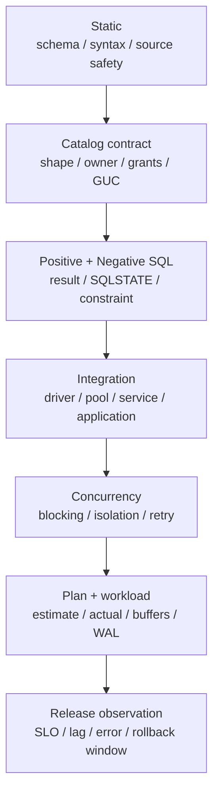

数据库代码通过 review 只是交付的一部分。接手者还需要知道它针对哪个状态、怎样重跑、错误时停在哪里、是否可以恢复、运行后怎样证明没有漂移。没有这些信息，一段正确 DDL 仍可能在错误 database 上、错误窗口里，以错误的应用版本执行。

本节定义“一个可交付数据库变更”需要携带的产物和质量门。它不是要求每个小改动都写几十页，而是让风险越高的动作拥有越强的前验、后验和接管信息。

## 6.5.1 DDL、迁移、数据生成与回滚 {#item-6-5-1}

一个完整交付包按职责拆分，而不是把所有内容塞进 `deploy.sql`：

| 产物 | 责任 | 必须避免 |
|---|---|---|
| contract/ADR | 目标、非目标、业务不变量、兼容边界 | 只写实现，不写为什么 |
| migration | 从已知 version 到下一 version | 同时猜测多个未知起点 |
| fresh install | 复用/生成自 migration authority | 独立维护另一套 latest schema |
| seed/fixture | 构造确定性最小场景 | 隐式当前时间、无 seed 随机数 |
| precheck | 在写入前证明输入可表示、依赖可控 | 迁移中途才发现坏值 |
| verify | catalog、权限、不变量、checksum 后验 | 只看脚本 exit 0 |
| negative cases | 证明错误状态被正确规则拒绝 | 捕获所有异常后宣称通过 |
| reset/cleanup | 仅用于明确可销毁范围 | 把 reset 冒充生产 rollback |
| runbook/evidence | 输入、命令、版本、stdout/stderr、结果 | 只保存截图或手工摘要 |

并非每项变更都需要 seed 或 reset。例如只读诊断没有持久对象，不应为了“模板完整”添加 destructive cleanup。生产 migration 通常也不提供一键 reset；它需要兼容回退和 forward repair。交付矩阵的价值是要求作者明确“适用/不适用及原因”，不是追求文件数量。

### migration 的起点必须可识别

执行前至少检查：

```text
database / effective role / primary
schema version / migration history
关键对象 shape 与 ownership
application compatibility window
source artifact hash
```

若起点未知，应在修改任何状态前拒绝。所谓“幂等”不应等价于到处写 `IF EXISTS` 后吞掉漂移；当对象存在但 shape、owner 或语义不同，安全行为是报错并交给 owner 判断。

migration 记录唯一 identity，成功后原子推进 schema version。重跑时：

- 已以同一 checksum 成功：可以明确报告 no-op；
- 尚未开始：从确定起点执行；
- 中途失败但 transaction rollback：确认起点仍成立；
- 包含非事务步骤或 outcome 不明：进入专门 reconcile/repair，不能盲重放。

### fixture 要可重建、可比较

`DEFAULT-FIXT-008` 要求教学/测试数据使用稳定业务值、显式 timestamp 和受控序列策略。随机数据可以用于 property/load test，但必须记录 seed、generator version 与规模参数。

验收不要依赖易变物理标识：

```text
稳定：row count、命名约束、业务 fingerprint、relation checksum
动态：PID、XID、LSN、ctid、sequence gap、当前 timestamp
```

动态值可以保存在 evidence 中帮助取证，却不能硬编码成跨运行 golden value。第 5 章 rollback 实验前后比较业务 fingerprint/checksum，同时允许 WAL LSN 前进，就是这一原则。

### reset 是独立的破坏动作

reset 的目标是清理教学/测试状态，不是自动恢复生产。`SAFE-DEST-009` 要求 DROP/reset/terminate：

1. 先把 service、database、schema/relation 或 PID+identity 解析成精确目标；
2. 拒绝空变量、通配符、workspace root 与 broad target；
3. 要求与目标绑定的独立确认 token；
4. 执行时保存 before state；
5. 执行后验证目标消失、预期保留对象仍存在、实验 worker 清零；
6. target identity 不再精确时停止自动清理。

例如终止 backend 不能只凭 PID，因为 PID 会复用；至少结合 database、user、`application_name`、`backend_start` 与当前 query。文件清理不能把未解析环境变量交给递归删除。成功 exit 只说明命令执行，不能证明范围正确。

本章自己的 quality gate 全部只读或故意失败，不创建持久对象，所以没有 reset action。这是设计结论，不是交付缺失。

## 6.5.2 自动测试、静态检查与计划证据 {#item-6-5-2}

数据库质量门应逐层增加成本与环境依赖：



不是每次提交都同步运行最昂贵层，但进入下一环境前必须知道哪些层已通过、哪些仍待验证。用“CI 绿了”概括所有层会丢失决策信息。

### Static：无数据库也能拒绝结构漂移

本章 [`check_baseline.py`](/labs/ch06/check_baseline.py) 只使用 Python 标准库，检查：

- JSON 没有重复 key，registry 满足固定 shape；
- 25 个 Rule ID 唯一，level 与 ID prefix 一致；
- evidence 只指向 ch01–ch05，且 artifact 实际存在；
- 人类指南中的 Rule ID 恰好各出现一次；
- delivery manifest 的 artifact 与 action 完整；
- ch01–ch06 受管 SQL/shell/JSON/YAML/config 中没有 `PGPASSWORD`、带凭据 PostgreSQL URI 或明文 password assignment；
- `DROP DATABASE/ROLE` 只出现在带 token 的专用 `reset.sql`。

`quality-gate.sh static` 还对 Python 做 bytecode compile，对全部 lab shell 做 `bash -n`。这些检查不连接 PostgreSQL，所以适合每次提交；它们能证明结构和已知危险模式，没有证明 SQL 在目标版本执行正确。

正则 secret scan 也不是 DLP。编码、模板展开、二进制或未知 secret 形式仍可能漏过；source reviewer 和 CI artifact policy 继续负责。检查器应报告自己的扫描文件数，使范围缩小时不会静默绿色。

### Catalog 与正反例：验证数据库真正拒绝什么

Catalog contract 比解析 DDL 文本可靠，因为它看到服务器已经解释后的对象：

```text
pg_class / pg_attribute / pg_constraint
pg_namespace / pg_roles / privileges
pg_proc.prosecdef / proconfig
pg_settings source / pending_restart
```

但 catalog 是检查时刻事实，不能自动证明迁移路径曾经安全。正向 case 证明有效输入工作；负向 case 必须断言稳定 SQLSTATE、constraint name 或自定义 error contract。不要用本地化 message 全文，也不要 `EXCEPTION WHEN OTHERS THEN pass`。

本章 wrong-session/wrong-target fixture 的意义就在于验证 gate 本身：若 guard 被意外删除，负向 case 会“错误成功”，CI 随即失败。

### Integration 与 concurrency：跨边界验证

SQL 在 `psql` 中通过，不代表 driver、pool 或 application transaction management 正确。Integration test 要覆盖：

- 参数绑定与类型/OID；
- NULL、encoding、timezone 和 decoder；
- pool mode、connection reset 与 transaction cleanup；
- timeout/cancel 如何映射为应用错误；
- service failover/route 与 read-only 行为；
- idempotency、ambiguous outcome 和 trace attribution。

并发正确性不能由单 session 单元测试推出。lost update、write skew、deadlock 和 retry 必须使用多个可识别 session、明确同步点、前后 checksum 与失败清理。第 10 章会加入这层；在那之前 `SAFE-RETR-008` 只能保留 review check。

### 计划证据验证关系，不冻结节点名

计划测试应保存：

```text
SQL + bound parameters
schema/statistics/settings/version
row distribution / relation size
EXPLAIN (ANALYZE, BUFFERS, WAL, SETTINGS)
多次运行与 warm/cold 条件
写路径成本和新增索引大小
```

稳定断言通常是：

- estimate/actual 误差是否越过调查阈值；
- buffers/temp/WAL 是否超预算；
- 参数范围内 p95/p99 是否满足 SLO；
- 变更是否让目标 workload 改善且写入代价可接受。

不要把“必须出现 Index Scan”“总 cost 小于 1234”作为跨版本 golden。planner、统计、数据量和 cache 变化都可能选择另一条同样正确的 plan。第 7–9 章会把 `PREF-PLAN-005` 扩展为可操作流程。

### Evidence directory 是可复核输入输出

`DEFAULT-EVID-009` 要求每次任务写入独立目录，至少包含：

```text
UTC captured_at / action / service name
client + server version
source SHA-256 / config fingerprint
stdout + stderr 分离
verify-before + verify-after
machine-readable summary
```

证据包不能包含展开后的 secret。service name 可以保存，password、credential URI、private key 和含 token 的环境 dump 不可以。生产 evidence 还应有访问控制与保留策略；“为了审计”不是永久复制敏感数据的理由。

## 6.5.3 变更说明、所有者与风险等级 {#item-6-5-3}

一份变更说明的首要作用是让另一个合格操作者可以在压力下判断：继续、停止、回退还是升级，而不是证明作者写过文档。

[`change-template.md`](/labs/ch06/change-template.md) 将信息分为七组：

1. **身份**：Change ID、owner、reviewer、target、窗口、application release；
2. **目标/非目标**：改变什么可观察事实，明确不解决什么；
3. **当前事实**：版本、对象大小、写入率、schema version、依赖方；
4. **迁移设计**：expand/backfill/validate/switch/contract 与重跑行为；
5. **资源预算**：lock mode、timeout、WAL、temp、lag、old snapshot；
6. **失败恢复**：哪一步可 rollback，哪一步只能 repair，outcome ambiguous 怎样确认；
7. **验证风险**：precheck、正反例、post-state、最大故障、停止条件与审批。

### 风险等级由影响与恢复共同决定

本书实验使用四级标签：

| 等级 | 含义 | 典型动作 |
|---|---|---|
| `R0·观察` | 只读、无主动状态改变 | catalog/query/metric 采集 |
| `R1·可逆变更` | 范围精确，可低成本恢复 | 创建专属 fixture、可验证配置 |
| `R2·受控演练/破坏` | 会写入、持锁、取消或删除实验对象 | rollback write、reset 专属 schema |
| `R3·生产敏感` | 影响真实流量/数据、恢复昂贵或范围较大 | failover、contract DDL、restore/cutover |

风险不是由 SQL 关键字单独决定。同一个 `ALTER TABLE` 在空 L1 和高写入生产表上不是同一级；只读 `EXPLAIN ANALYZE` 也会真实执行查询，可能成为 R2/R3。评估至少考虑 blast radius、可逆性、锁/WAL/容量、持续时间、权限和环境价值。

R3 不进入自动教学 harness。它必须使用生产 runbook、实时观测、双人/组织审批和明确 incident authority；本书后续章节可以演练机制，不会因为用户会运行实验就默认获得生产处置授权。

### owner 与 reviewer 责任不同

- change owner 对设计、前提、执行证据和结果负责；
- service owner 确认业务窗口、兼容与 SLO；
- database/platform reviewer 复核 PostgreSQL/Pigsty 机制；
- operator 有权在停止条件命中时终止；
- incident commander 只在预先声明的 breakglass 条件下扩大权限。

“DBA 批准”不能替代业务 owner 对数据语义负责，“应用团队说可以”也不能替代平台对恢复与容量负责。责任要落到具名角色和时间窗，而不是群聊。

### 停止条件必须在开始前写

可执行停止线使用可观察量：

```text
lock 未在 5s 内取得
replica lag 超过预算
WAL/temporary space 增长越界
oldest transaction/snapshot 超阈值
bad-row precheck 非零
application error/SLO 越界
catalog identity 或 source checksum 不一致
无法精确判断 outcome
```

“感觉不对就停”不能在压力下形成一致行为。停止也要对应下一步：rollback current transaction、停止新批次、切回旧 application path、进入 forward repair，还是升级 incident。

### waiver 也要进入交付链

default 或 preference 被偏离时，使用 [`waiver-template.md`](/labs/ch06/waiver-template.md) 记录：

- 哪条 Rule ID、在哪个 target/scope 偏离；
- 为什么失败机制在此场景不同；
- 剩余风险与补偿控制；
- owner、reviewer、expiry；
- 怎样验证、怎样回归默认。

Safety breakglass 不是普通 waiver。它要求更严格的身份、时限、撤销和事后复核；标记为 `exception.mode=none` 的规则则必须重新设计，不能靠审批覆盖。

## 本节最小质量门

进入下一环境前，交付包至少应能回答：

```text
What:   改什么合同？
Where:  精确 target 和起始版本是什么？
Who:    谁负责语义、平台、执行与停止？
Why:    哪个失败机制/需求推动变更？
How:    migration、兼容、timeout 和资源预算是什么？
Fail:   哪些 outcome 可 rollback，哪些只能 repair？
Proof:  正例、反例、catalog、checksum 和运行指标是什么？
Clean:  是否需要 cleanup，范围与 token 是什么？
```

任何一个高风险答案缺失，都不应通过“先上线再观察”。质量门的目的不是增加仪式，而是在变更仍便宜时暴露未知。

---

[上一节：查询与事务候选规则](../04/) · [返回本章目录](../) · [下一节：将规约接入统一实验环境](../06/) ·
[查看全书目录](/toc/) · [查看索引中心](/indexes/)
