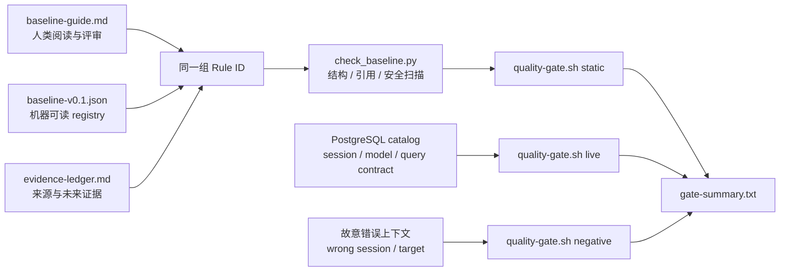

前五章已经留下了一批反复出现的工程判断：连接前先确认目标，运行角色不能等于对象所有者，关键不变量要进入约束，事务失败后必须显式恢复，分页需要稳定全序，实验结束要证明状态复原。它们此时还散落在不同章节里；如果只把这些句子摘成一张“最佳实践清单”，读者很快就会遇到两个问题：规则为什么成立，以及遇到例外时该听谁的。

本章不追求一份永远正确的规范，而是建立一条可持续的规则生产线：

```text
事故 / 评审 / 测量
  → 候选规则
  → 失败机制与适用范围
  → 正例、反例和运行证据
  → 自动检查 / 运行验证 / 人工评审
  → active baseline
  → waiver、修订或废弃
```

最终产物是 `pg36_shop` 的开发规约 baseline v0.1。它既有人可以阅读的指南，也有机器可以校验的 JSON registry；既声明 PostgreSQL 对象与查询合同，也展示如何把角色、数据库和接入路径映射到 Pigsty。更重要的是，它公开记录目前尚未自动化的缺口，而不把“写进文档”冒充“已经落实”。

## 本章目标

完成本章后，读者应当能够：

- 从失败机制出发写规则，而不是从个人偏好出发写口号；
- 为每条规则补齐 owner、scope、rationale、evidence、exception 和 checks；
- 区分 safety、default 与 preference，知道三类规则采用不同的阻断和例外机制；
- 把连接目标、凭据、会话参数和 `application_name` 组成可验证的连接合同；
- 解释 `search_path` 为什么同时是便利机制与信任边界；
- 用 schema、NOLOGIN owner、命名约束和注释表达对象边界；
- 审查数据类型、默认值、标识键和时间语义，而不是机械套用类型表；
- 把“可恢复迁移”理解为兼容演进、停止线和 forward repair，而不是承诺任意 DDL 都能自动 `down`；
- 为查询建立显式投影、稳定排序和分页合同；
- 把事务超时、整体重试、幂等与外部副作用放在一个失败模型里审查；
- 区分静态检查、catalog 验证、负向测试、并发实验与计划证据；
- 写出包含风险、停止条件、恢复路径和验收证据的数据库变更说明；
- 区分 Pigsty inventory 中的期望状态、PostgreSQL catalog 中的实际状态与 service 的实际路由；
- 运行 v0.1 质量门，读懂每个通过项和目前唯一的 safety 自动化缺口；
- 给后续 ch07–ch11 的计划、索引、并发与发布证据预留可追踪的追加位置。

## baseline v0.1 的边界

本章基线含 25 条 active 规则：

| 等级 | 数量 | 默认处置 | 允许的例外 |
|---|---:|---|---|
| safety | 10 | 阻断 merge/deploy | `none` 或受控 `breakglass` |
| default | 10 | 团队默认 | 有 owner、expiry 与补偿检查的 `waiver` |
| preference | 5 | 场景评审 | reviewer 根据证据决定 |

规则数量不是成熟度指标。v0.1 的证据只来自 ch01–ch05，范围限定为 `pg36_shop` 教学应用及 Pigsty L1 工作流；PostgreSQL 兼容目标为 14–18，当前真实验证版本为 18.4，Pigsty 说明以 v4.4.0 为准。Ubuntu 24.04 是 L1 目标平台，本章同时在 macOS/Homebrew 的 PostgreSQL 18.4 本地实验实例上验证 SQL 与 gate。任何内核分支、驱动、连接池模式和组织安全要求都可能收紧或改写规则边界。

v0.1 还故意保留一个可见缺口：10 条 safety 中，`SAFE-RETR-008`“只按 SQLSTATE 整体重试且副作用幂等”目前只有 review check，尚无自动或运行时检查。第 10 章完成并发与重试实验前，它不能被宣称为自动闭合；质量门会输出：

```text
safety_count=10
safety_non_review_count=9
```

这里的 `9` 不是失败，而是一张不可被悄悄抹掉的债务凭证。若到 ch12 仍未补齐，baseline 不得升为 v1.0。

## 人、机器与运行时三份合同



三份合同各自回答不同问题：

- 人类指南说明规则是什么意思、为何存在以及怎样申请例外；
- JSON registry 固定字段、ID、版本和证据引用，防止文档与自动化各说各话；
- 运行时 gate 连接真实 PostgreSQL，证明当前 target、session、catalog 与 query contract 符合预期。

静态通过不证明数据库已经部署；inventory 已提交不证明 playbook 已应用；catalog 正确也不证明连接流量经过了预期的 HAProxy/Pgbouncer 服务。只有把配置、运行和路由证据放在一起，才能声称这条交付链已经闭合。

## 实验资产

下载并审查以下资产：

- [机器可读 baseline v0.1](/labs/ch06/baseline-v0.1.json)
- [registry JSON Schema](/labs/ch06/baseline-schema.json)
- [人类可读规则指南](/labs/ch06/baseline-guide.md)
- [交付清单](/labs/ch06/delivery-manifest.json)
- [证据账本](/labs/ch06/evidence-ledger.md)
- [数据库变更说明模板](/labs/ch06/change-template.md)
- [规约例外模板](/labs/ch06/waiver-template.md)
- [Pigsty cluster-vars 示例](/labs/ch06/pigsty-declaration.example.yml)
- [连接上下文 guard](/labs/ch06/context.sql)
- [正确会话 profile](/labs/ch06/session-profile.sql)
- [错误会话 fixture](/labs/ch06/wrong-session.sql)
- [查询合同验证](/labs/ch06/query-contract.sql)
- [baseline 结构检查器](/labs/ch06/check_baseline.py)
- [统一质量门](/labs/ch06/quality-gate.sh)

这些资产不包含密码，也不会创建或删除数据库。`live` 与 `negative` 只在已经通过 ch04-v1 验收的可写 L1 上运行：正向检查全部只读，负向检查只故意设置错误会话参数或错误 expected database，并要求以精确 SQLSTATE 拒绝。

## 所属位置

- 卷别：[上卷：应用开发](/upper-volume/)（独立导读页，不构成章节父目录）
- 教学分组：第一篇：筑基——建立 PostgreSQL 工程认知
- 兼容入口：`/ch06/`、`/volume-1/development-standards/`

## 本章目录

### [6.1 规约不是口号](01/)

- [6.1.1 从事故、评审和测量中形成规则](01/#item-6-1-1)
- [6.1.2 每条规则记录动机、证据、例外和检查方式](01/#item-6-1-2)
- [6.1.3 区分安全底线、团队默认与场景偏好](01/#item-6-1-3)

先建立“规则也需要证据”的方法，再定义一条规则从 candidate 到 active、waived、deprecated 的生命周期。

### [6.2 连接与会话候选规则](02/)

- [6.2.1 连接上下文、超时与 `application_name`](02/#item-6-2-1)
- [6.2.2 时区、编码、`search_path` 与会话状态](02/#item-6-2-2)
- [6.2.3 用错误连接案例验证规则价值](02/#item-6-2-3)

把“能连上”升级为包含目标、身份、会话语义、超时预算和可归因性的连接合同，并让错误连接真的失败。

### [6.3 模式与 DDL 候选规则](03/)

- [6.3.1 命名、所有权、注释与对象边界](03/#item-6-3-1)
- [6.3.2 类型、约束和默认值的审查问题](03/#item-6-3-2)
- [6.3.3 可逆迁移与版本化 DDL](03/#item-6-3-3)

把前两章的逻辑模型与物理合同收敛为 DDL 评审问题，并准确界定 rollback、forward repair 和兼容发布的关系。

### [6.4 查询与事务候选规则](04/)

- [6.4.1 明确列、稳定排序与分页语义](04/#item-6-4-1)
- [6.4.2 事务大小、超时、重试与幂等](04/#item-6-4-2)
- [6.4.3 CTE、窗口函数与 `LATERAL` 的可读性门槛](04/#item-6-4-3)

查询规约约束的是外部合同和失败语义，不是 SQL 风格偏好；高级语法也不因“高级”而自动正确或错误。

### [6.5 交付物与质量门](05/)

- [6.5.1 DDL、迁移、数据生成与回滚](05/#item-6-5-1)
- [6.5.2 自动测试、静态检查与计划证据](05/#item-6-5-2)
- [6.5.3 变更说明、所有者与风险等级](05/#item-6-5-3)

一项数据库变更只有同时携带代码、验证、失败路径、风险和 owner 才是可接手的交付物。

### [6.6 将规约接入统一实验环境](06/)

- [6.6.1 角色、数据库与服务声明](06/#item-6-6-1)
- [6.6.2 初始化、验证与重置入口](06/#item-6-6-2)
- [6.6.3 配置事实与运行事实分开审查](06/#item-6-6-3)

Pigsty 提供可复现的基础设施入口，PostgreSQL catalog 和实验后验负责证明实际状态；本节把两种证据接起来。

### [6.7 实战：发布规约 baseline v0.1](07/)

- [6.7.1 审查 ch01–ch05 已出现的候选规则](07/#item-6-7-1)
- [6.7.2 为 `pg36_shop` 建立最小质量门](07/#item-6-7-2)
- [6.7.3 预留 ch07–ch11 的证据追加区](07/#item-6-7-3)
- [6.7.4 在 ch12 汇总为 v1.0 的验收条件](07/#item-6-7-4)

最后运行 static、live 与 negative 三层 gate，发布带 checksum、证据范围和已知缺口的 v0.1，而不是一份没有版本的规范文档。

## 章节验收

1. 能把一条口号改写成有 scope、rationale、evidence、exception、checks 和 owner 的规则；
2. 能解释 safety/default/preference 的差异，不用大写“必须”冒充风险分级；
3. baseline guide 与 JSON registry 的 Rule ID 一一对应；
4. registry 引用的 ch01–ch05 资产都存在，且五章均被实际证据覆盖；
5. source 与 evidence 中没有明文凭据、credential URI 或 `PGPASSWORD`；
6. 连接 gate 能确认 database、effective role、primary、模型版本和 session profile；
7. 错误会话固定以 `P0601` 失败，错误 target 固定以 `P0001` 失败；
8. 查询 gate 能验证 view shape、显式稳定排序、keyset 两页不重叠以及业务键/幂等键唯一；
9. 能解释 Pigsty `primary:5433` 与 `default:5436` 的不同使用边界；
10. 能从 catalog、`pg_settings` 和 service 路由分别验证 inventory 声明；
11. 能说明为什么“可恢复”通常依赖 expand/contract 与 forward repair，而非通用 down migration；
12. 能指出 v0.1 的 9/10 safety enforcement 缺口及其预定闭合章节；
13. `quality-gate.sh all` 生成 `status=ok`，且保存 baseline 与关系模型 checksum。

下一章 [ch07《追本溯源：执行计划与统计信息》](/query-plans-statistics/) 将开始给
`PREF-PLAN-005` 和查询成本审查补充第一批专门证据。

## 参考资料

- [PostgreSQL 18：The Connection Service File](https://www.postgresql.org/docs/18/libpq-pgservice.html)
- [PostgreSQL 18：The Password File](https://www.postgresql.org/docs/18/libpq-pgpass.html)
- [PostgreSQL 18：Database Connection Control Functions](https://www.postgresql.org/docs/18/libpq-connect.html)
- [PostgreSQL 18：Schemas](https://www.postgresql.org/docs/18/ddl-schemas.html)
- [PostgreSQL 18：Function Security](https://www.postgresql.org/docs/18/perm-functions.html)
- [PostgreSQL 18：CREATE FUNCTION](https://www.postgresql.org/docs/18/sql-createfunction.html)
- [PostgreSQL 18：Sorting Rows](https://www.postgresql.org/docs/18/queries-order.html)
- [PostgreSQL 18：LIMIT and OFFSET](https://www.postgresql.org/docs/18/queries-limit.html)
- [PostgreSQL 18：WITH Queries](https://www.postgresql.org/docs/18/queries-with.html)
- [Pigsty v4.4：User/Role](https://pigsty.io/docs/pgsql/config/user/)
- [Pigsty v4.4：Database](https://pigsty.io/docs/pgsql/config/db/)
- [Pigsty v4.4：Service/Access](https://pigsty.io/docs/pgsql/service/)

---

[上一章：运筹帷幄：查询、事务与锁的核心心智模型](/query-transaction-locks/) · [返回上卷导读](/upper-volume/) · [下一章：追本溯源：执行计划与统计信息](/query-plans-statistics/) ·
[查看全书目录](/toc/) · [查看索引中心](/indexes/)
