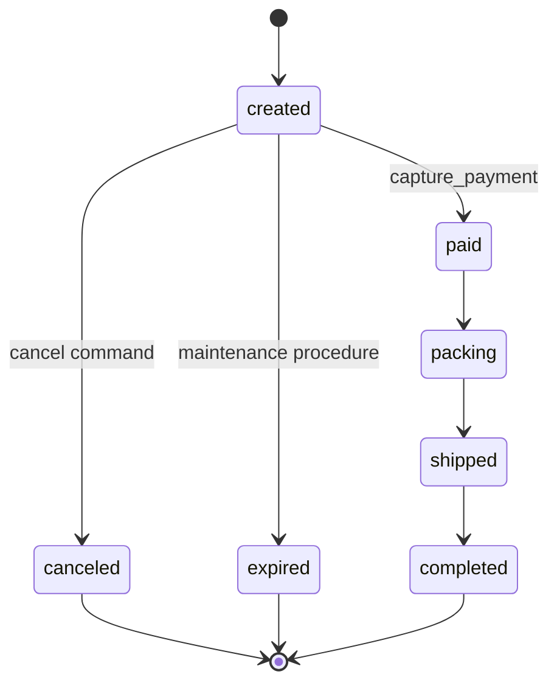

本节把前五节压成一个可运行、可失败、可复位的 release proposal。目标不是
展示最多的 PL/pgSQL 特性，而是让每个机制只承担一种可解释责任。

> **环境边界**
>
> `task.sh all` 会精确删除并重建专用 `shop_ch13` schema。它适合本书的
> 本地/开发夹具；不要把它当生产迁移直接执行。生产发布使用向前迁移、
> canary、观察窗口和独立回退，不先删 schema。

## 13.6.1 比较约束、函数、触发器与应用实现 {#item-13-6-1}

### 先冻结状态图

实验只允许六条边：



图中没有：

```text
created -> shipped
canceled -> paid
completed -> created
```

禁止边必须由数据库拒绝，而不是只在 UI 隐藏按钮。

### 规则拆分

#### 局部合法域：约束

[setup.sql](/labs/ch13/setup.sql)：

```sql
CONSTRAINT sales_order_total_positive
    CHECK (total_minor > 0),

CONSTRAINT sales_order_status_domain
    CHECK (
        status IN (
            'created', 'paid', 'packing', 'shipped',
            'completed', 'canceled', 'expired'
        )
    ),

CONSTRAINT sales_order_version_nonnegative
    CHECK (version >= 0)
```

这些规则不需要 `OLD`，不查询其他行，原生 `CHECK` 最合适。

#### transition matrix：纯 SQL function

```sql
allowed_transition(text,text)
  IMMUTABLE
  STRICT
  PARALLEL SAFE
  SECURITY INVOKER
```

它没有表访问和副作用，既可由
[transition-matrix.sql](/labs/ch13/transition-matrix.sql) 穷举 49 个状态对，
也能被 guard trigger 复用。

#### 所有普通写入口：`BEFORE ROW`

```text
invalid edge       -> P3613
version not +1     -> P3615
valid edge         -> normalize updated_at, return NEW
```

应用 command function、owner 直接 SQL 和 maintenance procedure 都经过同一
guard。应用层仍可做更早校验以改善 UX，但数据库是最终护栏。

#### 事务最终点：deferred constraint triggers

最终不变量：

```text
status = paid
  <=> captured_minor = total_minor
```

实验为简单起见不建 partial payment/refund 状态机，因此非 paid 订单捕获金额
必须为 0。真实支付模型通常需要 authorization、capture、refund、chargeback
账本，不能照抄这个简化等式。

两个 constraint trigger 同时覆盖：

- 改订单状态/金额；
- 插入、修改或删除 payment。

只挂一边会留下绕过入口。

#### 应用命令：definer functions

应用只能调用：

```text
order_snapshot(order_id)
transition_order(order_id, expected_version, target, actor)
capture_payment(order_id, expected_version, payment_ref, amount, actor)
```

它没有底表 DML。`capture_payment`：

```text
lock order row
  -> validate expected version/status/amount
  -> set transaction-local actor
  -> insert payment
  -> update order to paid and version +1
  -> row + statement triggers
  -> deferred checks at commit
```

支付引用有 `UNIQUE`；本章没有实现第 12 章那种完整幂等 response ledger，
因此 duplicate `payment_ref` 仍是约束错误。生产 API 应明确 duplicate
request 是 replay 还是 conflict。

#### 批量维护：invoker procedure

`expire_stale_orders`：

- 仅 owner/管理路径可调用；
- batch size 限制 1–1000；
- `ORDER BY order_id FOR UPDATE SKIP LOCKED LIMIT ...`；
- 每批集合 UPDATE；
- `COMMIT AND CHAIN`；
- 已 expired 行自然成为重跑断点。

它不提权、不调外部系统、不安排自己何时运行。

#### 跨系统动作：应用与 outbox

订单 paid 后通知履约不在 trigger 内发送。本章只证明数据库护栏；完整
outbox 服务见第 12 章。

### 物理对象

专用 schema：

```text
shop_ch13
├── schema_version
├── sales_order
├── payment
├── order_history
├── statement_audit
├── 7 functions
├── 1 procedure
└── 4 user triggers
```

身份 sequence 和系统内部 FK triggers 不算 user trigger inventory。

所有实验对象带同一 marker：

```text
pg36 ch13 routine guard lab; safe to rebuild
```

setup/reset 遇到未知 relation、routine、user trigger 或 marker 漂移会拒绝，
不会用 `CASCADE` 把未知依赖带走。

### 权限模型

```text
postgres/admin session
  └─ SET ROLE pg36_owner for reviewed DDL

pg36_owner
  ├─ NOLOGIN, non-superuser
  ├─ owns shop_ch13 objects
  └─ runs maintenance procedure

pg36_app
  ├─ LOGIN, constrained
  ├─ USAGE shop_ch13
  ├─ EXECUTE 3 public API functions
  └─ no table DML / internal function / procedure EXECUTE
```

所有 definer functions：

```sql
SET search_path = pg_catalog, pg_temp
```

业务对象全限定。

### 审计模型

每个状态变化写一行 `order_history`：

```text
order_id
old_status/new_status
old_version/new_version
actor/session_actor
statement_timestamp
xid8
```

每个 UPDATE statement 写一行 `statement_audit`：

```text
xid8
actor/session_actor
affected_count
ordered order_ids[]
statement_timestamp
```

关系：

```text
sum(statement_audit.affected_count)
  = count(order_history)
  = sum(final order versions)
  = 10
```

这是一条可机器验收的不变量。

### fixture 分工

| order | 用途 | 最终状态 |
|---:|---|---|
| 101 | 应用取消成功、旧 version 重放失败 | canceled v1 |
| 102 | 原子支付成功 | paid v1 |
| 103 | 非法 created→shipped、金额错误、异常 probe | created v0 |
| 104 | paid 无 payment，提交点失败 | created v0 |
| 105–107 | 单语句三行 bulk | canceled v1 |
| 108 | function stats rollback-only probe | created v0 |
| 201–205 | procedure 2/2/1 | expired v1 |

最终：

```text
orders=13
created=3
paid=1
canceled=4
expired=5
payments=1
history=10
statement_audit=6
affected_sum=10
```

### 设计选择对照

| 候选实现 | 本章结论 |
|---|---|
| 应用 `if` 检查全部规则 | 可做早校验，不能作为唯一护栏 |
| `CHECK allowed_transition(old,new)` | `CHECK` 没有 `OLD`，不适用 |
| transition function 由应用自愿调用 | 底表 DML 被拿走；同时 trigger 防 owner/脚本绕过 |
| row trigger 每行写一条 statement audit | 粒度错误；用 transition table |
| immediate cross-table trigger | 原子支付的中间步骤会被过早拒绝 |
| deferred constraint trigger | 适合提交点，但必须另有锁协议 |
| trigger 内调用履约 HTTP | 拒绝；写 outbox 后异步处理 |
| definer procedure 分批 commit | PostgreSQL 禁止该组合；用 invoker 管理过程 |
| procedure 自己每天运行 | 不可能；scheduler 属平台 |

## 13.6.2 注入绕过应用的错误写入 {#item-13-6-2}

### 前置条件

实验依赖前章建立的：

```text
database=pg36_shop
owner=pg36_owner
application role=pg36_app
model=ch04-v1
business checksum=stable
```

准备受控 libpq service：

```ini
[pg36-admin]
host=/path/to/socket-or-host
port=5432
dbname=pg36_shop
user=postgres
```

然后：

```bash
export PGSERVICEFILE=/path/to/pg_service.conf
export PGSERVICE=pg36-admin
```

不要把密码写进命令行或 evidence。生产使用受控 secret path。

### 先跑静态和单阶段入口

```bash
./static/labs/ch13/task.sh setup
./static/labs/ch13/task.sh catalog
./static/labs/ch13/task.sh behavior
```

`catalog` 和 `behavior` 会先重建 exact fixture，以保证结果不依赖上一轮。
正式验收直接运行 `all`。

### 正向路径

[api-happy.sql](/labs/ch13/api-happy.sql) 以 `pg36_app`：

```sql
SELECT *
FROM shop_ch13.transition_order(
    101, 0, 'canceled', 'app-cancel'
);

SELECT *
FROM shop_ch13.capture_payment(
    102, 0, 'pay-ch13-102', 2000, 'app-payment'
);
```

预期：

```text
101,canceled,1
102,paid,1,pay-ch13-102
```

这同时证明 definer 权限、trigger、deferred check 和返回形状。

### 故障 1：绕过 command API 的直接写

以 `pg36_app`：

```sql
UPDATE shop_ch13.sales_order
SET status = 'canceled', version = version + 1
WHERE order_id = 105;
```

预期：

```text
SQLSTATE 42501
```

失败发生在 ACL，trigger 无需承担应用授权。

### 故障 2：非法状态边

```sql
SELECT *
FROM shop_ch13.transition_order(
    103, 0, 'shipped', 'app-invalid'
);
```

预期：

```text
SQLSTATE P3613
order 103 remains created v0
history delta=0
audit delta=0
```

再用 owner 直接 UPDATE 同一非法边，仍应由 guard 拒绝。这才证明护栏不依赖
应用 handler。

### 故障 3：提交点不一致

```sql
SELECT *
FROM shop_ch13.transition_order(
    104, 0, 'paid', 'app-no-payment'
);
```

`BEFORE` 认为 `created→paid` 是允许边，UPDATE 与 `AFTER` audit 会在事务内部
执行；到 deferred check 时发现 captured=0：

```text
SQLSTATE P3614
order/history/audit all rolled back
```

这证明不能只看 function 的 `RETURNING`；事务必须成功提交才是完成。

反方向也必须覆盖：[delete-payment.sql](/labs/ch13/delete-payment.sql)
删除 order 102 的 captured payment，会由 payment 表上的 constraint
trigger 在提交点返回同一个 `P3614`，paid 订单与 payment 都保持原状。

### 故障 4：乐观版本冲突

order 101 已是 v1，再传 expected v0：

```text
SQLSTATE P3616
```

这不是 blind retry 信号。调用方重新读取，判断业务意图是否仍成立。

### 故障 5：支付前置条件

order 103 金额 3000，传 1：

```text
SQLSTATE P3618
payment delta=0
order remains created v0
```

前置条件在插 payment 前检查，且整笔 function 仍在一个事务。

### 故障 6：procedure 放进显式事务

[procedure-in-transaction.sql](/labs/ch13/procedure-in-transaction.sql)：

```sql
BEGIN;
CALL shop_ch13.expire_stale_orders(..., 2, 0);
COMMIT;
```

过程第一次 `COMMIT AND CHAIN`：

```text
SQLSTATE 2D000
```

显式事务回滚，201–205 仍 created。随后
[procedure-run.sql](/labs/ch13/procedure-run.sql) 用 top-level CALL：

```text
p_total=5
batches=[2,2,1]
```

立即第二次 top-level CALL：

```text
p_total=0
audit delta=0
```

这证明恢复依据是已提交状态，而不是只存在过程局部变量中的计数。

### 异常子事务

[exception-probe.sql](/labs/ch13/exception-probe.sql) 在 inner block 直接做非法
owner UPDATE，精确捕获 `P3613`：

```text
caught_state=P3613
status_after=created
version_after=0
```

probe 外层最后 `ROLLBACK`。它证明 handler 的持久化回滚语义，不把捕获当作
生产容错建议。

### 函数统计

[function-stats.sql](/labs/ch13/function-stats.sql)：

```sql
RESET ROLE;
SET track_functions = 'all';
SET ROLE pg36_owner;

BEGIN;
-- rollback-only calls
...
SELECT ... FROM pg_stat_xact_user_functions;
ROLLBACK;
```

证据至少包含：

```text
allowed_transition calls>=1
guard_order_transition calls>=1
audit_order_transition calls>=1
order_snapshot calls>=1
transition_order calls>=1
```

时间只要求非负，不做跨机器阈值。

### 完整 suite

```bash
evidence="$PWD/evidence/ch13/$(date -u +%Y%m%dT%H%M%SZ)"

PG36_EVIDENCE_DIR="$evidence" \
  ./static/labs/ch13/task.sh all
```

它额外验证 reset：

| case | 预期 |
|---|---|
| 错误 token | `P3620` |
| 错误 target | `P3621` |
| `pg36-ch13-*` worker active | `P3623` |
| marker/inventory drift | `P3622` |
| 正确 token + target + no worker | exact reset |

活跃 worker probe 只取消精确 PID、database、application_name 对应的
`pg_sleep`，不会广泛终止连接。

### evidence 结构

```text
evidence/
├── manifest.txt
├── preflight.txt
├── setup.txt
├── routine-catalog.csv
├── trigger-catalog.csv
├── security-catalog.csv
├── transition-matrix.csv
├── api-happy.csv
├── invalid-transition.{exit,stdout,stderr}
├── paid-without-payment.{exit,stdout,stderr}
├── version-conflict.{exit,stdout,stderr}
├── payment-mismatch.{exit,stdout,stderr}
├── delete-payment.{exit,stdout,stderr}
├── direct-write.{exit,stdout,stderr}
├── exception-probe.csv
├── function-stats.csv
├── bulk-update.csv
├── procedure-in-transaction.{exit,stdout,stderr}
├── procedure-run.csv
├── procedure-rerun.csv
├── final-state.csv
├── verify.txt
├── review.txt
├── reset-*.{exit,stdout,stderr}
├── reset.txt
└── rebuild/
    └── 同一套第二遍证据
```

`review.py` 读取原始 CSV/stderr/manifest，不从成功摘要自证成功。

### 最终 checksum

`final-state.sql` 对：

- order id/status/version；
- payment reference/amount/status；
- history edge/version/actor；
- statement affected set/actor；

做确定性排序和 MD5：

```text
business_checksum=f045467816a9be6774f30312adc16402
```

时间、xid、identity sequence 不进入 checksum，因为它们每次合法运行都可能
变化。

## 13.6.3 在 Pigsty L1 输出实现选择、测试证据与回退脚本 {#item-13-6-3}

### L1 不是“本机换个 host”

本地 PostgreSQL 18.4 direct 成功只证明：

```text
source + fixture + direct server behavior
```

Pigsty L1 还要绑定：

```text
cluster identity
service route
primary/recovery role
PostgreSQL minor version
PgBouncer path if used
role/database declaration
secret delivery
HA behavior
metrics/logs/alerts
change window and rollback authority
```

没有这些证据，就输出 `not-run`，不能把参考架构当成已验证事实。

### 声明角色与 database

[pigsty-declaration.example.yml](/labs/ch13/pigsty-declaration.example.yml)
提供无凭据 fragment：

```yaml
pg_users:
  - name: pg36_owner
    login: false
    superuser: false
    ...

  - name: pg36_app
    login: true
    pgbouncer: true
    pool_mode: transaction
    ...

pg_databases:
  - name: pg36_shop
    owner: pg36_owner
    schemas:
      - { name: shop_ch13, owner: pg36_owner }
```

它不包含 password。实际 secret 由受控 inventory/overlay 注入。

声明只负责 role/database/schema 基础对象；function source、ACL、marker 和
tests 仍由 reviewed SQL migration 管理。不要让两套系统同时争夺同一函数
定义。

### 接入路径

参考决策：

```text
application routine calls
  -> Pigsty primary service
  -> PgBouncer transaction pool
  -> pg36_app

reviewed DDL, catalog, maintenance CALL
  -> Pigsty direct/default management service
  -> PostgreSQL
  -> controlled admin SET ROLE pg36_owner
```

端口和 DNS 必须从目标 inventory 读取，不能照抄示例数字。应用路径要实际
验证：

- function calls；
- transaction-local setting；
- deferred commit error；
- cancel/timeout；
- failover/reconnect；
- transaction pooling 下的协议与 latency。

本章正式 suite 记录：

```text
validation_path=direct-postgresql
```

所以 PgBouncer 项仍为未验证。

### 把 setup 改造成生产 migration

生产 migration 不能运行“drop exact fixture + seed”：

1. 创建新 schema/table/constraints；
2. 创建纯 function 与内部 trigger functions；
3. 同事务创建 definer function、revoke PUBLIC、grant 精确 app；
4. 创建 trigger；
5. 运行 catalog/ACL contract；
6. 以 canary 业务行运行正负路径；
7. 启用新应用调用；
8. 观察；
9. 最后撤旧接口。

若改已有大表，先按第 11 章评估 lock、rewrite、backfill 和 validation。
`CREATE FUNCTION` 本身快，不代表挂 trigger 后的每次写入成本可忽略。

### 生产 canary 不使用教学 seed

选择：

- 隔离 tenant/test order；
- 有清晰清理合同；
- 不触发真实外部副作用；
- 可在 outbox consumer 侧隔离；
- 能用业务不变量验证；
- 不暴露敏感数据到 evidence。

同时执行 bypass test 需要额外 owner 权限，应在变更窗口和隔离对象上完成，
不是任意改生产订单。

### 观察查询

目录：

```sql
SELECT *
FROM pg_proc
WHERE oid IN (
  'shop_ch13.transition_order(bigint,bigint,text,text)'::regprocedure,
  'shop_ch13.capture_payment(bigint,bigint,text,bigint,text)'::regprocedure
);
```

调用：

```sql
SELECT *
FROM pg_stat_user_functions
WHERE schemaname = 'shop_ch13'
ORDER BY total_time DESC;
```

活跃与等待：

```sql
SELECT
    pid, backend_start, application_name,
    state, wait_event_type, wait_event,
    xact_start, query_start
FROM pg_stat_activity
WHERE datname = 'pg36_shop'
  AND application_name LIKE 'pg36-%';
```

业务关系：

```sql
SELECT
    count(*) FILTER (WHERE status = 'paid') AS paid_orders,
    count(*) FILTER (WHERE status = 'paid'
                     AND captured_minor <> total_minor) AS invalid
FROM reviewed_payment_projection;
```

最后一个 projection 需要按真实 schema 编写，示例名不是本章已创建对象。

### release proposal

[baseline-v1.1-proposal.json](/labs/ch13/baseline-v1.1-proposal.json) 冻结：

- target/version；
- 逻辑放置决策；
- SQLSTATE；
- 最终状态关系；
- 权限矩阵；
- rollback token/target；
- 未验证边界。

canonical SHA-256：

```text
32377d82a7ce958aa50b0077ebe99c47d27672223c3c77fd9f91072d3745de9d
```

manifest 和 review 独立重算；不是手抄字符串就算通过。

### 实验复位

仅对专用开发夹具：

```bash
PG36_RESET_TOKEN=RESET_CH13_ROUTINE_GUARD \
PG36_RESET_TARGET=pg36_shop/shop_ch13 \
  ./static/labs/ch13/task.sh reset
```

[reset.sql](/labs/ch13/reset.sql) 检查：

- database `pg36_shop`；
- writable instance；
- effective owner；
- ch04-v1；
- schema/object marker；
- relation/routine/trigger 白名单；
- 没有 `pg36-ch13-*` active worker；
- exact token 与 target。

随后按 FK/dependency 顺序 drop 精确对象，最后 `DROP SCHEMA`；不使用
`CASCADE`。

### 生产回退不是 reset

生产回退顺序：

```text
stop new callers / disable job schedule
  -> observe and drain active calls
  -> route application to compatible old API
  -> verify old writes still accepted
  -> revoke new EXECUTE
  -> disable/drop new trigger only if data remains valid
  -> preserve audit and migration evidence
  -> observation window
  -> later contract objects
```

若新逻辑已经产生旧应用无法理解的新状态，DDL 回退不能自动恢复语义；需要
数据补偿或 forward fix。发布前必须演练。

### L1 交付包

一份完整交付至少包含：

1. 逻辑放置 ADR；
2. migration source 与 artifact checksum；
3. exact signatures、owners、ACL、paths；
4. transition/state diagram；
5. 正向、负向、bypass、bulk、deferral、并发测试；
6. target manifest；
7. direct 与 pooler 路径结果；
8. SQLSTATE → 应用行为映射；
9. dashboard/log/alert 查询；
10. canary 与观察窗口；
11. scheduler/overlap 设计；
12. rollback 与停用顺序；
13. 未验证事实。

### 本章验收

你应能在不看答案时解释：

- 为什么状态域是 `CHECK`，状态边是 trigger；
- 为什么 payment invariant 要延迟，但仍要 row lock；
- 为什么应用没底表 DML；
- 为什么 definer path 必须固定、PUBLIC 必须撤销；
- 为什么 bulk audit 用 transition table；
- 为什么 procedure 显式事务中返回 `2D000`；
- 为什么 procedure 不是 scheduler；
- 为什么 trigger 不调用远端系统；
- 为什么 function counters 不是 trace；
- 为什么本地 direct 成功不能冒充 Pigsty/PgBouncer 成功；
- 为什么生产回退不能运行教学 reset。

能回答并用 evidence 证明，才算真正掌握数据库端逻辑。

---

[上一节：安全、测试与观测](../05/) · [返回本章目录](../) · [下一章：博采众长：内核分支与扩展生态](/extensions-ecosystem/) ·
[查看全书目录](/toc/) · [查看索引中心](/indexes/)
