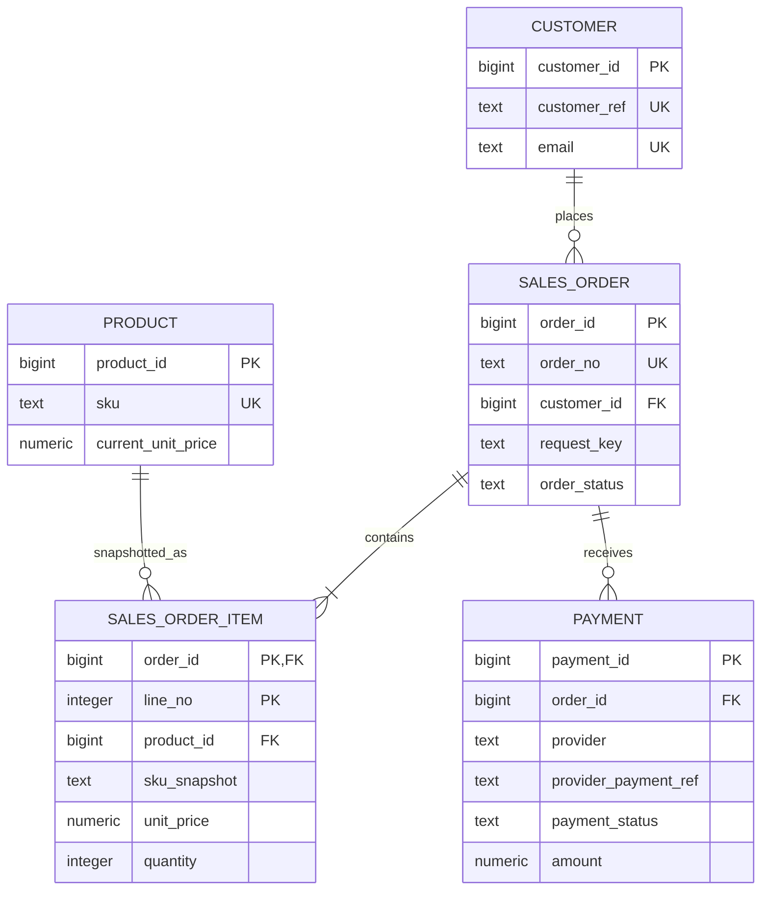

本实验把前五节的判断落入真实 PostgreSQL。它不是“写一遍 CREATE TABLE 就算建模完成”，而是同时交付业务事实、DDL、样例、正反规则、关系图和未决登记。

风险：

- `setup`：`R1·可逆变更`，创建五表、两个 schema 和一个 view；
- `seed`：`R1·可逆变更`，会清空并重建五表的教学数据；
- `verify`：`R0·观察`；
- `review`：`R2·破坏性演练`，事务内插入反例，最后强制回滚；
- `reset`：`R2·破坏性演练`，删除全部 ch03 对象，要求双重令牌。

## 3.6.1 用户、商品、订单、订单项与支付 {#item-3-6-1}

先审阅[业务事实清单](/labs/ch03/requirements.md)。五表各自只保存有明确所有权的事实：

| 关系 | 主键 | 业务/外部键 | 关键关系 | 快照或派生 |
|---|---|---|---|---|
| `customer` | customer_id | customer_ref、email | 无 | 当前档案 |
| `product` | product_id | SKU | 无 | 当前目录 |
| `sales_order` | order_id | order_no、customer-scoped request key | customer | buyer email 快照 |
| `sales_order_item` | order_id + line_no | 无 | order、product | SKU/name/unit price 快照 |
| `payment` | payment_id | provider reference、provider-scoped idempotency key | order | provider 响应记录 |

完整关系图：



可下载源文件是 [`model.mmd`](/labs/ch03/model.mmd)。

### v0 已经决定什么

- 所有关系有主键；
- customer ref、email、SKU、order no 有业务唯一约束；
- order request key 在 customer 范围唯一；
- payment provider ref 与 idempotency key 在 provider 范围唯一；
- 所有引用由 FK 维护；
- line_no、quantity、price/amount 的基本正值规则由 CHECK 维护；
- order line 保存购买时商品快照；
- runtime 与 owner 分离；
- 查询摘要由 view 派生，不重复写入 order。

### v0 故意没有决定什么

DDL 使用手工 `bigint`、无指定 precision/scale 的 `numeric`、`text` 状态和 `timestamptz`。它们让逻辑关系可以运行，但没有回答：

- ID 由 identity、UUID 还是应用生成；
- 金额是否用 minor units、如何表达币种和舍入；
- 状态允许值与转换；
- 业务时间 zone、precision、clock source；
- paid/order-line 等跨表不变量如何原子强制。

因此所有对象 comment 和输出都标记 `ch03-v0`。

## 3.6.2 在 Pigsty L1 的真实数据库中部署并用样例规则审查 {#item-3-6-2}

沿用 ch02 私有 service file：

```bash
export PGSERVICEFILE="$PWD/pg_service.conf"
export PGSERVICE=pg36-admin
psql -X -w "service=$PGSERVICE" -c '\conninfo'
```

确认目标是 L1 的 `pg36_shop` 主库。下载 ch03 文件到同一目录并运行：

```bash
chmod +x task.sh
export PG36_EVIDENCE_DIR="$PWD/evidence/ch03/all-$(date -u +%Y%m%dT%H%M%SZ)"
./task.sh all
```

综合顺序：

```text
manifest → setup → seed → verify → review → review rollback
```

Pigsty `5436` 负责把管理连接送到当前主库 PostgreSQL；应用 DDL 由版本化 SQL 迁移负责，不应塞进 Pigsty 集群拓扑配置。Pigsty 可以声明 database、role 和 service，业务表模式仍属于应用发布物。

### setup 的漂移保护

[`setup.sql`](/labs/ch03/setup.sql)使用 `CREATE ... IF NOT EXISTS` 支持重入，但随后从 `pg_attribute` 与 `pg_constraint` 验证：

- 五表的列名、类型、NOT NULL 与列集合精确匹配；
- 21 个命名 PK/UK/FK/CHECK 存在、类型正确且已验证；
- 没有额外用户约束；
- 相关对象 owner 是 `pg36_owner`。

若人为增加 `product.drift_probe`，setup 在事务中返回：

```text
ERROR: logical model has unexpected columns: product.drift_probe
```

`psql` 状态为 `3`，不会用“relation already exists”掩盖漂移。不要在有价值环境为了测试随意改表；这项负向验证只在可销毁 L1 做。

### seed 与状态摘要

[`seed.sql`](/labs/ch03/seed.sql)用固定 ID、金额与 UTC 时间生成：

- 2 customer；
- 3 product；
- 2 order；
- 3 line；
- 2 payment。

[`verify.sql`](/labs/ch03/verify.sql)检查行数、孤儿、order 1001 subtotal/captured amount、app/ro 权限和 private schema 边界。基线输出：

```text
status=ok
model_version=ch03-v0
customer_count=2
product_count=3
order_count=2
item_count=3
payment_count=2
open_decision_count=4
relation_checksum=cd7daa66543a6b5e0a5d7fc269558a6c
```

连续执行两次 `all`，摘要相同。setup 的 NOTICE 属于“对象已存在并经过后续验证”，不是静默成功。

### 规则审查必须有正反两面

[`review.sql`](/labs/ch03/review.sql)在一个事务内先尝试三类非法写入：

| 反例 | 预期 SQLSTATE 类别 |
|---|---|
| 重复 `SKU-COFFEE` | `unique_violation` |
| line 引用不存在 product | `foreign_key_violation` |
| quantity = 0 | `check_violation` |

脚本只捕获预期异常，若错误类型不同或写入意外成功，整个 review 失败。

随后插入三项当前 DDL允许、业务尚未批准的状态：

```text
arbitrary_money_scale_still_allowed=true
arbitrary_order_status_still_allowed=true
paid_without_items_or_payment_still_possible=true
```

事务末 `ROLLBACK`，再次 verify 仍得到原校验和。这组输出是 v0 的边界证据：约束有效，但模型尚未完整。

分步运行：

```bash
./task.sh setup
./task.sh seed
./task.sh verify
./task.sh review
```

每次给 evidence 新目录，保留失败现场。

## 3.6.3 产出金额、时间、状态、标识四项未决清单 {#item-3-6-3}

[未决登记](/labs/ch03/open-decisions.md)不是随手记下的待办列表，而是 ch04 的输入合同：

| 决策域 | 已知事实 | 仍需决定 | 关闭证据 |
|---|---|---|---|
| 金额 | line 保存购买价；payment 保存尝试金额 | 表示、币种、scale、rounding、refund | 非法精度/币种有明确失败 |
| 时间 | 下单与支付发生时间是瞬间 | 业务 zone、precision、clock、范围 | DST/客户端 zone 往返样例 |
| 状态 | order/payment 是不同状态域 | 允许值、转换、终态、实现 | 非法值与非法转换分别失败 |
| 标识 | internal/business/idempotency/provider/trace 含义不同 | 类型、生成方、公开性、顺序 | 并发生成与重复用例 |

### 决策不是选一个类型名

“金额用 numeric”仍缺少：

- 是否每行携带 currency；
- 同币种 scale；
- 税费、折扣与汇率何时舍入；
- 负数表示退款还是另建事实；
- API/JSON 如何序列化；
- index 和聚合代价。

“时间用 timestamptz”仍缺少：

- 字段表示发生瞬间还是业务日；
- 哪个时钟产生；
- 允许多远未来/过去；
- 展示用哪个 zone；
- 精度与外部系统对齐。

“状态用 enum”也没有定义转换；“ID 用 UUID”也没有定义版本、生成位置和暴露范围。ch04 必须把语义、DDL、错误与验证一起交付。

### 关闭条件

每项 decision 只有同时具备以下内容才从 open 变成 accepted：

1. 业务语义与反例；
2. PostgreSQL 表达；
3. 约束/生成与并发行为；
4. 旧数据迁移；
5. API 与错误契约；
6. 验证查询；
7. 回退或前滚路径；
8. 版本适用范围。

只在会议中口头说“应该两位小数”不算关闭。

## 3.6.4 生成逻辑关系图并链接 ch04 的可靠版本 {#item-3-6-4}

图必须能与真实目录互证。列出所有 FK：

```sql
SELECT
    c.conname,
    c.conrelid::regclass AS child_relation,
    c.confrelid::regclass AS parent_relation,
    pg_catalog.pg_get_constraintdef(c.oid, true) AS definition
FROM pg_catalog.pg_constraint AS c
WHERE c.contype = 'f'
  AND c.connamespace = 'shop'::regnamespace
ORDER BY (c.conrelid::regclass)::text, c.conname;
```

应得到四条边：

```text
sales_order.customer_id        -> customer.customer_id
sales_order_item.order_id      -> sales_order.order_id
sales_order_item.product_id    -> product.product_id
payment.order_id               -> sales_order.order_id
```

Mermaid 中 `SALES_ORDER ||--|{ SALES_ORDER_ITEM` 表达已接受订单应至少一行，但当前 FK 目录只能保证每个 line 有 order，不能反向保证 order 有 line。图表达目标模型，目录查询表达现有强制能力；两者差异必须进入未决登记，而不是让图冒充约束。

### v0 到可靠版本的交接

ch04 将建立 v1，至少产生：

```text
schema-v1.sql
migrate-v0-to-v1.sql
verify-v1.sql
negative-cases.sql
partition-adr.md
```

v1 关系图需要标出类型/状态决策变化，并保留 v0 作为迁移起点。不能直接改写 ch03 文件让读者失去演进过程。

### reset 边界

默认 `all` 不清理。如果必须回到 ch02：

```bash
export PG36_RESET_TOKEN=RESET_CH03_MODEL
export PG36_EVIDENCE_DIR="$PWD/evidence/ch03/reset-$(date -u +%Y%m%dT%H%M%SZ)"
./task.sh reset
unset PG36_RESET_TOKEN
```

SQL 内部还要求 `confirm_reset=RESET_CH03_MODEL`。reset 只删除：

- 五个 ch03 表；
- `shop_api.order_summary`；
- 空的 `shop_api` 与 `shop_private` schema。

它不删除 `pg36_shop`、`shop`、角色或 ch02 fixture。schema 使用默认 `RESTRICT` 删除；若出现未知额外对象，事务失败并整体回滚，避免把他人对象级联带走。

### 本章最终验收

- [ ] 业务事实清单有 owner、命令和不变量；
- [ ] 五表职责没有重叠的当前权威事实；
- [ ] 每类标识的作用域与用途明确；
- [ ] 四条 FK 与关系图互证；
- [ ] owner/runtime/schema 权限符合预期；
- [ ] setup 重跑收敛，额外列会返回状态 `3`；
- [ ] seed 摘要与 checksum 匹配；
- [ ] 三类非法写入触发准确约束；
- [ ] 三项开放规则被实验性证明且完全回滚；
- [ ] 四项 decision register 已链接 ch04 验收；
- [ ] 团队明确 v0 不是生产 DDL。

满足这些条件后进入 [ch04《量体裁衣：数据类型、约束与可靠数据表达》](/data-types-constraints/)。

## 参考资料

- [PostgreSQL 18：数据定义](https://www.postgresql.org/docs/18/ddl.html)
- [PostgreSQL 18：约束](https://www.postgresql.org/docs/18/ddl-constraints.html)
- [PostgreSQL 18：`pg_constraint`](https://www.postgresql.org/docs/18/catalog-pg-constraint.html)
- [PostgreSQL 18：`pg_get_constraintdef`](https://www.postgresql.org/docs/18/functions-info.html)
- [Pigsty v4.4：PostgreSQL 服务](https://pigsty.io/docs/pgsql/service/)

---

[上一节：规范化与有意识的冗余](../05/) · [返回本章目录](../) · [下一章：量体裁衣：数据类型、约束与可靠数据表达](/data-types-constraints/) ·
[查看全书目录](/toc/) · [查看索引中心](/indexes/)
