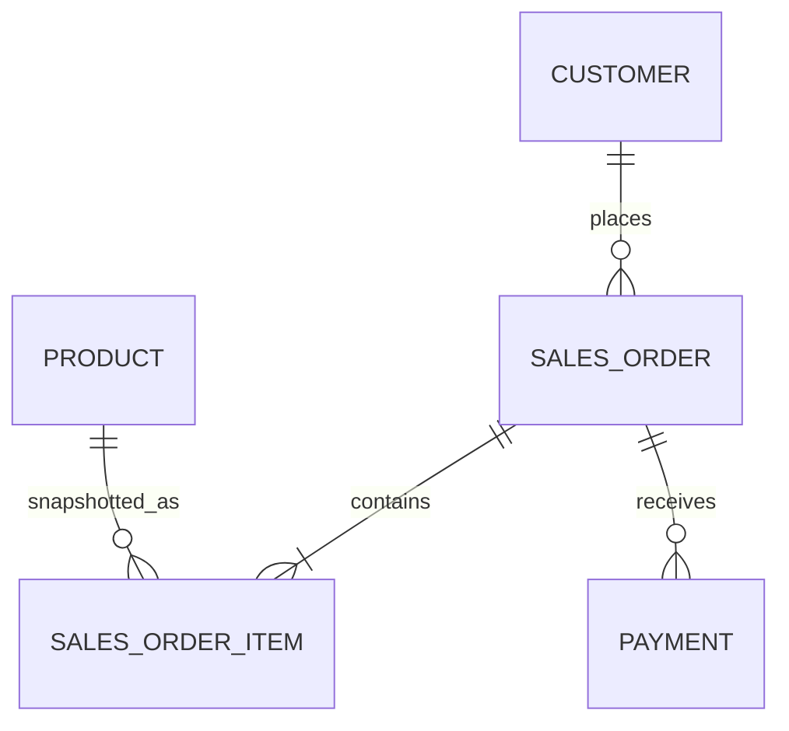

表不是字段清单的容器，关系模型也不是把接口 JSON 原样搬进数据库。建模首先要辨认系统承诺保存哪些事实、谁拥有这些事实、哪些组合状态绝不允许出现；表、键和外键只是把这些判断变成可验证结构。

本章建立 `pg36_shop` 逻辑模型 v0。它会真实部署到 PostgreSQL，并用正反样例审查，但它有意保留四项未决：金额、时间、状态和标识的可靠物理表达。v0 是通往 ch04 的设计证据，不是可以复制进生产的最终 DDL。

## 本章目标

完成本章后，读者应当能够：

- 从业务语言区分实体、事件、状态、命令与不变量；
- 识别一项事实的权威所有者，而不是让多个服务共享写入责任；
- 分开内部主键、业务键、外部标识、幂等键和追踪标识；
- 用主键、唯一约束与外键表达关系的最小完整性；
- 根据父子生命周期选择 `RESTRICT`、`CASCADE` 等外键动作；
- 识别简单约束能维护的行内/引用规则，以及需要事务或流程维护的跨表规则；
- 用模式、owner 与 runtime role 建立对象边界，不依赖不受控 `search_path`；
- 区分重复事实、历史快照、派生结果与缓存；
- 部署五表逻辑模型 v0，生成关系图、状态摘要和四项未决清单。

## 开始之前

本章假设已经完成 ch01 的 `pg36_shop` 基线和 [ch02 的可重跑工作流](/psql-workflow/07/)。实验仍使用 L1 的 Pigsty `default` 服务进入当前主库，但建模能力完全属于 PostgreSQL；Pigsty 只提供统一端点、运行环境和后续观测载体。

下载资产：

- [业务事实与所有权清单](/labs/ch03/requirements.md)
- [逻辑模型 setup](/labs/ch03/setup.sql)
- [确定性样例 seed](/labs/ch03/seed.sql)
- [状态验证](/labs/ch03/verify.sql)
- [正反规则审查](/labs/ch03/review.sql)
- [四项未决登记](/labs/ch03/open-decisions.md)
- [Mermaid 关系图源文件](/labs/ch03/model.mmd)
- [安全重置](/labs/ch03/reset.sql)
- [综合任务入口](/labs/ch03/task.sh)

## 本章案例

范围限定为五个概念：



- `customer` 保存当前客户档案；
- `product` 保存当前商品目录事实；
- `sales_order` 保存被接受的下单命令及买家快照；
- `sales_order_item` 保存订单组成与购买时商品快照；
- `payment` 保存支付尝试与外部提供方标识。

发货、库存、退款、优惠、税务和多币种不是被遗忘，而是明确排除在 v0 之外。一个小而闭合的模型比一个列很多却没有边界的“万能订单表”更适合演进。

## 教学路径


## 本章目录

### [3.1 从业务语言提取数据库事实](01/)

- [3.1.1 实体、事件、状态与业务不变量](01/#item-3-1-1)
- [3.1.2 命令模型、查询模型与数据所有权](01/#item-3-1-2)
- [3.1.3 哪些规则必须由数据库兜底](01/#item-3-1-3)

先写事实句、所有权和失败条件，再决定表。

### [3.2 标识、主键与业务键](02/)

- [3.2.1 自然键、代理键与外部标识](02/#item-3-2-1)
- [3.2.2 主键稳定性、键宽度与传播范围](02/#item-3-2-2)
- [3.2.3 幂等键、去重键与审计标识](02/#item-3-2-3)

同一行可以同时拥有多个不同目的的标识；只有一个承担内部引用主键。

### [3.3 关系与引用完整性](03/)

- [3.3.1 一对一、一对多与多对多](03/#item-3-3-1)
- [3.3.2 外键动作与生命周期](03/#item-3-3-2)
- [3.3.3 聚合边界与跨表不变量](03/#item-3-3-3)

把基数与生命周期写进外键，同时承认普通 `CHECK` 无法维护跨行、跨表真相。

### [3.4 模式、所有权与对象边界](04/)

- [3.4.1 业务模式、接口模式与内部模式](04/#item-3-4-1)
- [3.4.2 对象所有者与运行角色分离](04/#item-3-4-2)
- [3.4.3 避免依赖不受控的 `search_path`](04/#item-3-4-3)

`shop`、`shop_api`、`shop_private` 分别承载规范事实、查询接口与内部实现；schema 名称本身不自动构成安全边界。

### [3.5 规范化与有意识的冗余](05/)

- [3.5.1 函数依赖与重复事实](05/#item-3-5-1)
- [3.5.2 派生数据、快照数据与缓存列](05/#item-3-5-2)
- [3.5.3 接受冗余前先定义一致性责任](05/#item-3-5-3)

商品当前名称只保存一次，订单行上的名称则是购买时快照；两者字面重复，事实语义不同。

### [3.6 实战：建立逻辑模型 v0](06/)

- [3.6.1 用户、商品、订单、订单项与支付](06/#item-3-6-1)
- [3.6.2 在 Pigsty L1 的真实数据库中部署并用样例规则审查](06/#item-3-6-2)
- [3.6.3 产出金额、时间、状态、标识四项未决清单](06/#item-3-6-3)
- [3.6.4 生成逻辑关系图并链接 ch04 的可靠版本](06/#item-3-6-4)

v0 强制无争议的键、引用和正值规则，同时用事务内反例证明任意状态、任意金额小数位和“paid 但没有行/付款”仍可能穿透。

## 章节产物

运行 `task.sh all` 后，证据目录至少包括：

| 文件 | 证明什么 |
|---|---|
| `manifest.txt` | 客户端/服务端版本与十个输入文件哈希 |
| `setup.stdout` | 五表、两个辅助 schema 与一个查询 view 成功建立 |
| `verify.txt` | 行数、权限、引用与关系摘要符合 v0 |
| `review.txt` | 应拒绝的三类错误被拒绝，三项开放规则仍可穿透 |
| `review.stderr` | 预期 unique、foreign key、check violation 被明确捕获 |

基线数据摘要为：

```text
model_version=ch03-v0
customer_count=2
product_count=3
order_count=2
item_count=3
payment_count=2
open_decision_count=4
relation_checksum=cd7daa66543a6b5e0a5d7fc269558a6c
```

## 章节验收

1. 能把“用户下单”改写成至少五条可判断真假的事实；
2. 能解释 `order_id`、`order_no`、`request_key` 与 `trace_id` 为什么不能互换；
3. 能为每条外键说明父子生命周期与删除动作；
4. 能指出“订单至少一行”“paid 必须足额付款”为什么不是普通行级 `CHECK`；
5. 能区分订单行商品名称快照与无依据缓存；
6. 能证明 runtime role 不是对象 owner，且无权使用 `shop_private`；
7. 能从负向实验读出 v0 的已闭合与未闭合边界；
8. 不把 v0 宣称为可靠物理模式。

下一章 [ch04《量体裁衣：数据类型、约束与可靠数据表达》](/data-types-constraints/) 将逐项关闭金额、时间、状态和标识决策，并用类型、约束、反例与分区 ADR 产出可靠 DDL。

## 参考资料

- [PostgreSQL 18：表约束](https://www.postgresql.org/docs/18/ddl-constraints.html)
- [PostgreSQL 18：权限](https://www.postgresql.org/docs/18/ddl-priv.html)
- [PostgreSQL 18：模式与搜索路径](https://www.postgresql.org/docs/18/ddl-schemas.html)
- [PostgreSQL 18：CREATE VIEW](https://www.postgresql.org/docs/18/sql-createview.html)
- [PostgreSQL 18：系统目录 `pg_constraint`](https://www.postgresql.org/docs/18/catalog-pg-constraint.html)

---

[上一章：手到擒来：psql 与可复现工作流](/psql-workflow/) · [返回上卷导读](/upper-volume/) · [下一章：量体裁衣：数据类型、约束与可靠数据表达](/data-types-constraints/) ·
[查看全书目录](/toc/) · [查看索引中心](/indexes/)
