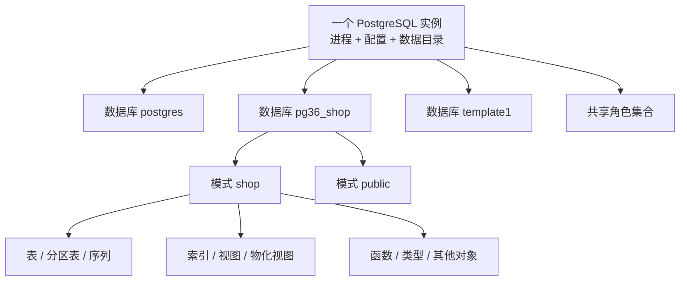

PostgreSQL 的对象不是装在一只名叫“数据库”的大盒子里。数据库和角色处在同一套服务器范围内，模式与关系对象则处在某一个数据库内部；一条普通连接只能进入其中一个数据库。只要层级画错，权限、命名、备份和迁移的判断就会跟着错。

先记住这张最小坐标图：



箭头表达包含或作用域，不表达磁盘上的目录结构。系统目录才是验证这些关系的权威入口。

## 1.2.1 实例、数据库、模式与关系对象 {#item-1-2-1}

PostgreSQL 文档更常使用“服务器”或“服务器进程”描述运行实体。工程语境中的一个 PostgreSQL **实例**，通常指一套正在运行的服务器进程，以及它们共同使用的配置、共享内存和数据目录。实例是运行边界，不是可以用 `CREATE INSTANCE` 创建的 SQL 对象。

一个实例管理多个**数据库**。数据库是连接边界：客户端在启动连接时选定数据库，普通 SQL 名称不能直接写成 `另一个数据库.模式.表` 跨库访问。确有跨库需求时，需要应用发起另一条连接，或显式使用 `postgres_fdw`、`dblink` 等机制；那是后续章节的内容。

每个数据库内部有多个**模式**（schema）。模式是数据库内的命名空间，`shop.orders` 中 `shop` 是模式，`orders` 是关系名。不同模式可以有同名对象，例如 `shop.orders` 与 `archive.orders`。

“关系”（relation）是 PostgreSQL 中一个比“表”更宽的家族。普通表、分区表、索引、序列、视图和物化视图等，都在 `pg_class` 中占有记录。先用系统目录观察层级：

```sql
-- 这张共享目录列出实例管理的数据库
SELECT oid, datname, datallowconn
FROM pg_catalog.pg_database
ORDER BY datname;

-- 以下目录只描述当前数据库中的对象
SELECT oid, nspname
FROM pg_catalog.pg_namespace
WHERE nspname !~ '^pg_temp_'
ORDER BY nspname;

SELECT
    n.nspname AS schema_name,
    c.relname AS relation_name,
    c.relkind
FROM pg_catalog.pg_class AS c
JOIN pg_catalog.pg_namespace AS n ON n.oid = c.relnamespace
WHERE n.nspname = 'shop'
ORDER BY c.relname;
```

`oid` 是 PostgreSQL 为许多对象分配的内部标识。把它用于取证和目录连接很方便，但不要把 OID 当成跨数据库、跨重建仍稳定的业务标识。应用数据应有自己的键。

可以用一个简单实验确认数据库边界：分别连接 `postgres` 和 `pg36_shop`，查询 `pg_namespace`。你会看到两个数据库各自拥有一套模式目录；而查询 `pg_database` 时，两边都能看到同一组数据库。

## 1.2.2 角色为何跨数据库存在 {#item-1-2-2}

角色（role）属于整个 PostgreSQL database cluster，而不是某一个数据库。原因很直接：客户端必须先用角色通过实例级认证，服务器才能允许它进入目标数据库。若角色本身藏在目标数据库里，认证顺序就会形成循环。

使用普通可见的 `pg_roles` 视图观察角色：

```sql
SELECT
    rolname,
    rolcanlogin,
    rolsuper,
    rolcreatedb,
    rolcreaterole
FROM pg_catalog.pg_roles
WHERE rolname LIKE 'pg36_%'
ORDER BY rolname;
```

在 `postgres` 与 `pg36_shop` 中执行这条查询，会看到相同的角色集合。底层的共享系统目录是 `pg_authid`，其中包含敏感认证信息，普通用户不应直接依赖；`pg_roles` 会隐藏密码字段。

角色跨数据库存在，不代表权限也自动跨数据库生效。需要分开看三件事：

1. **角色身份与成员关系**：在整个 database cluster 中存在；
2. **进入数据库的资格**：由数据库的 `CONNECT` 权限和认证规则控制；
3. **使用数据库内对象的权限**：由模式、表、序列、函数等各级授权控制。

例如，`pg36_app` 可以同时存在于所有数据库，却只被授予进入 `pg36_shop` 和使用 `shop` 模式的权限。角色名称与 Linux 用户也相互独立；本地 peer 认证可以建立两者的映射，但那是认证配置，不是二者天然相同。

用 PostgreSQL 自带的权限函数验证，不要只读 `GRANT` 脚本猜测最终结果：

```sql
SELECT
    has_database_privilege('pg36_app', 'pg36_shop', 'CONNECT')
        AS can_connect,
    has_schema_privilege('pg36_app', 'shop', 'USAGE')
        AS can_use_shop;
```

第二个函数必须在包含 `shop` 模式的数据库中执行。这个差异本身正好说明：角色是共享的，模式对象是数据库本地的。

## 1.2.3 表、索引、序列、视图、函数与扩展 {#item-1-2-3}

`psql` 的 `\d` 不是“describe table”的缩写式替代，而是进入 PostgreSQL 对象体系的一扇门。不同对象在目录中的位置和生命周期不同：

| 对象 | 主要目录证据 | 关键边界 |
|---|---|---|
| 表、分区表 | `pg_class`，`relkind` 为 `r`、`p` | 保存逻辑行；分区表本身与分区是不同关系 |
| 索引、分区索引 | `pg_class` + `pg_index` | 是独立关系对象，依赖被索引关系 |
| 序列 | `pg_class`，`relkind = 'S'` | 有独立状态；不是“表中自增列”的同义词 |
| 视图、物化视图 | `pg_class`，`relkind` 为 `v`、`m` | 普通视图保存查询定义，物化视图保存结果 |
| 函数、过程 | `pg_proc` | 名称可能重载，身份包含参数类型 |
| 扩展 | `pg_extension` + 成员对象 | 是安装、升级和卸载一组对象的打包边界 |

使用下面的查询把 `relkind` 翻译成可读类型：

```sql
SELECT
    n.nspname,
    c.relname,
    CASE c.relkind
      WHEN 'r' THEN 'table'
      WHEN 'p' THEN 'partitioned table'
      WHEN 'i' THEN 'index'
      WHEN 'I' THEN 'partitioned index'
      WHEN 'S' THEN 'sequence'
      WHEN 'v' THEN 'view'
      WHEN 'm' THEN 'materialized view'
      WHEN 'f' THEN 'foreign table'
      ELSE c.relkind::text
    END AS object_type
FROM pg_catalog.pg_class AS c
JOIN pg_catalog.pg_namespace AS n ON n.oid = c.relnamespace
WHERE n.nspname = 'shop'
ORDER BY object_type, c.relname;
```

扩展尤其容易被误解。`CREATE EXTENSION` 不是启动一个数据库外部插件进程，而是让 PostgreSQL 按扩展控制文件和 SQL 脚本创建并登记一组对象；某些扩展另外需要预加载共享库或外部服务，但不能据此概括所有扩展。查看当前数据库已安装扩展：

```sql
SELECT extname, extversion, extnamespace::regnamespace
FROM pg_catalog.pg_extension
ORDER BY extname;
```

扩展按数据库安装。软件包在操作系统上“可用”，不等于已经在每个数据库中执行了 `CREATE EXTENSION`。ch14《内核分支与扩展生态》会系统处理安装、启用、升级和退出成本。

## 1.2.4 PostgreSQL “database cluster”的特殊含义 {#item-1-2-4}

PostgreSQL 官方文档中的 **database cluster**，是“由一套服务器实例管理、存放在共同数据区域中的数据库集合”。`initdb` 的工作就是初始化这样一个 database cluster。它不天然表示多节点、高可用或分布式。

Pigsty 文档中的 **PGSQL 集群**，则是一个平台级业务单元：由一个主实例和零个或多个复制实例组成，通过服务暴露能力。每个实例都有自己的 PostgreSQL 数据目录；物理备库的数据来自主库复制，但仍是独立运行的服务器实例。

| 术语 | 本书中的含义 | 常见数量关系 |
|---|---|---|
| PostgreSQL database cluster | 一个实例所管理的一组数据库与共享角色 | 每个 PostgreSQL 实例一套 |
| PostgreSQL 实例 | 一套服务器进程、配置、共享内存和数据目录 | 一台节点通常一个，技术上可以多个 |
| Pigsty PGSQL 集群 | 作为自治服务单元的一组主备实例 | 一个或多个实例 |
| 数据库 | 客户端连接进入的逻辑边界 | 一个实例内多个 |
| 模式 | 某个数据库内的命名空间 | 一个数据库内多个 |

下面两条观察命令能把概念落到当前实例：

```sql
SHOW data_directory;

SELECT oid, datname
FROM pg_catalog.pg_database
ORDER BY oid;
```

`data_directory` 是当前实例的数据区域；`pg_database` 列出该实例所管理的数据库集合。生产环境不应依靠直接浏览数据目录理解对象，更不能手工移动或删除其中的文件。数据目录路径属于运维信息，公开证据包时应按环境敏感度处理。

若需要识别物理复制成员是否来自同一 PostgreSQL database cluster，可由有权限的管理员查询控制文件信息：

```sql
SELECT system_identifier, pg_control_version, catalog_version_no
FROM pg_catalog.pg_control_system();
```

物理主备通常共享 `system_identifier`；逻辑复制目标不会因此自动相同。这个值是取证线索，不是业务主键，也不等于 Pigsty 的 `pg_cluster` 名称。

### 本节验收：不用“数据库”糊弄过去

请为下面每项写出完整限定描述：

- `pg36_shop`：一个数据库；
- `shop`：`pg36_shop` 数据库中的模式；
- `pg36_app`：当前 PostgreSQL database cluster 中的角色；
- `pg-meta-1`：Pigsty 管理的 PostgreSQL 实例名；
- `pg-meta`：Pigsty PGSQL 集群名，也可能被配置为集群服务域名。

随后在 `postgres` 与 `pg36_shop` 各执行一次 `pg_roles`、`pg_database` 和 `pg_namespace` 查询。验收标准是：你能够根据结果解释哪些目录共享、哪些目录随数据库改变，而不是只说“两个库看起来差不多”。

## 参考资料

- [PostgreSQL 18：管理数据库概览](https://www.postgresql.org/docs/18/manage-ag-overview.html)
- [PostgreSQL 18：数据库角色](https://www.postgresql.org/docs/18/database-roles.html)
- [PostgreSQL 18：系统目录](https://www.postgresql.org/docs/18/catalogs.html)
- [PostgreSQL 18：数据库物理存储](https://www.postgresql.org/docs/18/storage.html)
- [Pigsty v4.4：PGSQL 集群模型](https://pigsty.io/docs/concept/model/pgsql/)

---

[上一节：从连接串识别操作落点](../01/) · [返回本章目录](../) · [下一节：一条查询经过了什么](../03/) ·
[查看全书目录](/toc/) · [查看索引中心](/indexes/)
