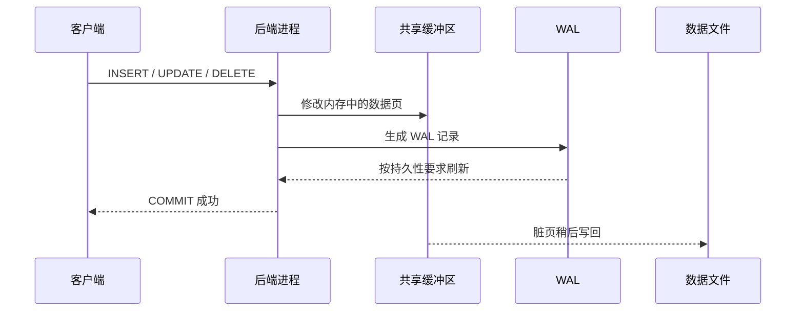

现在沿着已经确认的连接继续向内走。客户端发送的不是“直接操作磁盘”的命令，而是 PostgreSQL 前后端协议中的消息；服务器端后端进程在一个会话上下文中解析、规划并执行 SQL，再通过共享资源读写数据。

本节只建立全景路径。查询优化器、事务、锁和执行器的细节会在 ch05《查询、事务与锁的核心心智模型》和 ch07《执行计划与统计信息》中展开。

## 1.3.1 客户端、后端进程与会话 {#item-1-3-1}

PostgreSQL 采用客户端／服务器模型。`psql`、应用驱动和 GUI 都是客户端；`postgres` 服务器进程接受连接，并为每个直接连接创建一个后端进程（backend）。这个后端在连接存续期间保存会话状态，例如当前角色、当前数据库、参数、临时对象和事务状态。

连接池会改变观察方式。直连 PostgreSQL 时，一个客户端连接稳定对应一个后端；经过 PgBouncer 的事务池时，客户端连接与 PostgreSQL 后端只在事务期间绑定，下一个事务可能换到另一个后端。不要把某次观察到的 PID 永久记作“这个应用的进程”。

在当前连接中查看自己的会话：

```sql
SELECT
    pid,
    backend_type,
    datname,
    usename,
    application_name,
    client_addr,
    backend_start,
    state,
    wait_event_type,
    wait_event
FROM pg_catalog.pg_stat_activity
WHERE pid = pg_backend_pid();
```

这里有三类事实：

- `pid`、`backend_start` 描述当前后端生命周期；
- `datname`、`usename`、`application_name` 描述会话上下文；
- `state`、`wait_event_type`、`wait_event` 描述采样时刻正在做什么。

`state = 'active'` 只表示该后端当时正在执行查询，不等于它“健康”或“很忙”；`idle` 也不等于可以随意终止，因为客户端可能正在两次请求之间等待。活动视图是现场快照，解释它必须结合时间、事务状态和应用协议。

一条普通查询的最小路径如下：

1. 客户端建立连接并完成认证；
2. 客户端发送 SQL 或带参数的协议消息；
3. 后端解析语法，解析对象名称与权限；
4. 重写器处理规则和视图，规划器选择执行方案；
5. 执行器读取或修改关系页，必要时等待锁、I/O 或其他资源；
6. 后端把行、命令状态或错误返回客户端。

并行查询可能临时使用并行工作进程，但会话仍由领导后端承接；后台还有 autovacuum、WAL writer 等进程。它们都出现在进程体系中，却不是“一位用户连接一个会话”的反例。

### 双会话观察

打开终端 A，使用直连端点运行：

```sql
SELECT pg_backend_pid(), pg_sleep(10);
```

立刻在终端 B 中查询：

```sql
SELECT
    pid,
    application_name,
    state,
    wait_event_type,
    wait_event,
    left(query, 60) AS query_sample
FROM pg_catalog.pg_stat_activity
WHERE datname = current_database()
  AND query LIKE '%pg_sleep%'
  AND pid <> pg_backend_pid();
```

预期能看到终端 A 的后端处于 `active`，并等待 `Timeout/PgSleep`。这是受控 L1 实验，不要在共享生产连接池中用 `pg_sleep` 制造占用。

## 1.3.2 共享内存、数据文件与 WAL {#item-1-3-2}

不同后端进程需要看到同一份数据库状态，因此 PostgreSQL 使用共享内存协调缓存、锁、WAL 缓冲区和其他全局结构。最常被提到的 `shared_buffers` 是 PostgreSQL 管理的数据页缓存，但它不是数据库使用的全部内存；后端私有内存、操作系统页缓存和外部组件都在同一台主机上争用资源。

```sql
SELECT name, setting, unit, context
FROM pg_catalog.pg_settings
WHERE name IN (
    'shared_buffers',
    'wal_buffers',
    'work_mem',
    'maintenance_work_mem'
)
ORDER BY name;
```

`context` 提示参数需要怎样生效，但不直接说明“最佳值”。参数机制与资源预算留到 ch27《参数调优与资源治理》。

表和索引最终以页面形式保存在数据文件中。系统目录知道对象对应的相对路径：

```sql
SELECT
    'pg_catalog.pg_class'::regclass AS relation,
    pg_relation_filepath('pg_catalog.pg_class') AS relative_path;
```

返回的是相对于数据目录的路径线索，不是让用户绕过 PostgreSQL 直接读取或修改文件的接口。数据文件可能分段、使用表空间，并受到版本、存储管理器和关系类型影响。手工编辑数据目录几乎从来不是合格的应用操作。

WAL（Write-Ahead Log，预写式日志）记录数据库变化所需的重做信息。“先写”指的是：相关 WAL 必须在脏数据页落盘之前持久化；事务提交通常要等待其提交记录达到所要求的持久性级别，而数据页可以稍后由后台进程写出。这个顺序使崩溃恢复能够从一致检查点继续重放。

观察当前实例的 WAL 位置：

```sql
SELECT
    CASE
      WHEN pg_is_in_recovery()
        THEN pg_last_wal_replay_lsn()
      ELSE pg_current_wal_lsn()
    END AS observed_lsn,
    pg_is_in_recovery() AS in_recovery;
```

LSN（Log Sequence Number）是 WAL 流中的位置，不是墙上时钟，也不能脱离时间线和实例角色直接比较。WAL 也不是“把每条 SQL 原文记下来”的审计日志，更不能替代经过验证的备份；这些边界会在 ch20、ch21 和 ch32 分别用于复制、高可用与恢复。

可以先形成一个高层心智模型：



图中省略了锁、检查点、全页镜像、复制和存储栈等细节；它只用来记住 WAL 与数据页写出的先后约束。

## 1.3.3 系统目录与统计视图如何描述自身 {#item-1-3-3}

PostgreSQL 很大一部分可观测性来自“用 SQL 描述自己”，但系统目录与统计视图回答的是两类不同问题。

**系统目录**保存数据库的结构事实，例如：

- `pg_database`：有哪些数据库；
- `pg_namespace`：当前数据库有哪些模式；
- `pg_class`：有哪些关系对象；
- `pg_attribute`：关系有哪些列；
- `pg_proc`：有哪些函数与过程。

目录变化参与事务。例如，在事务中创建表后，当前事务能立即从 `pg_class` 看到它；回滚后记录消失。应用不应直接修改系统目录，而应使用 `CREATE`、`ALTER`、`DROP` 和 `GRANT` 等 SQL 接口。

**统计视图**描述运行活动与累计现象，例如：

- `pg_stat_activity`：当前会话、状态与等待；
- `pg_stat_database`：按数据库累计的事务、读写与冲突计数；
- `pg_stat_user_tables`：用户表扫描、修改与维护计数；
- `pg_stat_replication`：主库看到的复制发送状态。

统计信息可能因采样时刻、权限、统计重置和事务快照而变化。`0` 表示在当前统计口径下没有观测到，不等于历史上从未发生。监控系统从这些视图采集并保存时间序列，正是为了补上“当前快照没有历史”的缺口。

下面的查询把结构事实、运行事实和配置事实放在一张快照里：

```sql
SELECT jsonb_pretty(
    jsonb_build_object(
        'database', current_database(),
        'database_oid', (
            SELECT oid
            FROM pg_catalog.pg_database
            WHERE datname = current_database()
        ),
        'user', current_user,
        'backend_pid', pg_backend_pid(),
        'in_recovery', pg_is_in_recovery(),
        'server_version_num', current_setting('server_version_num'),
        'search_path', current_setting('search_path')
    )
) AS connection_snapshot;
```

JSON 只是便于保存的输出格式，不改变证据强度。对每个字段仍要问：

- 它来自客户端标签、配置、系统目录还是运行统计？
- 它描述当前连接、当前数据库、当前实例还是整套平台？
- 它会不会在重连、故障切换、统计重置或升级后改变？

### 本节验收：复述一条查询的旅程

不看本页，画出以下路径并为每一段写出一个可观察证据：

```text
客户端 →（可选代理）→ 后端进程 → 对象目录／执行器
                         ├→ 共享内存
                         ├→ WAL
                         └→ 数据文件
```

最低验收结果：

- 用 `pg_backend_pid()` 与 `pg_stat_activity` 从两个会话观察到同一个后端；
- 用 `pg_settings` 记录共享内存相关配置，而不是猜测；
- 用 `pg_relation_filepath()` 找到关系路径线索，但没有直接修改数据文件；
- 能解释系统目录的结构事实与统计视图的运行事实为什么不能混为一谈。

## 参考资料

- [PostgreSQL 18：体系结构基础](https://www.postgresql.org/docs/18/tutorial-arch.html)
- [PostgreSQL 18：服务器进程](https://www.postgresql.org/docs/18/app-postgres.html)
- [PostgreSQL 18：系统目录](https://www.postgresql.org/docs/18/catalogs.html)
- [PostgreSQL 18：累计统计系统](https://www.postgresql.org/docs/18/monitoring-stats.html)
- [PostgreSQL 18：WAL 可靠性](https://www.postgresql.org/docs/18/wal-reliability.html)

---

[上一节：PostgreSQL 对象与术语坐标](../02/) · [返回本章目录](../) · [下一节：从数据库实例到数据库服务](../04/) ·
[查看全书目录](/toc/) · [查看索引中心](/indexes/)
