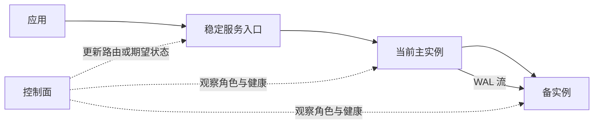

一个 PostgreSQL 实例可以接受连接、执行事务并持久化数据，却还不自动等于一项可交付的数据库服务。生产用户关心的是稳定入口、可用性、恢复目标、容量、安全与责任人，而不是某个进程今天恰好运行在哪台主机上。

从实例走向服务，不是贬低 PostgreSQL“功能不全”，而是把数据库内核与平台工程放在正确边界上。这个边界也是本书后半卷的总地图。

## 1.4.1 单实例、复制组、服务入口与控制面 {#item-1-4-1}

先把四个层次分开：

1. **单实例**：一套 PostgreSQL 服务器进程与数据目录。它可以是完整、可用的开发数据库，但主机或实例故障会直接中断服务；
2. **复制组**：主实例产生 WAL，一个或多个备实例接收并重放。复制提供数据副本与追赶机制，不自动回答何时提升、如何避免双主、客户端去哪里重连；
3. **服务入口**：用稳定的域名、VIP、代理端口或服务发现名称表达“读写”“只读”“管理直连”等访问意图，并把流量路由到当前合格实例；
4. **控制面**：保存期望状态、观察实际状态，并协调初始化、配置、选主、切换、备份、扩缩和维护等动作。

可以把请求路径与控制路径分开看：



实线是数据面：应用查询和复制数据真实流动的路径。虚线是控制面：决定谁有资格承载流量，以及系统应当处于什么状态。控制面发生故障，不一定让当前 PostgreSQL 事务立即停止；但它可能让后续切换、配置变更或成员管理失效。

PostgreSQL 原生提供物理复制、同步提交、恢复、时间线和角色状态等基础机制，却有意不规定唯一的高可用编排方案。你可以用 Patroni，也可以使用托管数据库控制面、Kubernetes Operator 或组织自建系统。ch20《高可用拓扑与容灾目标》会根据故障模型重新审视这些选择。

在单节点 L1 中，复制组退化为一个主实例，服务入口与控制面仍然存在。这很适合学习组件关系，却不能证明多节点高可用已经成立。不要从“我能访问 `5433`”推导出“这套环境能容忍主机故障”。

## 1.4.2 计算、存储、网络、配置与可观测职责 {#item-1-4-2}

数据库服务需要同时管理五类资源。每一类都要有“期望状态、运行事实、变更入口和失败边界”。

| 职责 | PostgreSQL 能看到或控制的部分 | 平台还必须承担的部分 | 最小证据 |
|---|---|---|---|
| 计算 | 后端进程、并行度、内存参数、后台任务 | CPU/NUMA、内存限额、OOM、操作系统调度、资源隔离 | `pg_stat_activity`、`pg_settings`、主机指标 |
| 存储 | 数据页、WAL、表空间、检查点、I/O 统计 | 磁盘与卷、文件系统、容量、冗余、快照、备份仓库 | `pg_stat_io`、目录容量、备份清单 |
| 网络 | 监听地址、连接、TLS、HBA、复制协议 | DNS、VIP、负载均衡、防火墙、跨区链路与证书分发 | `pg_hba_file_rules`、socket、路由和探测 |
| 配置 | GUC、角色和数据库级设置、重载与重启语义 | 模板、差异、密钥、分批变更、审计、回退 | `pg_settings`、配置清单、变更记录 |
| 可观测 | 系统目录、统计视图、日志、`EXPLAIN` | 指标与日志采集、长期存储、告警、面板、值班流程 | 原生查询、时间序列、告警事件 |

表格中的“平台”不是某个特定产品，而是任何生产方案都绕不开的责任集合。托管数据库把很多责任交给云厂商；自建系统则必须明确由谁实现、谁值守，以及产品边界之外还剩什么。

一个常见错误是只记录配置文件中的目标值。例如清单写着 `shared_buffers: 8GB`，实际实例可能尚未重启，`SHOW shared_buffers` 仍是旧值；清单写着实例角色为 `primary`，运行中的 PostgreSQL 却可能已经因为切换成为备库。声明、落地和运行事实是三层证据，不能互相替代。

另一个错误是把监控面板当成事实源本身。面板是对指标和日志的解释界面；当图表异常时，应当能够追到采集查询、标签、时间范围和 PostgreSQL 原生证据。反过来，只查询当前系统目录也没有历史，因此不能取代时间序列监控。

## 1.4.3 PostgreSQL 原生能力与平台组合能力的边界 {#item-1-4-3}

全书采用三层叙述，避免把某个平台的按钮写成数据库原理：

### 第一层：PostgreSQL 原生机制

包括 SQL 语义、事务与锁、MVCC、WAL、复制协议、备份与恢复接口、角色权限、配置参数、系统目录、统计视图和扩展机制。关键结论优先回到 PostgreSQL SQL、日志、配置或官方文档验证。

### 第二层：数据库平台通用职责

包括主机置备、软件分发、拓扑编排、故障检测、选主与防脑裂、稳定接入、连接池、备份调度、密钥管理、监控告警、变更审计和恢复演练。这些责任客观存在，但实现方式不唯一。

### 第三层：Pigsty 参考实现

Pigsty 使用声明式配置与自动化，把 PostgreSQL、Patroni、etcd、HAProxy、PgBouncer、pgBackRest 和可观测组件组合起来。它提供一套可以拆开验证的具体答案，而不是 PostgreSQL 唯一的运行方式。

面对任意平台操作，都按下面的证据链追问：

| 问题 | 例子 |
|---|---|
| 用户要实现的服务目标是什么？ | “写请求在主库故障后恢复”，而不是“运行一个切换命令” |
| PostgreSQL 提供了哪些原生状态？ | `pg_is_in_recovery()`、复制 LSN、时间线、事务只读状态 |
| 平台根据什么规则采取动作？ | 健康检查、租约、故障阈值、候选优先级和 fencing |
| Pigsty 由哪些组件实现？ | Patroni 决策角色，HAProxy 根据健康接口路由 |
| 如何从另一侧复核？ | SQL 角色、Patroni 状态、代理后端和指标应相互一致 |
| 失效时如何停止与回退？ | 停止自动动作、保护现场、恢复路由或重建成员 |

这套追问可以迁移到其他平台。即使界面、CLI 和组件名称完全不同，“服务目标—原生状态—控制规则—运行证据—回退路径”的结构仍然成立。

### 分类练习

把下面动作分别归入“PostgreSQL 原生机制”“平台通用职责”“Pigsty 具体实现”，允许一项跨两层，但要说明边界：

- `CREATE ROLE`；
- 为主库提供稳定域名；
- `pg_basebackup` 复制基础数据；
- 发现主实例故障后选择备实例提升；
- HAProxy 在 `5433` 暴露读写服务；
- `pg_stat_activity` 观察会话；
- 保存 30 天指标并在 SLO 违约时告警。

参考判断：`CREATE ROLE` 与 `pg_stat_activity` 是原生接口；稳定域名、故障切换和长期告警是通用职责；“HAProxy + 5433”是 Pigsty 的具体实现。`pg_basebackup` 是原生工具，但“何时运行、保存在哪里、如何校验”仍属于平台工作流。

### 本节验收

选取你当前连接的 `pg36_shop` 服务，写出一条完整证据链：

```text
服务目标
→ 客户端入口
→ 路由组件
→ PostgreSQL 实例
→ 原生 SQL 证据
→ 平台状态证据
→ 不一致时的停止条件
```

合格答案必须包含至少一个 PostgreSQL 原生查询，且不能只引用面板颜色或配置文件。下一节会把这条抽象链具体映射到 Pigsty。

## 参考资料

- [PostgreSQL 18：高可用、负载均衡与复制](https://www.postgresql.org/docs/18/high-availability.html)
- [PostgreSQL 18：监控数据库活动](https://www.postgresql.org/docs/18/monitoring.html)
- [Pigsty v4.4：PGSQL 架构](https://pigsty.io/docs/concept/arch/pgsql/)

---

[上一节：一条查询经过了什么](../03/) · [返回本章目录](../) · [下一节：Pigsty 的资源模型](../05/) ·
[查看全书目录](/toc/) · [查看索引中心](/indexes/)
