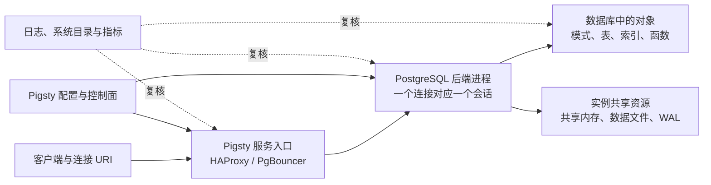

会写 SQL，并不等于知道 SQL 落在了哪里。一个连接 URI 里同时出现主机、端口、数据库和角色；连接成功后又会遇到实例、模式、关系、后端进程、WAL、服务端点与集群等词。它们属于不同层次，却经常被笼统地叫作“数据库”。许多误操作、权限错误和接入故障，都始于这张地图没有画清楚。

本章不急着介绍 PostgreSQL 的所有功能。我们只完成一件事：建立一套此后能够反复使用的坐标系。读者将从一条真实连接出发，逐层确认连接落点、对象边界、查询路径与服务拓扑，最后创建全书贯穿案例 `pg36_shop` 的最小基线。

> **版本基线**：本章按 PostgreSQL 18.4、Pigsty v4.4.0 和单节点 L1 沙箱编写。核心 PostgreSQL 概念适用于当前受支持的大版本；Pigsty 的端口、组件和配置入口以 v4.4.0 为准。所有命令都先查询实际运行版本，书中示例输出只展示需要判断的字段。

## 本章目标

回答“我连到了什么、数据对象在哪里、一次查询经过什么、Pigsty 又管理了什么”，并固化后续章节共同使用的实验基线。

## 读者前置

开始本章前，你应当已经：

- 掌握 Linux 终端、环境变量和基本文件操作；
- 会写常用 SQL，但不要求熟悉 PostgreSQL 的系统目录；
- 拥有一个可连接的 PostgreSQL 环境；推荐使用第 0 章准备的 Pigsty L1 沙箱；
- 知道实验管理员连接信息存放在哪里，但不会把密码写进书稿、脚本或 Git。

如果已经有其他 PostgreSQL 环境，也可以完成 1.1–1.3 与 1.6；1.4、1.5 和 1.7 中的服务拓扑与平台证据需要 Pigsty。

## 学习完成标准

完成本章后，你应当能够拿出证据完成以下任务，而不是凭名称猜测：

1. 从连接 URI 中指出主机、端口、数据库和登录角色，并用 SQL 确认服务器、数据库、会话角色、模式搜索路径与读写状态；
2. 解释实例、database cluster、数据库、模式和关系对象的包含关系，说明角色为什么不隶属于某一个数据库；
3. 画出“客户端 → 服务入口 → PostgreSQL 后端 → 共享内存／数据文件／WAL”的最小查询路径；
4. 区分 PostgreSQL 原生能力、生产平台必须承担的职责和 Pigsty 的具体实现；
5. 使用最少的一组 `psql` 命令探索对象、切换数据库、执行脚本、保存证据和安全中断；
6. 创建并验证 `pg36_shop` 数据库、`shop` 模式与最小角色，生成后续章节可复用的环境快照。

## 贯穿场景

假设应用团队交给你下面这样的连接入口：

```text
postgresql://pg36_app@pg-meta:5433/pg36_shop
```

这串字符并没有告诉你所有事实。`pg-meta` 可能是主机名，也可能是随主节点漂移的集群域名；`5433` 在 Pigsty 中通常是读写服务，而不是 PostgreSQL 进程直接监听的 `5432`；`pg36_shop` 是数据库名，不是实例名；`pg36_app` 是数据库角色，也不是 Linux 用户。只有把连接参数与服务器返回的证据合在一起，才能确认操作落点。

本章沿着同一条连接向内、再向外展开：



这张图不是完整架构图，而是本章的读图顺序：先确认连接参数，再让服务器说明自己是谁，然后才讨论平台如何把实例组合成服务。

## 本章路线

### [1.1 从连接串识别操作落点](01/)

先把 URI 中的五个名字拆开，并通过一条上下文快照查询确认“我到底连到了哪里”。这一节还会第一次区分实例端点、读写服务端点和只读服务端点。

### [1.2 PostgreSQL 对象与术语坐标](02/)

建立实例、database cluster、数据库、模式与关系对象的层级图，特别处理 PostgreSQL 中 “cluster” 与 Pigsty 集群容易混淆的问题。

### [1.3 一条查询经过了什么](03/)

用一个会话和一条查询观察客户端、后端进程、共享内存、数据文件、WAL、系统目录与统计视图各自扮演的角色。

### [1.4 从数据库实例到数据库服务](04/)

从单个 `postgres` 进程向外扩展，说明复制组、稳定入口、控制面、计算、存储、网络与可观测性为什么属于“服务”问题。

### [1.5 Pigsty 的资源模型](05/)

把通用职责映射到 Pigsty 的节点、实例、集群和服务，以及 PostgreSQL、Patroni、PgBouncer 与 HAProxy 的分工。

### [1.6 最小 psql 生存卡](06/)

只学习完成后续实验所需的最小命令集。更系统的连接保护、变量、脚本与可复现工作流留到 ch02《psql 与可复现工作流》。

### [1.7 实战：建立 `pg36_shop` 地图与实验基线](07/)

创建最小对象，采集连接、对象、服务与版本证据，建立 `verify:state` 和三档复位边界，并从 SQL 与 Pigsty 两侧指认同一对象。

## 本章交付物

完成实验后，至少保留以下内容：

- 一份不含密码的连接上下文快照；
- 一份 `pg36_shop` 对象树；
- 一份 L1 节点、实例、集群、服务与端口映射；
- `pg36_shop` 数据库、`shop` 模式和三类最小角色；
- 一次通过的 `verify:state` 输出；
- 明确的 `reset:sql`、`reset:cluster`、`reset:host` 适用边界。

这些产物从 ch02 开始会被直接复用。不要为了得到“好看”的输出而手工修改证据；环境差异本身也是需要记录的事实。

## 复习与迁移问题

1. `postgresql://alice@db.example:5433/shop` 中，哪一部分由客户端决定，哪一部分必须由服务器返回才能确认？
2. 为什么同一个角色可能连接多个数据库，而同一个普通表不能跨数据库直接访问？
3. 直连实例与连接稳定服务端点，各自暴露了什么假设？
4. `pg_is_in_recovery()` 能证明什么，不能证明什么？
5. 如果配置清单写着某实例是主库，而 SQL 显示它正在恢复，你会把哪一项当作当前运行事实？为什么？
6. 在托管数据库或 Kubernetes Operator 中，Pigsty 的“节点、实例、服务、控制面”分别可能映射成什么职责？

## 下一章如何使用本章

ch02《psql 与可复现工作流》不再解释这些对象是什么，而会把本章的临时命令整理成安全、可审查、可重跑的工作流。届时会加入服务文件、环境保护、失败即停、变量、确定性数据与机器可读输出。

如果此刻你仍不能在不查看答案的情况下画出连接到对象的完整路径，请先重做 1.7 的验收；后面的每一章都会默认这张地图已经建立。

## 参考基线

- [PostgreSQL 18：连接字符串](https://www.postgresql.org/docs/18/libpq-connect.html#LIBPQ-CONNSTRING)
- [PostgreSQL 18：体系结构基础](https://www.postgresql.org/docs/18/tutorial-arch.html)
- [PostgreSQL 18：数据库角色](https://www.postgresql.org/docs/18/database-roles.html)
- [PostgreSQL 18：psql](https://www.postgresql.org/docs/18/app-psql.html)
- [Pigsty v4.4：PGSQL 集群模型](https://pigsty.io/docs/concept/model/pgsql/)
- [Pigsty v4.4：服务与接入](https://pigsty.io/docs/pgsql/service/)

---

[返回上卷导读](/upper-volume/) · [下一章：手到擒来：psql 与可复现工作流](/psql-workflow/) ·
[查看全书目录](/toc/) · [查看索引中心](/indexes/)
