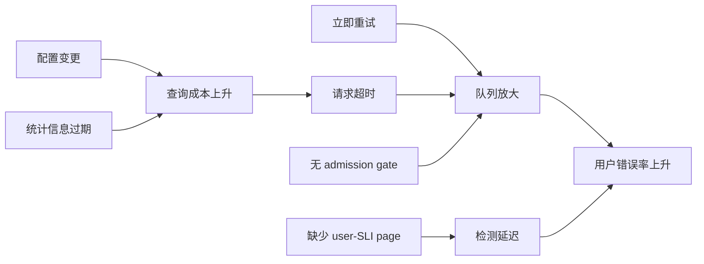

时间线回答“先后发生了什么”，因果分析回答“哪些条件共同使结果成为可能”。二者不能
互相替代：相关事件排在前面，不代表它导致后果；一个关键条件没有出现在日志里，也
不代表它不存在。

## 36.2.1 触发条件、放大机制与失效防线 {#item-36-2-1}

### 先建立三种时间

每条 timeline event 至少区分：

```text
event_time       被观察对象声称事件发生的时间
observed_at      collector 或人看到它的时间
recorded_at      它进入证据库的时间
```

再加：

```text
source_clock / timezone / clock_offset
sequence or monotonic marker
source identity and hash
actor or automation
action / observation / decision
knowledge available at that moment
confidence and later correction
```

跨 PostgreSQL、Patroni、HAProxy、应用、主机和外部依赖时，wall clock 可能偏移；事务
XID、LSN、timeline、request token、日志 sequence 和 trace span 能建立局部 happens-
before，但它们也不是一个全局时钟。不要为了画出整齐图表而把不确定的秒级顺序伪造
成毫秒精度。

### 因果链的五个位置

```text
latent condition
  平时存在但尚未造成可见影响的条件

trigger
  让系统进入失效路径的事件

amplifier
  扩大范围、持续时间或恢复难度的反馈

failed / absent defense
  本应阻断、发现或减轻路径却没有生效的控制

impact
  用户、数据、安全、恢复能力或运营负担的结果
```

以一个假设性 PostgreSQL 连接事故为例：

```text
latent:  pool 没有 admission budget，应用重试无 jitter
trigger: downstream latency 突升
amplifier: 请求超时 -> 立即重试 -> session/lock queue 继续增长
failed defense: user SLI 未分页，只有 node connection alert
impact: checkout timeout；后台任务挤占交互式容量
```

“连接数过多”只是中间状态；“调大 `max_connections`”可能增强放大器。好的分析会继续
问工作为何被允许无界进入、为何重试不知 commit outcome、为何隔离和降级没有生效。

### 用反事实检验边

对每条 `A -> B` 写出可反驳命题：

```text
evidence for temporal ordering
mechanism connecting A to B
independent observation
counterfactual: if A were absent, would B still occur?
alternative explanations
confidence
```

反事实不是要求在线复现生产事故。可以用 trace、query plan、WAL/lock graph、隔离
fixture、历史对照或模型验证。若证据只支持相关性，就写“contributing hypothesis”，
不要升级成 root cause。

### 防线为什么失效

逐层检查：

| 防线 | 应回答 |
|---|---|
| prevent | 为什么错误配置、无界请求或危险变更能进入系统 |
| detect | 为什么没有在用户影响前/同时发现 |
| mitigate | 为什么隔离、限流、降级或围栏没缩小影响 |
| recover | 为什么 restore、failover、rebuild 或对账不够快/不够可信 |

“告警触发了”不等于 detect control 有效。若它晚于客户投诉、没有 route、缺少 owner
或每次都误报，它只生成噪声。

## 36.2.2 技术、流程、组织与认知因素 {#item-36-2-2}

把 contributing factors 只写成技术缺陷，常常会在另一条路径重演同类事故。四个视角
互相约束：

### 技术

```text
software defect / query plan / lock behavior
capacity and queue design
replication, WAL, backup and storage
topology, routing and failure domain
configuration/default/version interaction
observability and identity
```

例如 Patroni 正确 promotion 仍可能遇到应用没有幂等 token；backup 完整仍可能因目标
选择或业务 delta 缺失而恢复错误 history。

### 流程

```text
review and approval
change staging and rollback
incident command and handoff
runbook decision points
backup/restore/failover exercise
action verification and expiry
```

不要把“runbook 没写”当终点。继续问：这个判断是否适合 runbook？信息能否自动采集？
当证据冲突时是否有 stop line？runbook 是否随当前版本演练过？

### 组织

```text
service and data ownership
on-call authority
dependency contract
priority and staffing
incentive and delivery pressure
cross-team escalation
```

如果 database team 能看到 replication lag，却不知道哪个 slot 属于谁，问题不是
`pg_replication_slots` 文档不足，而是 retention owner 没有进入服务目录与升级路径。

### 认知

```text
mental model available at the time
ambiguous names or dashboards
confirmation bias and anchoring
alert framing
hidden automation
training and experience
```

认知因素不是把责任还给个人。平台要让正确 mental model 更容易形成：明确 endpoint
语义、显示 target identity、把 evidence 与 inference 分栏、对危险动作展示前置谓词，
并让未知状态进入 `STOP_AND_ESCALATE`。

### 建一张因素矩阵

| 失效环节 | 技术 | 流程 | 组织 | 认知 |
|---|---|---|---|---|
| 进入 | 无 admission limit | 发布门未测压力 | owner 不明 | 把 timeout 当失败 |
| 扩大 | 即时重试 | 无降级触发线 | app/DB 各自优化 | 把 session 当容量 |
| 检测 | 缺 user SLI | 告警未演练 | page owner 空缺 | dashboard 名称误导 |
| 恢复 | 无 token 对账 | runbook 缺 stop | 权威不明确 | 先重启再取证 |

矩阵不要求每格都填内容；它防止团队只在自己熟悉的层面找答案。

## 36.2.3 避免单一根因和个人归罪 {#item-36-2-3}

### “谁执行”仍是事实，“谁粗心”不是机制

可审计表述：

```text
At T, the release role applied revision X to target Y.
The preview did not include generated lock acquisition.
The approval UI showed cluster name but not system identifier.
Rollback criterion was not defined before execution.
```

归罪表述：

```text
某某不够谨慎。
值班同学经验不足。
操作失误导致事故。
```

前者保留动作、上下文和控制缺口，后者用人格标签替代可改变的系统条件。真正无责的分析
假设参与者在当时信息、目标、工具和压力下有局部合理性，然后追问系统怎样让危险动作
显得合理。

### accountability 与 blame

无责不取消 accountability：

- incident commander 对响应目标与决策节奏负责；
- service owner 接受用户影响和 residual risk；
- action owner role 按期交付验证证据；
- reviewer 对结论的证据强度提出异议；
- management 为优先级、资源和到期 exception 作决定。

故意违规、欺诈、骚扰或安全事件可以进入独立的人事、法律或合规程序；不要把该程序
塞进技术复盘，也不要用“blameless”掩盖它。技术复盘仍分析系统如何预防、检测和限制
后果。

### 不要寻找一个可删除的“根”

复杂系统通常有多条必要/充分关系：

```text
trigger existed
AND guard absent
AND amplification active
AND detection late
AND recovery path unverified
-> observed impact
```

“五个为什么”可帮助继续追问，但线性链容易忽略并发分支。用 causal graph 表示：



行动优先选能切断多条边、覆盖多类事故且可验证的控制，而不是只修最后一次 trigger。
例如目标身份 + exact scope 的发布门，可能同时降低误恢复、误切换、误删 slot 和误改
PGDATA 的风险。

### 复盘结论的证据等级

```text
observed       source-bound direct evidence
corroborated   two independent observations agree
inferred       mechanism fits evidence, alternatives remain
hypothesized   plausible and testable, not yet verified
unknown        material fact unavailable
```

写作时保留等级。评审者要能指出哪条新证据会推翻结论；无法被反驳的“根因”通常也无法
指导一个可验证控制。

---

[上一节：服务恢复不等于事件结束](../01/) · [返回本章目录](../) · [下一节：证据质量与决策复盘](../03/) ·
[查看全书目录](/toc/) · [查看索引中心](/indexes/)
