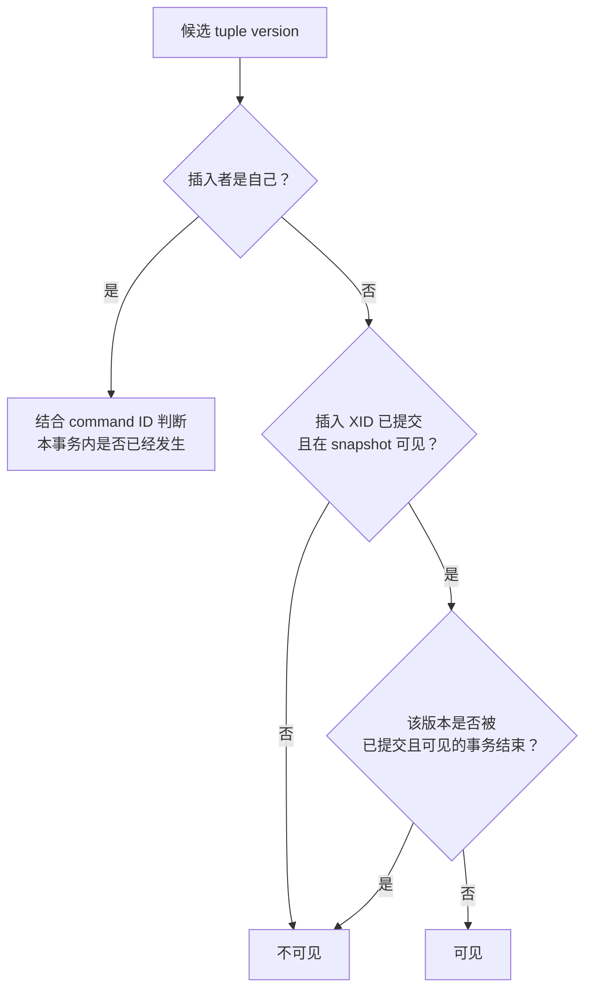

应用说“订单 1002 这一行”，heap 中却可能先后存在多个 tuple version。PostgreSQL 不让读取者与写入者围绕同一份可变字节互相排斥，而是让语句用 snapshot 判断哪些版本对自己可见。这就是 MVCC 的核心；它换来的并发性并非免费，旧版本最终必须由 VACUUM 安全回收。

## 5.2.1 元组版本、事务 ID 与快照 {#item-5-2-1}

对 heap table，`UPDATE` 的基本效果是建立新版本并让旧版本退出未来可见范围，不是原地覆盖所有字段。逻辑主键仍指向“同一订单”，但物理 tuple header 携带版本信息：

| 系统列 | 诊断含义 | 不能怎样用 |
|---|---|---|
| `xmin` | 插入此 tuple version 的 transaction ID | 不能当创建时间或全局唯一业务 ID |
| `xmax` | 删除/更新/锁定相关 XID 或 MultiXact 信息 | 非零不自动等于“已提交删除” |
| `ctid` | 当前 tuple version 的物理 page/slot | UPDATE、VACUUM FULL 等会改变，不能当主键 |
| `cmin/cmax` | 同一事务内 command ordering 的内部信息 | 不应写进应用协议 |

官方文档把 `xmin` 定义为“插入这个 row version 的事务”，并明确说每次更新会形成新的 row version。`xmax` 的语义更复杂：删除事务未提交、已经回滚，或行锁形成 MultiXact 时都可能非零。因此：

```sql
SELECT order_id, xmin, xmax, ctid
FROM shop.sales_order
WHERE order_id = 1002;
```

是很好的实验探针，却不是可靠的“这行是否存活”判断器。让 PostgreSQL 的 visibility machinery 返回普通 `SELECT` 结果，才是应用应使用的接口。

### XID 是版本排序工具，不是永久编号

普通内部 XID 是 32 bit 循环空间，依靠 modulo 比较和 freezing 维持可见性。它会 wrap around，也可能因只读事务尚未写入而暂未分配。`pg_current_xact_id_if_assigned()` 正是为了在不强行分配 XID 的情况下观察当前事务。

本章一次只读观察得到：

```text
assigned_xid_before_write=<none>
backend_snapshot=<none>|959|<none>|<none>
```

第一项是当前 backend 尚无 write XID；第二项依次是 `backend_xid`、`backend_xmin`、wait type、wait event。它不是“没有事务”：`BEGIN ... READ ONLY` 已经建立事务与 snapshot，只是尚不需要普通写 XID。

PostgreSQL 13 起提供的 `xid8`/`pg_snapshot` 函数给诊断和逻辑解码工具更适合的 64-bit 表达；它仍不是跨 cluster、跨恢复周期的订单 ID。业务标识继续使用 ch04 的 PK/业务键。

### snapshot 是边界加活跃集合

`pg_current_snapshot()` 的文本形状为：

```text
xmin:xmax:xip_list
```

例如 `959:959:` 表示：

- `snapshot xmin=959`：当时最老的活跃 top-level XID 边界；
- `snapshot xmax=959`：大于或等于这个上界的 XID 在快照时还不能视为已完成可见；
- `xip_list` 为空：在两个边界之间没有额外列出的活跃 top-level XID。

这不是“所有已提交事务清单”。对某个 tuple，系统还要结合插入/删除 XID 的提交状态、当前事务自身、command ID、MultiXact 与 hint/frozen 状态判断。snapshot 也只列 top-level XID，不直接列每个 subtransaction。

可下载的 [`observe.sql`](/labs/ch05/observe.sql)把同一 snapshot 保存后分别用：

```sql
pg_snapshot_xmin(snapshot)
pg_snapshot_xmax(snapshot)
pg_snapshot_xip(snapshot)
```

解析，避免在应用里用字符串切割重造规则。snapshot 导出/导入还有严格的事务与隔离级别条件，本章不把它扩展成分布式一致性方案。

## 5.2.2 活跃、提交、中止与可见性判断 {#item-5-2-2}

tuple header 记录“谁创建/结束版本”，transaction status 记录这些事务最终是 in progress、committed 还是 aborted，snapshot 则记录观察时刻的并发边界。可以先用一张非实现代码的判断图建立直觉：



真实实现还要处理 aborted XID、subtransaction、MultiXact、frozen tuple 和多种 infomask；这张图只用于解释责任分工，不能复制成应用端 visibility algorithm。

### 三种事务状态会留下不同结果

- **in progress**：普通并发读不能看到它尚未提交的 tuple version；
- **committed**：是否可见还取决于 snapshot 是否足够新；
- **aborted**：它写出的版本不成为正常可见数据，但空间和 WAL 工作不会凭空消失。

同一事务总能在适当 command boundary 后看到自己的写入，否则无法执行“插入后查询、再更新”。这由 command ID 与特殊的 self-visibility 规则配合完成，不意味着别的会话也可见。

在默认 Read Committed 中，每个 command 获取新 snapshot。因此事务 A 的两个普通 `SELECT` 之间若事务 B 提交，第二个查询可以看到新版本。在 Repeatable Read/Serializable 中，普通读取使用 transaction snapshot，不会因 B 后来提交而更新自己的视图。隔离级别改变的是 snapshot 生命周期和冲突处理，不是把 heap 换成另一套存储。

### 不要从 header 单字段猜提交状态

下面这些推论都不成立：

- `xmin` 小，所以一定 committed；
- `xmax=0`，所以永远没有锁；
- `xmax<>0`，所以该行已经删除；
- `ctid` 没变，所以没有并发更新；
- 当前 XID 比 tuple XID 大，所以可见。

例如行锁也可能写 `xmax`/MultiXact；aborted 删除会留下非零信息；VACUUM/freezing 与 hint bits 又会改变内部表示。需要调查某个 XID 时，可以在受控诊断中使用 `pg_xact_status(xid8)` 等官方函数并注明版本和保留窗口，但应用正确性不能依赖旧 XID 状态永远可查。

另一个边界是 sequence：`nextval` 的推进不随调用事务 rollback。这是为了并发与唯一分配效率，因此 identity/sequence 允许 gap。不要拿“订单行回滚了但 ID 跳号”反驳事务原子性；序列值本就有专门的非事务语义。

## 5.2.3 读不阻塞写的条件与代价 {#item-5-2-3}

PostgreSQL 文档常用“reading never blocks writing and writing never blocks reading”概括 MVCC。工程上应把它展开为：**在 primary 上，普通 heap `SELECT` 不与同一行的 row-level write lock 冲突；读取者可见旧的 committed version，写者创建新版本。**

这不意味着任意读永远不会等：

- `SELECT ... FOR UPDATE/SHARE` 主动成为 row locker；
- 普通 `SELECT` 的 `ACCESS SHARE` table lock 会被 `ACCESS EXCLUSIVE` DDL/maintenance 阻塞；
- query 可能等待 I/O、LWLock、buffer pin、WAL/IPC、parallel worker 或客户端；
- standby 查询可能与 recovery cleanup 冲突；
- CPU、buffer cache 和存储带宽仍会形成资源争用。

因此“读不阻塞写”是 lock compatibility 的精确性质，不是无延迟承诺。

### 本章实验中的两个并发结果

blocker 对订单 1002 执行未提交 `UPDATE` 后停在 `pg_sleep`。此时：

```text
blocker:
  backend_xid=962
  wait_event_type=Timeout
  wait_event=PgSleep

ordinary reader:
  statement_timeout=1s
  result=旧的已提交 request_fingerprint

second writer:
  state=active
  wait_event_type=Lock
  wait_event=transactionid
  pg_blocking_pids={blocker_pid}
```

普通 reader 没去读取 blocker 的脏版本，而是从版本链找到旧 committed tuple；second writer 不能同时决定同一逻辑行的下一版本，所以等待 blocker XID 完成。这正是“read concurrency 高、write conflict 仍需排序”的组合。

### 代价落在空间、WAL 与清理

更新旧版本不会立即消失，因为仍可能有旧 snapshot 需要它。结果包括：

- heap 中产生 obsolete/dead tuple，需要 VACUUM 标记空间可重用；
- indexes 可能增加新 entry，取决于 HOT 条件和 indexed columns；
- 写入与回滚都可能产生 WAL、dirty buffers 和统计计数；
- 长事务/长 snapshot 提高全局 xmin horizon，延迟 dead tuple 清理；
- autovacuum 既要回收空间，也要维护 visibility map 和防止 XID wraparound；
- index-only scan 是否免 heap fetch 还依赖 visibility map。

所以生产上“没有锁等待但表越来越大”并不矛盾。MVCC 把读写冲突转成版本管理工作；
[第 28 章](/vacuum-freeze-bloat/)会专门治理 VACUUM、freeze 和 bloat。

### 用三个问题判断所谓 MVCC 问题

1. **当前会话在等什么？** 看 `state`、`wait_event_type`、`wait_event`，不要先猜锁。
2. **谁阻碍了清理 horizon？** 看 transaction age、`backend_xmin`、replication slot/standby feedback 等证据。
3. **版本制造速度和回收速度是否失衡？** 看 tuple change、dead tuple、autovacuum、WAL 与 relation size 趋势。

把所有性能问题笼统叫“MVCC 膨胀”不会产生动作。现象必须落到 version churn、oldest snapshot、vacuum progress、lock/wait 或 I/O 中的一项。

---

[上一节：SQL 从文本到结果](../01/) · [返回本章目录](../) · [下一节：事务边界与失败语义](../03/) ·
[查看全书目录](/toc/) · [查看索引中心](/indexes/)
