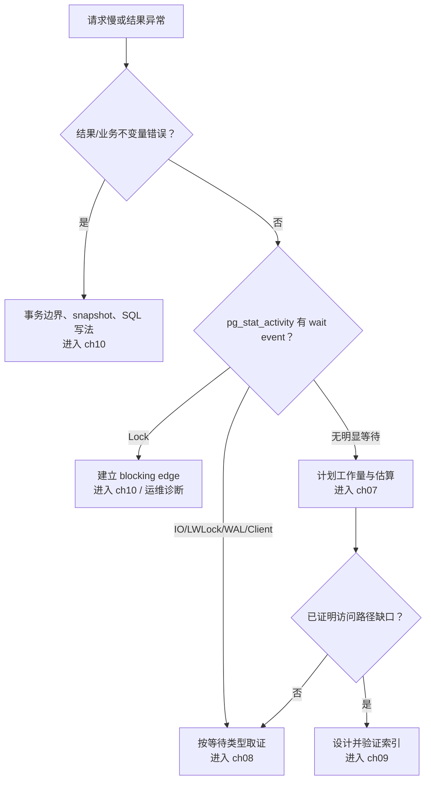

隔离级别不是从“弱一致”到“强一致”的四档万能开关。SQL 标准用禁止哪些并发现象来规定最低保证，PostgreSQL 再用 MVCC、snapshot isolation 与 SSI 给出自己的具体实现。讨论任何异常时，都必须同时写出数据库、隔离级别、SQL 形状和最终提交结果。

## 5.5.1 脏读、不可重复读、幻读与序列化异常 {#item-5-5-1}

先把四种现象定义准确：

- **dirty read**：读到并发 transaction 尚未提交的值；
- **nonrepeatable read**：同一 transaction 再读同一逻辑行，看到另一个已提交 transaction 的修改；
- **phantom read**：同一 transaction 重跑同一 predicate query，满足条件的 row set 因并发提交而变化；
- **serialization anomaly**：一组成功提交事务的总体结果无法等价于任何串行顺序。

PostgreSQL 18 的实际矩阵是：

| 请求的 isolation | dirty read | nonrepeatable | phantom | serialization anomaly |
|---|---:|---:|---:|---:|
| Read Uncommitted | 不会发生 | 可能 | 可能 | 可能 |
| Read Committed | 不会发生 | 可能 | 可能 | 可能 |
| Repeatable Read | 不会发生 | 不会发生 | 不会发生 | 可能 |
| Serializable | 不会发生 | 不会发生 | 不会发生 | 不会让异常事务全部成功提交 |

第一处 PostgreSQL 特性是：虽然接受四个标准名称，内部只有三个不同级别，Read Uncommitted 按 Read Committed 执行。第二处是 PostgreSQL Repeatable Read 比标准最低要求更强，不允许 phantom，但仍可能发生 serialization anomaly。

### snapshot 生命周期解释大部分差异

Read Committed 是默认级别。每个 command 使用 statement-start snapshot，因此：

```text
BEGIN;
SELECT ...;  -- snapshot S1
-- concurrent transaction commits
SELECT ...;  -- snapshot S2，可能看到新值/新行
COMMIT;
```

单条普通 `SELECT` 内部仍看到一致 snapshot，也不会读 dirty tuple。`UPDATE`/`DELETE`/locking SELECT 遇到并发更新时会等待，并在 Read Committed 规则下对最新版本重新判断条件；这让一条 command 的行为比“先固定全表 snapshot，再机械写入”更细致。

Repeatable Read 在 transaction 的第一个非 transaction-control statement 时取得 transaction snapshot，此后普通查询保持同一视图。如果它准备更新的目标已被 snapshot 之后的并发事务真正修改并提交，会收到 `40001`，必须整体重试。只读 Repeatable Read 不会因这种 row update conflict 失败，但仍可能观察到不满足任何串行顺序的跨行组合。

Serializable 在 Repeatable Read 的 snapshot 行为上增加 SSI dependency tracking。predicate lock（`SIReadLock`）用于发现危险的 read/write dependency，不像普通 row lock 那样阻塞 writer；若无法证明一组并发事务可串行化，至少一个以 `40001` 失败。因此“Serializable”承诺的是成功提交集合可串行化，不是所有 transaction 都无等待、无 abort。

### isolation 不能替代错误处理

更强隔离通常把 silent anomaly 转成可见 abort，而不是让 application 省掉重试。Serializable 环境必须：

- 对 `40001` 统一执行 whole-transaction retry；
- 只在 commit 成功后信任 transaction 内读到的结果；
- 限制 active connection 与 transaction 时长；
- 将只读事务声明 `READ ONLY`；
- 对适合的长只读任务考虑 `SERIALIZABLE READ ONLY DEFERRABLE`，理解它可能在开始时等待安全 snapshot。

sequence 仍有特殊非事务行为；外部 API 仍不受 isolation 管理。把 isolation 调高不能修复缺失 idempotency key、跨库原子性或错误的业务 predicate。

## 5.5.2 lost update 必须绑定具体隔离级别与写法 {#item-5-5-2}

“Read Committed 会丢更新”只说了一半。下面两个流程都想把库存从 10 减 1，结果不同。

### 原子相对更新

两个 session 都执行：

```sql
UPDATE inventory
SET stock = stock - 1
WHERE sku = 'SKU-GIFT'
  AND stock > 0
RETURNING stock;
```

在 Read Committed 下，第一个 writer 锁住目标行；第二个等待，随后在已更新版本上重新检查 `stock > 0` 并计算 `stock - 1`。若初始为 10，正常结果依次为 9、8，不会因两者都先拿到常量 10 而覆盖。

这仍需检查 affected row count：库存为 0 时返回零行，应用必须解释为 sold out，而不是假定成功。row-level `CHECK (stock >= 0)` 可以成为最后防线。

### 应用层 read-modify-write

两个 session 都先：

```sql
SELECT stock FROM inventory WHERE sku = 'SKU-GIFT'; -- 都读到 10
```

应用各自在内存算出 9，再执行：

```sql
UPDATE inventory
SET stock = 9
WHERE sku = 'SKU-GIFT';
```

第二个 writer 仍会等待第一个，但等待后把最新 9 又覆盖成常量 9；两次业务扣减只留下一个效果。这才是典型 lost update。锁确实排序了物理写入，却不知道常量 9 是由旧 snapshot 推导的。

可选控制方式：

| 方式 | SQL 合同 | 失败/等待语义 | 适用边界 |
|---|---|---|---|
| 原子相对 UPDATE | `SET stock=stock-1 WHERE stock>0` | row wait；零行表示条件失效 | 单行可表达运算，首选 |
| optimistic version | `WHERE id=? AND version=?` | 零行表示冲突，应用重新读/决策 | UI/API 更新、冲突不频繁 |
| pessimistic lock | `SELECT ... FOR UPDATE` 后计算 | 提前等待，事务持锁变长 | 必须读取多列后决定同一行 |
| Repeatable Read | transaction snapshot | 并发改同一行时常以 `40001` 失败 | 应用已有 whole-tx retry |
| Serializable | SSI 验证整体 serial order | 可能 `40001` | 跨行 predicate invariant |

optimistic 例子：

```sql
UPDATE inventory
SET stock = :new_stock,
    version = version + 1
WHERE sku = :sku
  AND version = :seen_version
RETURNING stock, version;
```

返回零行不是 database outage，而是“决策前提已经过期”。应用可返回 conflict 或在新值上重新执行业务逻辑，不能只把同一个常量 UPDATE 无限重试。

### lost update 与 write skew 不是同一异常

lost update 竞争同一逻辑值；write skew 往往更新不同行。两个医生各自看到“至少还有另一人值班”，随后分别把自己的行改为 off-call；没有同一行 write/write conflict，两者在 Repeatable Read 可能都提交，却破坏“至少一人值班”的跨行不变量。

处理优先级是：

1. 能用 PK/UK/FK/CHECK/EXCLUDE 等 declarative constraint 表达，就让数据库无条件拒绝；
2. 能收敛为同一 counter/guard row 的 atomic update，就避免分散 predicate；
3. 否则用 Serializable + whole-transaction retry，或明确、顺序一致的 predicate/row locking；
4. 用并发测试证明成功提交集合满足不变量。

只说“加 `FOR UPDATE`”也不完整：必须锁到所有能改变 predicate 的对象；若满足条件的 row 尚不存在，普通 row lock 没有一行可锁。第 10 章会用 write skew、phantom/predicate 和 retry harness 把这些边界逐项跑出来。

## 5.5.3 ch07–ch10 如何分别展开计划与并发 {#item-5-5-3}

本章的作用是建立分诊，不是在第一次遇见概念时把所有旋钮讲完。后续四章各回答一种不同问题：

### 第 7 章：计划为什么这样选

[执行计划与统计信息](/query-plans-statistics/)会深入：

- `EXPLAIN (ANALYZE, BUFFERS, WAL, SETTINGS)` 的安全使用；
- estimated/actual rows、loops 与第一次估算偏差；
- MCV、histogram、correlation 与 extended statistics；
- custom/generic prepared plans、parallel plan 与 JIT；
- planner cost calibration 和实验对照。

入口问题是“backend 没有明显 wait，但 plan 的工作量/估算哪里异常？”

### 第 8 章：慢时间到底花在哪里

[慢 SQL 诊断方法论](/slow-query-diagnosis/)会先做 workload attribution，再区分 CPU、I/O、lock、WAL、temp spill、client backpressure 和连接排队；结合 `pg_stat_statements`、auto_explain、logs、OS/Pigsty metrics 建立时间线。

入口问题是“用户说慢，先用什么证据把 wall time 拆开？”

### 第 9 章：索引是否真正改善目标 workload

[索引设计与效果验证](/index-design/)会从 equality/range/order/join pattern 设计 B-tree、GIN、GiST、BRIN、partial/expression/covering index，并同时验证写放大、空间、visibility map 与并发创建风险。

入口问题是“已经证明访问路径缺口，哪种 index contract 能改善且值得成本？”

### 第 10 章：并发提交是否仍满足不变量

[并发控制与隔离异常](/concurrency-isolation/)会用多个真实 session 复现 nonrepeatable read、lost update、write skew、deadlock、serialization failure，比较 atomic SQL、optimistic version、row lock、advisory lock 与 Serializable retry。

入口问题是“单事务看起来正确，多事务交错后哪些成功提交结果不再正确？”

### 当前应能完成的四向分诊



一条 SQL 同时可能有多个问题，但动作顺序仍要可证伪。例如 waiter 的 `EXPLAIN` 再漂亮，也不会解除 blocker；给一个错误的 read-modify-write 加索引，也不会消除 lost update。先判层，再深入，是本章希望形成的习惯。

---

[上一节：锁与等待](../04/) · [返回本章目录](../) · [下一节：实战：观察一笔订单事务](../06/) ·
[查看全书目录](/toc/) · [查看索引中心](/indexes/)
