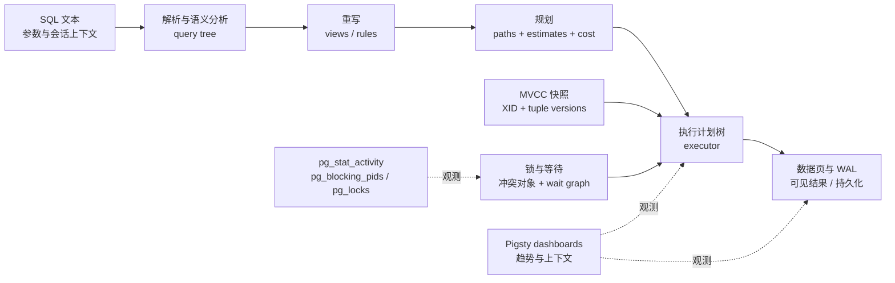

前四章已经把连接、工具、逻辑模型与物理数据合同固定下来。接下来遇到的三个问题看似分散：为什么同一条 SQL 会选择不同路径，为什么一个会话看不见另一个会话刚写的值，为什么一个“正在运行”的请求其实在等锁。它们必须放在同一张图中理解：SQL 被转换为执行计划，执行节点在某个 MVCC 快照上访问 tuple version，写操作再通过事务状态、锁和 WAL 协调并发与恢复。

本章建立这张原理地图，但刻意不把后续专题挤进一章。这里只要求读者能把现象归入正确层次、找到第一组权威证据，并知道下一步去哪里；第 7 章深入计划和估算，第 8 章建立慢 SQL 诊断流程，第 9 章验证索引设计，第 10 章再系统实验隔离异常与并发控制。

## 本章目标

完成本章后，读者应当能够：

- 按 raw parsing、semantic analysis、rewrite、planning、execution 解释 SQL 的处理路径；
- 区分 SQL 的关系语义与 Seq Scan、Hash Join、Sort 等物理执行节点；
- 把 planner cost 理解为基于统计与成本参数的比较量，而不是运行时间预言；
- 区分逻辑行与 heap tuple version，知道 `xmin`、`xmax`、`ctid` 只适合诊断；
- 读懂 `pg_snapshot` 的 `xmin:xmax:xip_list`，但不手工仿造完整可见性算法；
- 说明普通读为何通常不等待行级写锁，以及这种并发性的存储与维护代价；
- 正确处理 autocommit、显式事务、failed transaction 与 savepoint；
- 区分数据库原子性、WAL 持久化条件、复制确认与外部副作用；
- 区分 table lock、row lock、regular lock manager、LWLock 与 wait event；
- 用 `pg_stat_activity`、`pg_blocking_pids()` 和 `pg_locks` 还原一条阻塞边；
- 准确描述 PostgreSQL 四个隔离级别名称对应的三个实现级别；
- 把 lost update 绑定到具体隔离级别和 SQL 写法，而不是背一句口号；
- 在 Pigsty 的 Activity、Session、Xacts、Persist 与 PGCAT Locks 面板中提出可验证的问题；
- 完成一次 rollback-only 多会话实验，并证明业务状态没有漂移。

## 开始之前

本章沿用 ch02 的私有 `PGSERVICEFILE` 和 `pg36-admin` service，要求 ch04-v1 已验收：

```text
model_version=ch04-v1
order_count=2
relation_checksum=f8a7bfae59c6d16cd323abecfefe1014
```

实验基线为 PostgreSQL 18.4、Pigsty v4.4.0、Ubuntu 24.04；本章 SQL 和 shell 路径保持 PostgreSQL 14–18 可用。页面讲到 PostgreSQL 18 当前行为时，以 18 版官方文档为准；Pigsty 面板名以 v4.4 文档为准。不同大版本、内核分支或定制 dashboard 必须重新核对，不能仅凭截图类推。

下载资产：

- [实验合同与风险边界](/labs/ch05/lab-contract.md)
- [会话、快照、tuple 与 WAL 只读观察](/labs/ch05/observe.sql)
- [failed transaction 与 savepoint 反例](/labs/ch05/transaction-errors.sql)
- [回滚写入与 WAL 位置实验](/labs/ch05/wal-rollback.sql)
- [blocker SQL](/labs/ch05/blocking-blocker.sql)
- [waiter SQL](/labs/ch05/blocking-waiter.sql)
- [多会话阻塞编排器](/labs/ch05/blocking-lab.sh)
- [阻塞时间线 Mermaid 源文件](/labs/ch05/timeline.mmd)
- [状态验收](/labs/ch05/verify.sql)
- [综合任务入口](/labs/ch05/task.sh)

这些实验不创建 ch05 持久对象，也不提交业务写入，所以没有 reset 动作；这不等于“零代价”。回滚的 `UPDATE` 仍会取得锁、创建 tuple version、产生 WAL 和统计活动，blocking 动作还会取消一个精确识别的实验 backend。只能在已确认可演练的 L1/测试库运行。

## 一张贯通全章的图



这张图也给出诊断顺序。结果错误先问语义、快照与事务边界；查询慢先区分“在执行”还是“在等待”；计划异常先检查估算，不要看到 Seq Scan 就先建索引；提交延迟则需要区分本地 WAL、同步复制、锁与客户端网络。

## 所属位置

- 卷别：[上卷：应用开发](/upper-volume/)（独立导读页，不构成章节父目录）
- 教学分组：第一篇：筑基——建立 PostgreSQL 工程认知
- 兼容入口：`/ch05/`、`/volume-1/query-transaction-locks/`

## 本章目录

### [5.1 SQL 从文本到结果](01/)

- [5.1.1 解析、重写、规划与执行](01/#item-5-1-1)
- [5.1.2 关系代数直觉与执行节点](01/#item-5-1-2)
- [5.1.3 优化器为什么做估算而不是预言](01/#item-5-1-3)

先把“声明想要什么”与“服务器怎样得到它”分开，再理解统计估算为何是计划选择的输入而非未来运行时间。

### [5.2 MVCC 与可见性](02/)

- [5.2.1 元组版本、事务 ID 与快照](02/#item-5-2-1)
- [5.2.2 活跃、提交、中止与可见性判断](02/#item-5-2-2)
- [5.2.3 读不阻塞写的条件与代价](02/#item-5-2-3)

逻辑行通过多个物理版本演进；快照与事务状态决定当前语句看到哪个版本，VACUUM 则负责在安全之后回收代价。

### [5.3 事务边界与失败语义](03/)

- [5.3.1 自动提交、显式事务与中止状态](03/#item-5-3-1)
- [5.3.2 原子性、持久性与 WAL](03/#item-5-3-2)
- [5.3.3 保存点、重试边界与外部副作用](03/#item-5-3-3)

一个错误不仅是某条语句失败，还会改变整个事务的可用状态；数据库回滚也不会撤销已经发送的邮件、HTTP 请求或消息。

### [5.4 锁与等待](04/)

- [5.4.1 表锁、行锁与轻量级锁的职责](04/#item-5-4-1)
- [5.4.2 等待图、阻塞链与死锁检测](04/#item-5-4-2)
- [5.4.3 锁模式名称不等于业务影响](04/#item-5-4-3)

锁名、锁对象、冲突模式、持有时长和业务扇出共同决定影响；本章用一条真实的 transaction-ID wait 说明怎样从 waiter 回到 blocker。

### [5.5 隔离现象与后续路线](05/)

- [5.5.1 脏读、不可重复读、幻读与序列化异常](05/#item-5-5-1)
- [5.5.2 lost update 必须绑定具体隔离级别与写法](05/#item-5-5-2)
- [5.5.3 ch07–ch10 如何分别展开计划与并发](05/#item-5-5-3)

PostgreSQL 的 Read Uncommitted 等同 Read Committed，Repeatable Read 又比标准最低要求更强；隔离级别名称必须与具体 SQL 形状一起讨论。

### [5.6 实战：观察一笔订单事务](06/)

- [5.6.1 从 SQL 观察会话、快照、锁和 WAL 位置](06/#item-5-6-1)
- [5.6.2 从 Pigsty 观察连接、事务与等待指标](06/#item-5-6-2)
- [5.6.3 注入阻塞并解释“现象—证据—原理”](06/#item-5-6-3)

综合实验先建立前验，再观察快照和失败事务，最后用两个唯一命名会话制造阻塞、采集锁链、受控释放并执行后验。

## 章节产物

在 ch05 资产目录运行：

```bash
export PGSERVICEFILE="$PWD/pg_service.conf"
export PGSERVICE=pg36-admin
export PG36_EVIDENCE_DIR="$PWD/evidence/ch05/$(date -u +%Y%m%dT%H%M%SZ)"

./task.sh all
```

执行路径是：

```text
manifest
  → verify-before
  → observe
  → expected errors + savepoint
  → WAL-producing rollback
  → blocker / reader / waiter / observer
  → verify-after
```

一次 PostgreSQL 18.4 实测中，关键证据为：

```text
assigned_xid_before_write=<none>
transaction-errors: 22012 → 25P02
savepoint error:     23514 → ROLLBACK TO → valid write → ROLLBACK
wal_insert_advanced=t
reader_saw_previous_committed_version=true
waiter_wait_event_type=Lock
waiter_wait_event=transactionid
cancel_exact_blocker=t
state_restored=true
remaining_workers=0
```

XID、PID、LSN、`ctid` 和 WAL 字节数每次都会变化；它们是本次证据，不是 golden value。稳定验收是错误类别、阻塞关系和最终不变量：

```text
status=ok
model_version=ch04-v1
lab_state=rollback-only
active_lab_workers=0
order_1002_fingerprint=2bfa6eac30b9a1cfa2d51e98c4e98332
relation_checksum=f8a7bfae59c6d16cd323abecfefe1014
```

## 章节验收

1. 能说明 syntax parse 与 catalog-backed semantic analysis 不是同一步；
2. 能从 SQL 语义、plan node 与运行时状态三个层次解释一次查询；
3. 不把 cost 当毫秒，不把一次 `EXPLAIN ANALYZE` 当未来预测；
4. 能说明 snapshot 的边界含义，不把 `xip_list` 当全部已提交事务清单；
5. 不把 `xmin`、`xmax`、XID、LSN 或 `ctid` 当长期业务标识；
6. 能复现普通读看到旧已提交版本、同一行写者等待的差异；
7. 遇到 `25P02` 会回滚或回到 savepoint，而不是继续发送业务 SQL；
8. 能解释 rollback 后数据未变但 WAL insert LSN 仍可能前进；
9. 能说清 `synchronous_commit=off` 改变的是最近提交的持久性保证，而不是原子性；
10. 知道 `ROW EXCLUSIVE` 是表锁名称，且普通 `SELECT` 只与 `ACCESS EXCLUSIVE` 表锁冲突；
11. 能用 `pg_blocking_pids()` 建立 blocker 边，再用 activity 与 locks 补上下文；
12. 能区分长等待与死锁环，知道死锁受害事务需整体重试；
13. 能准确填出 PostgreSQL 的隔离现象矩阵；
14. 能分别判断原子 `UPDATE`、应用 read-modify-write、version predicate 和 `FOR UPDATE`；
15. `all` 前后 checksum 一致，且没有残留 lab backend。

下一章 [ch06《立木取信：开发规约与交付基线》](/development-standards/) 会把 ch01–ch05 已经验证的连接、命名、类型、错误、事务、超时和取证规则收敛为团队可执行的开发基线。

## 参考资料

- [PostgreSQL 18：The Path of a Query](https://www.postgresql.org/docs/18/query-path.html)
- [PostgreSQL 18：Executor](https://www.postgresql.org/docs/18/executor.html)
- [PostgreSQL 18：MVCC Introduction](https://www.postgresql.org/docs/18/mvcc-intro.html)
- [PostgreSQL 18：Transaction Isolation](https://www.postgresql.org/docs/18/transaction-iso.html)
- [PostgreSQL 18：Explicit Locking](https://www.postgresql.org/docs/18/explicit-locking.html)
- [PostgreSQL 18：Write-Ahead Logging](https://www.postgresql.org/docs/18/wal-intro.html)
- [PostgreSQL 18：System Information Functions](https://www.postgresql.org/docs/18/functions-info.html)
- [PostgreSQL 18：Cumulative Statistics](https://www.postgresql.org/docs/18/monitoring-stats.html)
- [Pigsty v4.4：PostgreSQL dashboards](https://pigsty.io/docs/pgsql/dashboard/)

---

[上一章：量体裁衣：数据类型、约束与可靠数据表达](/data-types-constraints/) · [返回上卷导读](/upper-volume/) · [下一章：立木取信：开发规约与交付基线](/development-standards/) ·
[查看全书目录](/toc/) · [查看索引中心](/indexes/)
