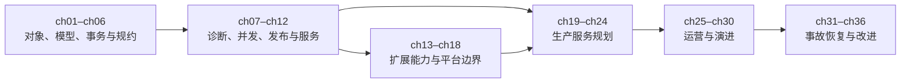

# 《PostgreSQL 36 计》

## 从 SQL 到生产：PostgreSQL 与 Pigsty 实战

> 最终目录设计
> 正文 36 章，分为上下两卷、六篇，每篇六章；另设不可跳过的全书导读、可跳过的第 0 章与若干速查附录。

---

# 全书导读（不可跳过，不计入 36 章）

## D.1 本书解决什么问题

- 从“会写 SQL”走到“能交付 PostgreSQL 应用”；
- 从“装好了数据库”走到“能运营 PostgreSQL 服务”；
- 从“看见告警”走到“能安全恢复并防止复发”；
- 用 Pigsty 把分散的 PostgreSQL 能力组合成可重复、可观察的生产实践。

## D.2 读者假设与知识边界

正文默认读者已经掌握：

- Linux、Shell、SSH、文件与进程的基本操作；
- DDL、CRUD、连接、聚合、子查询、CTE 与基础事务；
- 至少一种后端编程语言；
- 基本的软件工程、版本控制与测试概念。

本书会解释 PostgreSQL 特有的语义与工程方法，但不系统补授 Linux、通用 SQL 或编程基础。第 0 章只解决实验环境，不承担基础课职能。

## D.3 PostgreSQL 与 Pigsty 的关系

- PostgreSQL 是全书的核心知识对象；
- Pigsty 是全书统一的实验载体、观察窗口与生产参考实现；
- `[PG]` 表示可由 PostgreSQL 原生接口验证的能力；
- `[平台]` 表示任何生产数据库平台都必须承担的职责；
- `[Pigsty]` 表示 Pigsty 对这些职责的具体组合与实现；
- Pigsty 特有操作若容易被误解为 PostgreSQL 通用行为，会附一行跨平台职责映射，但不扩写成其他平台教程。

作者在序言中披露与 Pigsty 的关系。“36 计”只代表 36 个递进的实战单元，不把每章强行附会为古代计策。

## D.4 安全公约与风险标记

- `R0·观察`：只读查询、状态采样、计划分析，可在明确授权的环境中执行；
- `R1·可逆变更`：会改变对象、配置或流量，但有经过验证的回退路径；
- `R2·破坏性演练`：故障注入、切换、恢复、数据损坏，只能在可销毁的隔离环境执行；
- 全书示例使用专用实验凭据，不公开真实密码，不把数据库或管理入口裸露到公网；
- AI 辅助操作遵循最小权限、先预览、再验证原则，不允许“自动批准一切”；
- 任何生产命令都必须结合版本、拓扑、数据量和组织授权重新评估。

## D.5 版本契约与勘误机制

正式写作开始时冻结并公布一组可复现基线：

- PostgreSQL 大版本与小版本范围；
- Pigsty 版本与配置模板；
- 操作系统、内核与关键系统参数；
- Patroni、PgBouncer、HAProxy、备份工具及核心扩展版本；
- L1/L2/L3 实验拓扑的最低与推荐资源规格。

所有容易随版本变化的结论必须标注适用范围。面板讲指标语义，不依赖易漂移的点击路径；Pigsty 结论尽量回到 SQL、配置或原生组件验证。定稿前执行一次“版本增量通过”，出版后用在线勘误与版本矩阵维护差异。

## D.6 实验契约

每章按需提供以下产物，而不是机械凑齐固定数量：

- `setup`：建立确定的实验起点；
- `exercise`：主实验或故障注入；
- `verify:state`：机器验证系统是否达到预期状态；
- `checklist:evidence`：验证是否收集了足够决策证据；
- `expected`：关键输出及解释；
- `reset:sql`：重置数据库对象与数据；
- `reset:cluster`：恢复集群、服务与配置；
- `reset:host`：重建或回滚主机级环境。

实验数据生成器固定随机种子、规模档位与校验和。小规格虚拟机用于证明方法，不用于宣称绝对性能数字。

## D.7 贯穿案例与四个阶段

主线案例统一为 `pg36_shop`：

1. ch01–ch12：持续演进、可运行的电商与支付应用；
2. ch13–ch18：复用核心模式的独立能力场景，不强迫一个后端服务承载所有扩展；
3. ch19–ch30：复用确定性数据与工作负载，把应用建设成生产服务；
4. ch31–ch35：从快照克隆独立事故现场，避免演练相互污染；
5. ch36：将事故证据重新汇总到治理与平台演进。

## D.8 三层实验拓扑

- `L1`：单节点 Pigsty 开发沙箱，用于 ch01–ch18；
- `L2`：三节点、可销毁的生产仿真环境，用于 ch19–ch30；
- `L3`：由已知快照克隆的故障演练环境，用于 ch31–ch35。

L1/L2/L3 的精确规格由 ch08、ch20、ch32 三种样章实测后冻结。性能章节同时记录硬件、数据量、并发、缓存状态与噪声，避免把玩具环境结果外推到生产。

## D.9 推荐阅读路线

- 完整路线：ch01 → ch36；
- 应用开发：ch01–ch18，再读 ch22、ch23、ch25；
- DBA/SRE：ch01、ch02、ch05–ch10，再读 ch19–ch36；
- 架构与平台：ch01、ch06、ch12、ch14、ch17–ch24、ch36；
- 故障处置：先读 ch31，再按症状索引进入 ch32–ch35，不建议脱离前置知识直接照抄命令。

核心依赖关系：

## D.10 按任务查找

| 任务 | 首选章节 | 必要前置 |
|---|---|---|
| 设计可靠模式 | ch03–ch04 | ch01–ch02 |
| 查慢 SQL / 设计索引 | ch07–ch09 | ch05 |
| 处理并发错误 | ch10 | ch05 |
| 安全改表与发布 | ch11–ch12 | ch06–ch10 |
| 选择扩展 | ch14–ch18 | ch07–ch12 |
| 建设高可用与备份 | ch19–ch22 | ch01、ch05 |
| 建立安全与治理 | ch23–ch25 | ch19–ch22 |
| 压测、调优与维护 | ch26–ch30 | ch07–ch11、ch25 |
| 误操作恢复 | ch31–ch32 | ch21 |
| 主库或 DCS 故障 | ch31、ch33 | ch20 |
| 连接风暴与资源耗尽 | ch31、ch34 | ch22、ch25–ch28 |
| 数据损坏与抢救 | ch31、ch35 | ch21、ch28、ch30 |

---

# 第 0 章（可跳过）：扬帆起航——准备实验环境

已经拥有符合版本契约的 Pigsty 沙箱，并能确认 PostgreSQL 服务状态的读者，可直接进入 ch01。

## 0.1 选择实验环境

### 0.1.1 本地虚拟机、开发服务器与已有 Pigsty 环境

### 0.1.2 L1 沙箱的最低资源、网络与磁盘要求

### 0.1.3 云主机的防火墙、入口与费用边界

## 0.2 安装单节点 Pigsty 沙箱

### 0.2.1 获取与核对版本

### 0.2.2 配置、部署与幂等重跑

### 0.2.3 检查 PostgreSQL、连接池与观察组件状态

## 0.3 完成首次连通

### 0.3.1 找到服务端点、数据库与实验凭据

### 0.3.2 执行 `SELECT version()` 与只读状态查询

### 0.3.3 确认编码、时区和扩展清单后进入 ch01

---

# 上卷：应用开发

# 第一篇：筑基——建立 PostgreSQL 工程认知

## ch01 盲人摸象：PostgreSQL 与 Pigsty 全局地图

**本章目标**：回答“我连到了什么、数据对象在哪里、一次查询经过什么、Pigsty 又管理了什么”，并固化后续章节共同使用的实验基线。

### [PG] 1.1 从连接串识别操作落点

#### 1.1.1 主机、端口、服务、数据库与角色

#### 1.1.2 `current_database()`、`current_user` 与 `search_path`

#### 1.1.3 实例端点、服务端点与只读端点

### [PG] 1.2 PostgreSQL 对象与术语坐标

#### 1.2.1 实例、数据库、模式与关系对象

#### 1.2.2 角色为何跨数据库存在

#### 1.2.3 表、索引、序列、视图、函数与扩展

#### 1.2.4 PostgreSQL “database cluster”的特殊含义

### [PG] 1.3 一条查询经过了什么

#### 1.3.1 客户端、后端进程与会话

#### 1.3.2 共享内存、数据文件与 WAL

#### 1.3.3 系统目录与统计视图如何描述自身

### [平台] 1.4 从数据库实例到数据库服务

#### 1.4.1 单实例、复制组、服务入口与控制面

#### 1.4.2 计算、存储、网络、配置与可观测职责

#### 1.4.3 PostgreSQL 原生能力与平台组合能力的边界

### [Pigsty] 1.5 Pigsty 的资源模型

#### 1.5.1 节点、集群、实例与服务

#### 1.5.2 PostgreSQL、Patroni、PgBouncer 与 HAProxy 的职责

#### 1.5.3 配置清单、运行状态与监控事实分别来自哪里

> 跨平台职责映射：托管数据库通常把这些职责拆进实例、参数组、端点和监控服务；自建方案则由编排、代理与监控组件承担。

### [PG] 1.6 最小 psql 生存卡

#### 1.6.1 用 URI 连接，用 `\l`、`\dn`、`\d` 看对象

#### 1.6.2 用 `\c` 切库，用 `-c` 与 `-f` 执行

#### 1.6.3 用 `\o` 或 `-A -t` 保存输出

#### 1.6.4 用 `\q`、`Ctrl-C` 安全退出与中断

### [平台] 1.7 实战：建立 `pg36_shop` 地图与实验基线

#### 1.7.1 创建数据库、业务模式和最小角色

#### 1.7.2 生成连接快照、对象树、服务拓扑与环境清单

#### 1.7.3 建立 `verify:state` 与三档 `reset`

#### 1.7.4 验收：从 SQL 与 Pigsty 两侧指认同一对象

## ch02 手到擒来：psql 与可复现工作流

**本章目标**：掌握后续 34 章反复使用的最小工具链，把临时手工操作变成可审查、可验证、可重跑的任务。

### [PG] 2.1 可靠连接与上下文保护

#### 2.1.1 连接 URI、服务文件与环境变量

#### 2.1.2 `application_name`、提示符与上下文快照

#### 2.1.3 防止连错库、用错角色和改错模式

### [PG] 2.2 用 psql 探索与取证

#### 2.2.1 对象、权限和会话元命令

#### 2.2.2 扩展显示、分页、计时与查询缓冲区

#### 2.2.3 元命令与系统目录查询互相验证

### [PG] 2.3 编写可靠 SQL 脚本

#### 2.3.1 `ON_ERROR_STOP`、退出码与失败即停

#### 2.3.2 变量、条件、包含文件与事务包装

#### 2.3.3 幂等、重入与执行前预览

#### 2.3.4 日志、清单与机器可读结果

### [PG] 2.4 输入、输出与确定性数据

#### 2.4.1 `COPY` 与 `\copy` 的权限和执行边界

#### 2.4.2 CSV、文本与错误隔离

#### 2.4.3 固定随机种子、规模档位与校验和

### [PG] 2.5 最小 pgbench 工作负载

#### 2.5.1 初始化自定义脚本与参数

#### 2.5.2 区分吞吐、延迟、错误与环境噪声

#### 2.5.3 本节只建立可复现基线，不做性能结论

### [PG] 2.6 最小逻辑备份闭环

#### 2.6.1 `pg_dump` 的对象、模式与自定义格式

#### 2.6.2 `pg_restore` 的清单、选择性恢复与验证

#### 2.6.3 与 ch21《未雨绸缪：备份体系与恢复演练》的边界

### [平台] 2.7 实战：把人工操作变成可重跑任务

#### 2.7.1 生成 `pg36_shop` 初始数据与校验摘要

#### 2.7.2 从 Pigsty 服务端点执行并保存证据

#### 2.7.3 注入脚本错误，验证停止、修复与复位

## ch03 正本清源：从业务规则到关系模型

**本章目标**：先表达业务事实、不变量与所有权，再把逻辑模型 v0 跑进真实数据库；本章模式是过渡版本，可靠物理模式在 ch04 闭合。

### [PG] 3.1 从业务语言提取数据库事实

#### 3.1.1 实体、事件、状态与业务不变量

#### 3.1.2 命令模型、查询模型与数据所有权

#### 3.1.3 哪些规则必须由数据库兜底

### [PG] 3.2 标识、主键与业务键

#### 3.2.1 自然键、代理键与外部标识

#### 3.2.2 主键稳定性、键宽度与传播范围

#### 3.2.3 幂等键、去重键与审计标识

### [PG] 3.3 关系与引用完整性

#### 3.3.1 一对一、一对多与多对多

#### 3.3.2 外键动作与生命周期

#### 3.3.3 聚合边界与跨表不变量

### [PG] 3.4 模式、所有权与对象边界

#### 3.4.1 业务模式、接口模式与内部模式

#### 3.4.2 对象所有者与运行角色分离

#### 3.4.3 避免依赖不受控的 `search_path`

### [PG] 3.5 规范化与有意识的冗余

#### 3.5.1 函数依赖与重复事实

#### 3.5.2 派生数据、快照数据与缓存列

#### 3.5.3 接受冗余前先定义一致性责任

### [PG] 3.6 实战：建立逻辑模型 v0

#### 3.6.1 用户、商品、订单、订单项与支付

#### 3.6.2 在 Pigsty L1 的真实数据库中部署并用样例规则审查

#### 3.6.3 产出金额、时间、状态、标识四项未决清单

#### 3.6.4 生成逻辑关系图并链接 ch04 的可靠版本

## ch04 量体裁衣：数据类型、约束与可靠数据表达

**本章目标**：利用 PostgreSQL 类型系统、约束与分区决策，把 ch03 的逻辑模型逐项落成可靠物理模式。

### [PG] 4.1 金额、文本与时间

#### 4.1.1 整数、`numeric` 与金额精度

#### 4.1.2 `text`、排序规则与大小写语义

#### 4.1.3 `date`、`timestamptz`、时区与业务时间

### [PG] 4.2 标识、状态与半结构化数据

#### 4.2.1 `bigint`、UUID 与标识生成

#### 4.2.2 布尔、枚举、查找表与状态机

#### 4.2.3 数组、范围、JSONB 与拆表边界

### [PG] 4.3 NULL、默认值与生成值

#### 4.3.1 “未知”“不存在”与空值语义

#### 4.3.2 默认值、身份列与序列

#### 4.3.3 生成列与数据库派生事实

### [PG] 4.4 用约束表达不变量

#### 4.4.1 主键、唯一、外键与检查约束

#### 4.4.2 排他约束与 `btree_gist` 的适用条件

#### 4.4.3 仅对支持类型使用 DEFERRABLE，并说明事务末校验代价

### [PG] 4.5 类型与约束的物理代价

#### 4.5.1 行宽、对齐、TOAST 与更新成本

#### 4.5.2 隐式转换、操作符与索引可用性

#### 4.5.3 约束、索引与写放大的关系

### [PG] 4.6 分区决策门

#### 4.6.1 先证明生命周期、体量或裁剪需求再决定分区

#### 4.6.2 分区键与主键、唯一约束必须共同设计

#### 4.6.3 外键、引用方式与未来在线改造代价

#### 4.6.4 产出“现在分区 / 暂不分区”的可复查 ADR

### [PG] 4.7 实战：把逻辑模型落成可靠物理模式

#### 4.7.1 闭合金额与时间表达

#### 4.7.2 闭合状态与标识生成

#### 4.7.3 用反例验证类型、约束与错误语义

#### 4.7.4 在 Pigsty L1 输出可靠 DDL、分区决策与 `verify:state`

## ch05 运筹帷幄：查询、事务与锁的核心心智模型

**本章目标**：建立执行计划、并发控制和故障诊断共同依赖的原理地图，不在本章穷举后续专题。

### [PG] 5.1 SQL 从文本到结果

#### 5.1.1 解析、重写、规划与执行

#### 5.1.2 关系代数直觉与执行节点

#### 5.1.3 优化器为什么做估算而不是预言

### [PG] 5.2 MVCC 与可见性

#### 5.2.1 元组版本、事务 ID 与快照

#### 5.2.2 活跃、提交、中止与可见性判断

#### 5.2.3 读不阻塞写的条件与代价

### [PG] 5.3 事务边界与失败语义

#### 5.3.1 自动提交、显式事务与中止状态

#### 5.3.2 原子性、持久性与 WAL

#### 5.3.3 保存点、重试边界与外部副作用

### [PG] 5.4 锁与等待

#### 5.4.1 表锁、行锁与轻量级锁的职责

#### 5.4.2 等待图、阻塞链与死锁检测

#### 5.4.3 锁模式名称不等于业务影响

### [PG] 5.5 隔离现象与后续路线

#### 5.5.1 脏读、不可重复读、幻读与序列化异常

#### 5.5.2 lost update 必须绑定具体隔离级别与写法

#### 5.5.3 ch07–ch10 如何分别展开计划与并发

### [平台] 5.6 实战：观察一笔订单事务

#### 5.6.1 从 SQL 观察会话、快照、锁和 WAL 位置

#### 5.6.2 从 Pigsty 观察连接、事务与等待指标

#### 5.6.3 注入阻塞并解释“现象—证据—原理”

## ch06 立木取信：开发规约与交付基线

**本章目标**：不提前宣判“最佳实践”，而是建立“候选规则—证据—适用范围—例外—验证”的规约生成方法，产出 baseline v0.1。

### [平台] 6.1 规约不是口号

#### 6.1.1 从事故、评审和测量中形成规则

#### 6.1.2 每条规则记录动机、证据、例外和检查方式

#### 6.1.3 区分安全底线、团队默认与场景偏好

### [PG] 6.2 连接与会话候选规则

#### 6.2.1 连接上下文、超时与 `application_name`

#### 6.2.2 时区、编码、`search_path` 与会话状态

#### 6.2.3 用错误连接案例验证规则价值

### [PG] 6.3 模式与 DDL 候选规则

#### 6.3.1 命名、所有权、注释与对象边界

#### 6.3.2 类型、约束和默认值的审查问题

#### 6.3.3 可逆迁移与版本化 DDL

### [PG] 6.4 查询与事务候选规则

#### 6.4.1 明确列、稳定排序与分页语义

#### 6.4.2 事务大小、超时、重试与幂等

#### 6.4.3 CTE、窗口函数与 `LATERAL` 的可读性门槛

### [平台] 6.5 交付物与质量门

#### 6.5.1 DDL、迁移、数据生成与回滚

#### 6.5.2 自动测试、静态检查与计划证据

#### 6.5.3 变更说明、所有者与风险等级

### [Pigsty] 6.6 将规约接入统一实验环境

#### 6.6.1 角色、数据库与服务声明

#### 6.6.2 初始化、验证与重置入口

#### 6.6.3 配置事实与运行事实分开审查

### [平台] 6.7 实战：发布规约 baseline v0.1

#### 6.7.1 审查 ch01–ch05 已出现的候选规则

#### 6.7.2 为 `pg36_shop` 建立最小质量门

#### 6.7.3 预留 ch07–ch11 的证据追加区

#### 6.7.4 在 ch12 汇总为 v1.0 的验收条件

---

# 第二篇：应用——从 SQL 正确走向稳定交付

## ch07 追本溯源：执行计划与统计信息

**本章目标**：学会读计划、验证估算、解释计划变化，并建立分区裁剪和自动计划采样的正确边界。

### [PG] 7.1 优化器如何选择路径

#### 7.1.1 扫描、连接、排序、聚合与物化节点

#### 7.1.2 成本、选择率、行数与路径竞争

#### 7.1.3 计划树的阅读顺序与数据流

### [PG] 7.2 正确使用 EXPLAIN

#### 7.2.1 `EXPLAIN`、`ANALYZE`、`BUFFERS`、`WAL`

#### 7.2.2 规划时间、执行时间与客户端时间

#### 7.2.3 对写语句使用 `ANALYZE` 的事务保护

### [PG] 7.3 统计信息与估算偏差

#### 7.3.1 直方图、高频值、空值率与相关性

#### 7.3.2 扩展统计解决跨列相关

#### 7.3.3 数据倾斜、陈旧统计与采样误差

### [PG] 7.4 分区裁剪的两种时机

#### 7.4.1 规划时裁剪与常量条件

#### 7.4.2 执行时裁剪、参数化节点与通用计划

#### 7.4.3 分区父表统计需要显式 `ANALYZE`

#### 7.4.4 产出裁剪生效与失效的计划对照

### [PG] 7.5 参数、缓存计划与计划漂移

#### 7.5.1 自定义计划与通用计划

#### 7.5.2 预备语句、数据倾斜与参数敏感

#### 7.5.3 计划变化是症状，不自动等于回归

### [平台] 7.6 建立计划证据基线

#### 7.6.1 `pg_stat_statements` 的归一化视角

#### 7.6.2 `auto_explain` 的阈值、采样与日志成本

#### 7.6.3 从 Pigsty 时间窗保存 SQL、参数、统计、计划与环境上下文

### [PG] 7.7 实战：解释订单查询的计划变化

#### 7.7.1 用固定数据种子制造估算偏差

#### 7.7.2 修复统计与条件表达后重新比较

#### 7.7.3 把一条有证据的计划规则追加到规约

## ch08 抽丝剥茧：慢 SQL 诊断方法论

**本章目标**：从“用户说慢”出发，建立从范围界定、证据收集、假设排序到受控验证的诊断闭环。本章同时作为全书方法型样章。

### [平台] 8.1 先定义“慢”

#### 8.1.1 延迟分位数、吞吐、并发与错误率

#### 8.1.2 单次慢、持续慢与整体退化

#### 8.1.3 应用时间、排队时间与数据库时间

### [PG] 8.2 从会话到语句定位范围

#### 8.2.1 活跃、等待、阻塞与空闲事务

#### 8.2.2 按调用、总时长、均值和尾延迟排序

#### 8.2.3 查询指纹、参数与时间窗口

### [平台] 8.3 关联日志、指标与计划

#### 8.3.1 日志最小基线与慢语句记录

#### 8.3.2 SQL 指标、主机资源与部署事件

#### 8.3.3 用同一时间轴排除巧合

### [PG] 8.4 建立而不是猜测假设

#### 8.4.1 计划与估算问题

#### 8.4.2 锁、I/O、CPU、内存与临时文件

#### 8.4.3 客户端取数、网络与连接池排队

### [PG] 8.5 设计受控实验

#### 8.5.1 每次只改变一个解释变量

#### 8.5.2 冷热缓存、参数与数据规模控制

#### 8.5.3 反证、回退与副作用观察

### [Pigsty] 8.6 从可观测面板回到原生证据

#### 8.6.1 用指标语义定位时间、实例与查询

#### 8.6.2 用 SQL、日志和计划复核面板判断

#### 8.6.3 不把截图、颜色或当前点击路径当作知识

> 跨平台职责映射：其他平台可以使用各自的性能洞察或监控产品，但仍需落回查询指纹、等待、资源与执行计划这组证据。

### [平台] 8.7 实战：三种“慢”只修真正瓶颈

#### 8.7.1 估算错误、锁等待与客户端慢消费

#### 8.7.2 随机隐藏一种根因，先独立诊断再揭晓

#### 8.7.3 输出证据包、假设树、修复前后对照与复位结果

## ch09 巧夺天工：索引设计与效果验证

**本章目标**：从访问模式而不是字段直觉设计索引，并用读取收益、写入代价与维护成本共同验收。

### [PG] 9.1 索引方法与操作符类

#### 9.1.1 B-tree 与 Hash 的适用查询

#### 9.1.2 GiST、SP-GiST 与空间、范围、近邻问题

#### 9.1.3 GIN 与数组、JSONB、文本检索

#### 9.1.4 BRIN 与物理相关的大表；Bloom 的扩展边界

### [PG] 9.2 从谓词、连接与排序推导索引

#### 9.2.1 等值、范围与多列顺序

#### 9.2.2 连接键、排序、分组与 Top-N

#### 9.2.3 选择率、相关性与访问路径

### [PG] 9.3 表达式、部分与覆盖索引

#### 9.3.1 表达式必须与查询语义一致

#### 9.3.2 部分索引的谓词蕴含与参数陷阱

#### 9.3.3 `INCLUDE`、index-only scan 与可见性图

### [PG] 9.4 索引也有写入和生命周期成本

#### 9.4.1 写放大、缓存占用与 WAL

#### 9.4.2 HOT 更新、页分裂与填充因子

#### 9.4.3 重复、未使用与失效索引的判断

### [平台] 9.5 验证而不是“加完就快”

#### 9.5.1 计划、缓冲区、延迟分布与写入代价

#### 9.5.2 数据规模和缓存状态一致的 A/B 对照

#### 9.5.3 线上创建、失败回收与监控窗口

### [PG] 9.6 实战：为订单、库存与搜索入口设计索引

#### 9.6.1 从真实查询清单提出候选索引

#### 9.6.2 在 Pigsty L1 保留、合并或拒绝并记录证据

#### 9.6.3 将索引审查规则追加到规约

## ch10 顾此失彼：并发控制与隔离异常

**本章目标**：在明确隔离级别和业务不变量的前提下重现并发异常，选择锁、条件更新、重试与幂等策略。

### [PG] 10.1 隔离级别与可观察现象

#### 10.1.1 Read Committed 的语句快照

#### 10.1.2 Repeatable Read 的事务快照与写冲突

#### 10.1.3 Serializable、谓词冲突与序列化失败

### [PG] 10.2 Lost update 不是一句口号

#### 10.2.1 读—算—写在 Read Committed 下如何丢更新

#### 10.2.2 原子更新与带版本条件的更新

#### 10.2.3 更高隔离级别何时拒绝而不是静默覆盖

### [PG] 10.3 悲观锁与锁队列

#### 10.3.1 `FOR UPDATE`、`NO KEY UPDATE` 与引用关系

#### 10.3.2 `NOWAIT`、`SKIP LOCKED` 与任务领取

#### 10.3.3 锁顺序、阻塞链与死锁

### [PG] 10.4 乐观控制、重试与幂等

#### 10.4.1 版本列、唯一键与条件写入

#### 10.4.2 重试只包围可重放的事务

#### 10.4.3 支付、消息与外部副作用的边界

### [PG] 10.5 咨询锁与跨行协调

#### 10.5.1 会话级与事务级咨询锁

#### 10.5.2 键空间、碰撞与所有权

#### 10.5.3 不用咨询锁掩盖缺失的数据约束

### [平台] 10.6 观察与诊断并发

#### 10.6.1 `pg_stat_activity`、`pg_locks` 与等待事件

#### 10.6.2 从 Pigsty 定位锁等待与长事务

#### 10.6.3 保存阻塞图，而不是先杀会话

### [PG] 10.7 实战：库存扣减与支付幂等

#### 10.7.1 在指定隔离级别重现丢更新和死锁

#### 10.7.2 比较原子更新、行锁与可重试事务

#### 10.7.3 用并发测试验证业务不变量并追加规约

## ch11 守正出奇：模式变更与安全发布

**本章目标**：先判断锁、重写、扫描和兼容性，再设计可观察、可中止、可回退的模式发布；完成分区能力的第三个触点。

### [PG] 11.1 识别 DDL 的四类风险

#### 11.1.1 锁等级与持锁时间

#### 11.1.2 表重写、全表扫描与 WAL 放大

#### 11.1.3 新旧应用版本的兼容窗口

#### 11.1.4 数据回填的节奏与失败恢复

### [平台] 11.2 Expand–Migrate–Contract

#### 11.2.1 先扩展兼容结构

#### 11.2.2 分批迁移、双读校验与切换

#### 11.2.3 观察稳定后再收缩旧结构

### [PG] 11.3 索引与约束的在线化路径

#### 11.3.1 `CREATE INDEX CONCURRENTLY` 的阶段与失败残留

#### 11.3.2 `NOT VALID`、`VALIDATE CONSTRAINT` 与验证扫描

#### 11.3.3 默认值、非空与类型变更的版本边界

### [PG] 11.4 在线分区化

#### 11.4.1 从 ch04 的分区 ADR 选择迁移路径

#### 11.4.2 预建约束、`ATTACH` 与扫描规避

#### 11.4.3 `DETACH`、并发能力与锁等级必须按版本说明

#### 11.4.4 产出一次可回退的分区化发布

### [平台] 11.5 数据回填与流量切换

#### 11.5.1 批次、限速、水位与断点续跑

#### 11.5.2 影子读、双写的风险与一致性验证

#### 11.5.3 何时暂停、回退或前滚

### [Pigsty] 11.6 发布窗口中的平台观察

#### 11.6.1 从服务入口隔离实验流量

#### 11.6.2 观察锁、复制延迟、WAL 与资源水位

#### 11.6.3 配置变更与模式变更分别留证

### [平台] 11.7 实战：无中断演进订单模式

#### 11.7.1 加字段、回填、建约束与新旧版本共存

#### 11.7.2 注入锁等待和回填中断，验证中止与恢复

#### 11.7.3 把发布证据与新规则追加到规约

## ch12 一气呵成：从数据库契约到后端服务

**本章目标**：把前十一章收束成一个可运行、可观测、可部署的最小服务；后续章节不再长期维护同一套 Go 代码。

### [平台] 12.1 数据库契约与应用边界

#### 12.1.1 模式、查询、错误与兼容性契约

#### 12.1.2 业务不变量在应用与数据库之间分工

#### 12.1.3 迁移版本与服务发布的依赖

### [PG] 12.2 为服务设计查询接口

#### 12.2.1 参数化 SQL 与稳定结果语义

#### 12.2.2 CTE、窗口函数和 `LATERAL` 的工程用法

#### 12.2.3 错误码、约束名与领域错误映射

### [平台] 12.3 Go 服务中的连接与事务

#### 12.3.1 连接池大小、超时与上下文取消

#### 12.3.2 事务函数、失败重试与外部副作用

#### 12.3.3 健康检查不等于业务可用

### [PG] 12.4 会话状态与连接池陷阱

#### 12.4.1 session、transaction 与 statement pooling

#### 12.4.2 预备语句行为必须绑定 PgBouncer 与驱动版本

#### 12.4.3 `SET LOCAL`、事务边界与 RLS 上下文

#### 12.4.4 在 ch22、ch23 分别深化池化与权限

### [平台] 12.5 服务级可观测性

#### 12.5.1 请求、事务、查询指纹与 `application_name`

#### 12.5.2 延迟、错误、连接等待和数据库等待

#### 12.5.3 从一次请求追到数据库证据

### [Pigsty] 12.6 部署与接入 `pg36_shop`

#### 12.6.1 角色、数据库、服务与凭据声明

#### 12.6.2 通过连接池和服务端点接入

#### 12.6.3 用平台指标验证部署，而非只看进程存活

> 跨平台职责映射：托管平台通常通过端点、连接池或代理、密钥服务和监控产品提供同类职责，具体配置方式并不通用。

### [平台] 12.7 实战：交付应用闭环与规约 v1.0

#### 12.7.1 跑通下单、扣库存、支付幂等与查询

#### 12.7.2 注入数据库超时、重试与连接耗尽

#### 12.7.3 汇总 ch07–ch11 的证据，发布规约 v1.0

#### 12.7.4 冻结服务样例，后续改用 SQL 与工作负载脚本

---

# 第三篇：扩展——扩大 PostgreSQL 的能力边界

## ch13 言出法随：函数、触发器与存储过程

**本章目标**：判断逻辑应该位于 SQL、数据库函数、触发器还是应用中，并能测试、观测和安全发布数据库端逻辑。

### [PG] 13.1 先决定逻辑放在哪里

#### 13.1.1 数据不变量、批处理与接口封装

#### 13.1.2 数据库内聚与应用可演进性的权衡

#### 13.1.3 不用触发器隐藏跨系统工作流

### [PG] 13.2 SQL 与 PL/pgSQL 函数

#### 13.2.1 参数、返回值、集合与多态

#### 13.2.2 波动性、严格性、并行安全与规划影响

#### 13.2.3 异常、子事务与错误契约

### [PG] 13.3 触发器与约束触发器

#### 13.3.1 行级、语句级与 transition table

#### 13.3.2 BEFORE、AFTER 与 INSTEAD OF

#### 13.3.3 递归、顺序、批量写入与隐藏成本

### [PG] 13.4 过程、任务与事务控制

#### 13.4.1 procedure 与 function 的边界

#### 13.4.2 批处理、维护任务与显式事务

#### 13.4.3 调度属于平台职责，不由过程本身解决

### [PG] 13.5 安全、测试与观测

#### 13.5.1 `SECURITY DEFINER`、固定 `search_path` 与最小权限

#### 13.5.2 单元测试、属性测试与并发测试

#### 13.5.3 函数级统计、日志与慢调用定位

### [PG] 13.6 实战：为订单状态建立数据库端护栏

#### 13.6.1 比较约束、函数、触发器与应用实现

#### 13.6.2 注入绕过应用的错误写入

#### 13.6.3 在 Pigsty L1 输出实现选择、测试证据与回退脚本

## ch14 博采众长：内核分支与扩展生态

**本章目标**：不从“能安装”推导“该使用”，建立扩展发现、选型、供应链、升级与退出的统一 ADR。

### [PG] 14.1 PostgreSQL 扩展机制

#### 14.1.1 control、SQL 脚本、动态库与对象所有权

#### 14.1.2 普通扩展、预加载库与超级用户需求

#### 14.1.3 扩展依赖、版本与 `ALTER EXTENSION`

### [平台] 14.2 内核、发行版与托管服务

#### 14.2.1 上游 PostgreSQL、补丁内核与兼容性承诺

#### 14.2.2 包仓库、容器镜像与托管白名单

#### 14.2.3 “兼容 PostgreSQL”需要逐层验证

### [平台] 14.3 扩展选型的六个问题

#### 14.3.1 它解决的具体问题和原生替代是什么

#### 14.3.2 数据格式是否锁定、能否导出和退出

#### 14.3.3 维护活跃度、许可证与商业连续性

#### 14.3.4 权限、崩溃面与供应链风险

### [PG] 14.4 生命周期与升级耦合

#### 14.4.1 安装版本不等于数据库对象版本

#### 14.4.2 大版本升级、备份恢复与逻辑复制兼容

#### 14.4.3 依赖扩展不可用时的降级策略

### [Pigsty] 14.5 用 Pigsty 管理扩展可用性

#### 14.5.1 包、仓库、模板与节点差异

#### 14.5.2 声明安装与数据库内 `CREATE EXTENSION`

#### 14.5.3 从监控和日志识别加载失败

> 跨平台职责映射：托管数据库由扩展白名单与版本策略承担这部分职责；自建环境需要自己管理包、动态库、预加载和升级顺序。

### [平台] 14.6 建立可复用扩展 ADR

#### 14.6.1 问题、候选、假设与成功标准

#### 14.6.2 最小 PoC、风险清单与退出路径

#### 14.6.3 结论的版本范围和复审触发器

### [平台] 14.7 实战：评审三个候选扩展

#### 14.7.1 一个接受、一个试点、一个拒绝

#### 14.7.2 在 L1 安装并验证原生对象与平台状态

#### 14.7.3 产出供 ch15–ch17 复用的 ADR 模板

## ch15 见微知著：全文、模糊与向量检索

**本章目标**：从检索质量与业务语义出发，完成全文、模糊、向量和混合检索的最小可复现 PoC，并知道生产代价。

### [PG] 15.1 先定义检索任务与评估集

#### 15.1.1 精确筛选、词法相关与语义相似

#### 15.1.2 查询、候选、排序和过滤的分层

#### 15.1.3 建立带人工相关性标签的查询集合

### [PG] 15.2 PostgreSQL 全文检索

#### 15.2.1 文档、词典、配置与 `tsvector`

#### 15.2.2 查询语法、权重与相关性排序

#### 15.2.3 GIN/GiST 索引、更新与语言边界

### [PG] 15.3 模糊匹配与拼写容错

#### 15.3.1 `pg_trgm` 相似度与距离

#### 15.3.2 前缀、包含、拼写错误与候选召回

#### 15.3.3 与全文检索的互补和重复

### [PG] 15.4 可复现的向量检索

#### 15.4.1 维度、距离度量与归一化

#### 15.4.2 精确近邻与近似索引

#### 15.4.3 索引参数、过滤条件与召回代价

#### 15.4.4 冻结文本、模型标识、许可证、向量文件与校验和

### [PG] 15.5 混合检索与排序验证

#### 15.5.1 词法、模糊和语义候选合并

#### 15.5.2 分数归一、倒数排名融合与重排

#### 15.5.3 用标注集比较质量，不用单个“好看案例”

### [Pigsty] 15.6 扩展部署与运行代价

#### 15.6.1 安装检索扩展并核对版本

#### 15.6.2 观察索引体积、构建、查询和维护

#### 15.6.3 外部嵌入生成的权限、费用与数据边界

### [平台] 15.7 实战：`pg36_shop` 商品混合检索 PoC

#### 15.7.1 用冻结向量离线复现实验

#### 15.7.2 比较全文、模糊、向量与混合结果

#### 15.7.3 输出 ADR、质量证据、生产代价与退出路径

#### 15.7.4 验收采用 `checklist:evidence`，不设脱离场景的性能线

## ch16 经天纬地：时序、空间与时空查询

**本章目标**：分别建立时间与空间数据的正确模型，最终用时空联合查询证明两者为何值得在同一章出现。

### [PG] 16.1 时间语义先于时序扩展

#### 16.1.1 事件时间、处理时间与有效时间

#### 16.1.2 时区、迟到、乱序与重复事件

#### 16.1.3 范围类型、窗口与时间对齐

### [PG] 16.2 时序表与时间分区

#### 16.2.1 从 ch04 的分区 ADR 选择时间键

#### 16.2.2 写入模式、冷热生命周期与保留

#### 16.2.3 原生分区、聚合与可选时序扩展

#### 16.2.4 不在本章重复在线分区化和维护细节

### [PG] 16.3 空间类型与坐标参考

#### 16.3.1 geometry、geography 与测量语义

#### 16.3.2 SRID、投影、单位与坐标转换

#### 16.3.3 点、线、面、边界与有效几何

### [PG] 16.4 空间谓词与索引

#### 16.4.1 包含、相交、邻近与最近邻

#### 16.4.2 包围盒过滤与精确计算

#### 16.4.3 GiST/SP-GiST 计划与选择率验证

### [PG] 16.5 时空联合查询是本章收束目标

#### 16.5.1 某时段、某区域内的配送事件

#### 16.5.2 轨迹、停留、地理围栏与迟到修正

#### 16.5.3 时间裁剪、空间索引与二阶段过滤

### [Pigsty] 16.6 时空扩展的交付与观察

#### 16.6.1 安装 PostGIS 与可选时序扩展

#### 16.6.2 核对版本、依赖、备份和升级边界

#### 16.6.3 观察分区、索引、写入与聚合成本

### [平台] 16.7 实战：配送事件的时空 PoC

#### 16.7.1 生成确定性事件与地理数据

#### 16.7.2 验证 SRID 错误、裁剪失效和空间索引

#### 16.7.3 输出 ADR、PoC 证据与生产代价清单

#### 16.7.4 超预算时先删扩展专属细节，不删基础判断力

## ch17 合纵连横：分析加速与分布式选型

**本章目标**：先用证据证明单机边界，再比较单机分析加速与分布式方案，完成最小 PoC；不预演下卷的复制、路由和多集群运维。

### [PG] 17.1 先证明单机边界

#### 17.1.1 定义数据量、并发、延迟与新鲜度目标

#### 17.1.2 区分 CPU、I/O、内存、锁与计划瓶颈

#### 17.1.3 单机未被正确使用前不急于分布式

### [PG] 17.2 单机分析能力

#### 17.2.1 并行扫描、连接、聚合与限制

#### 17.2.2 分区、物化视图、增量汇总与批处理

#### 17.2.3 列式能力候选必须写入版本基线

#### 17.2.4 OLTP 与分析负载在同机共存的代价

### [平台] 17.3 何时需要分布式

#### 17.3.1 容量、吞吐、地域与组织边界

#### 17.3.2 分片键、数据局部性与跨分片事务

#### 17.3.3 一致性、运维复杂度与退出成本

### [平台] 17.4 比较分布式候选

#### 17.4.1 PostgreSQL 扩展、兼容数据库与专用分析系统

#### 17.4.2 SQL 兼容不等于事务、扩展和运维兼容

#### 17.4.3 用同一工作负载和失败条件比较

### [Pigsty] 17.5 部署最小分布式 PoC

#### 17.5.1 明确 PoC 只验证一个关键假设

#### 17.5.2 记录组件、版本、拓扑和数据分布

#### 17.5.3 不把演示集群的绝对性能外推到生产

### [平台] 17.6 实战：从单机证据到选型 ADR

#### 17.6.1 证明一个边界，拒绝一个伪瓶颈

#### 17.6.2 比较单机加速与一个分布式候选

#### 17.6.3 输出 ADR、PoC 证据、生产代价和撤退路线

#### 17.6.4 验收采用 `checklist:evidence`

## ch18 万法归宗：PostgreSQL 数据平台与替代边界

**本章目标**：把上卷能力组合成一张数据平台地图，同时明确 PostgreSQL 不应该承担的工作，为下卷的服务建设建立边界。

### [平台] 18.1 从数据库产品到能力组合

#### 18.1.1 事务、检索、时空、分析与任务能力

#### 18.1.2 计算、存储、接入、控制与观察平面

#### 18.1.3 组件组合必须有统一服务目标

### [PG] 18.2 PostgreSQL 的强项与代价

#### 18.2.1 关系一致性、可扩展类型与统一查询

#### 18.2.2 通用性带来的资源竞争与维护责任

#### 18.2.3 扩展能力不自动等于生产就绪

### [平台] 18.3 明确替代边界

#### 18.3.1 缓存、消息、对象存储与离线湖仓

#### 18.3.2 超大规模检索、流处理与专用分析

#### 18.3.3 用数据所有权、时效和一致性决定分工

### [平台] 18.4 平台服务目录与多租户

#### 18.4.1 服务等级、规格、版本与扩展套餐

#### 18.4.2 数据库、模式、实例和集群隔离

#### 18.4.3 成本归属、配额和生命周期

### [Pigsty] 18.5 Pigsty 作为参考实现

#### 18.5.1 把 PostgreSQL、HA、备份、接入和观察组合起来

#### 18.5.2 哪些能力开箱可用，哪些仍需组织流程

#### 18.5.3 不把参考实现冒充唯一架构

> 跨平台职责映射：托管 RDS、Kubernetes Operator 或自建 Patroni 都可承担类似平台职责，但能力边界、控制接口与责任模型不同。

### [平台] 18.6 实战：设计 `pg36_shop` 生产蓝图

#### 18.6.1 选择保留在 PostgreSQL 内的能力

#### 18.6.2 选择外置组件及其数据契约

#### 18.6.3 输出服务目录草案、架构 ADR 与下卷验收问题

---

# 下卷：运维管理

# 第四篇：规划——建设可交付的 PostgreSQL 服务

## ch19 开天辟地：环境规划与部署基线

**本章目标**：从工作负载、服务目标和责任边界出发，规划并验收 L2 生产仿真环境，而不是从一份默认配置开始。

### [平台] 19.1 先写服务需求

#### 19.1.1 业务重要性、数据分类与所有者

#### 19.1.2 负载形态、增长、峰谷和批处理窗口

#### 19.1.3 可用性、RPO、RTO 与维护窗口

### [平台] 19.2 计算、内存、存储与网络

#### 19.2.1 CPU 核数、频率、NUMA 与虚拟化

#### 19.2.2 内存预算、页缓存与 OOM 边界

#### 19.2.3 IOPS、吞吐、时延、容量与冗余

#### 19.2.4 时钟、DNS、带宽、防火墙与故障域

### [平台] 19.3 操作系统与主机基线

#### 19.3.1 文件系统、挂载、预读与透明大页

#### 19.3.2 用户、目录、权限、时间同步与日志

#### 19.3.3 基线检查必须记录事实而非套用调优模板

### [PG] 19.4 版本与数据库初始化契约

#### 19.4.1 PostgreSQL、locale、collation、编码与 checksum

#### 19.4.2 WAL、页大小、扩展与认证前提

#### 19.4.3 版本矩阵、升级窗口与勘误入口

### [平台] 19.5 拓扑、命名与故障域

#### 19.5.1 主节点、同步副本、异步副本与仲裁

#### 19.5.2 节点、实例、集群、服务的统一词表

#### 19.5.3 环境、区域、租户与业务命名

### [Pigsty] 19.6 用声明式清单交付两个服务单元

#### 19.6.1 inventory、参数模板与主机分组

#### 19.6.2 生产服务与隔离验证服务

#### 19.6.3 幂等部署、差异检查与失败重跑

> 跨平台职责映射：其他方案会用参数组、Operator 自定义资源或配置管理系统表达同类期望状态；关键是声明、事实与变更记录可互相核对。

### [平台] 19.7 实战：L2 部署验收

#### 19.7.1 核对版本、拓扑、资源、端点和安全入口

#### 19.7.2 从 SQL、主机与 Pigsty 三侧验证同一事实

#### 19.7.3 产出基线清单、风险例外与 `reset:cluster`

## ch20 狡兔三窟：高可用拓扑与容灾目标

**本章目标**：把复制、选主、故障域和业务 RPO/RTO 连接起来，通过一次可重复的切换演练证明高可用。本章同时作为全书架构型样章。

### [平台] 20.1 从失败模型设计高可用

#### 20.1.1 进程、主机、磁盘、网络、机房与控制面故障

#### 20.1.2 RPO、RTO、降级目标与数据风险

#### 20.1.3 高可用不等于备份，也不等于零数据丢失

### [PG] 20.2 物理流复制

#### 20.2.1 WAL 发送、接收、重放与 LSN

#### 20.2.2 timeline、恢复目标与历史分叉

#### 20.2.3 复制槽、归档与 WAL 保留

### [PG] 20.3 同步策略与提交语义

#### 20.3.1 异步、同步与远程应用确认

#### 20.3.2 多副本同步集合与退化条件

#### 20.3.3 延迟、可用性和数据保护的交换

### [平台] 20.4 选主、DCS 与防脑裂

#### 20.4.1 Patroni、租约、leader lock 与健康判断

#### 20.4.2 fencing、watchdog 与旧主隔离

#### 20.4.3 DCS 可用性与数据库可用性不是同一件事

### [平台] 20.5 切换、故障转移与重加入

#### 20.5.1 planned switchover 与 unplanned failover

#### 20.5.2 端点切换、客户端恢复与只读窗口

#### 20.5.3 `pg_rewind`、重建与时间线验证

### [Pigsty] 20.6 交付并观察 HA 集群

#### 20.6.1 拓扑、同步策略与服务端点声明

#### 20.6.2 从 Patroni、SQL 和指标验证角色

#### 20.6.3 演练动作对应的 Pigsty 入口与原生证据

> 跨平台职责映射：托管平台可能隐藏选主实现，但仍需向用户承诺故障域、RPO/RTO、端点行为和演练能力。

### [平台] 20.7 实战：一次有证据的计划切换

#### 20.7.1 预检查、切换、客户端观察与数据核对

#### 20.7.2 测量实际 RTO、提交风险与恢复时间

#### 20.7.3 输出拓扑证据、时间线和改进项

#### 20.7.4 记录把本章迁移到新版本基线的工时

## ch21 未雨绸缪：备份体系与恢复演练

**本章目标**：从恢复目标反推备份、WAL 归档、保留和异地策略，并用隔离恢复证明备份可用。

### [平台] 21.1 从恢复场景设计备份

#### 21.1.1 误删、介质故障、区域故障与合规留存

#### 21.1.2 RPO、RTO、恢复粒度与保留周期

#### 21.1.3 逻辑、物理、快照和副本的职责边界

### [PG] 21.2 物理备份与 WAL 连续性

#### 21.2.1 基础备份、检查点与一致性起点

#### 21.2.2 归档、timeline history 与恢复链

#### 21.2.3 复制槽、归档失败与 WAL 保留者

### [平台] 21.3 备份仓库与保留策略

#### 21.3.1 全量、差异、增量与过期

#### 21.3.2 校验、加密、不可变与异地副本

#### 21.3.3 容量预算、失败告警与责任人

### [PG] 21.4 恢复流程与验证

#### 21.4.1 选择备份集、目标时间和恢复位置

#### 21.4.2 启动前核对时间线与 WAL 完整性

#### 21.4.3 数据库一致不等于业务数据正确

### [Pigsty] 21.5 用 pgBackRest 交付备份策略

#### 21.5.1 仓库、策略、调度与凭据

#### 21.5.2 备份状态、归档状态与容量观察

#### 21.5.3 在隔离目标而不是原集群上恢复

> 跨平台职责映射：托管快照也必须回答恢复粒度、WAL 连续性、跨区域、保留、验证与导出问题；“控制台显示成功”不是恢复证据。

### [平台] 21.6 实战：完成一次隔离恢复演练

#### 21.6.1 创建已知业务检查点并执行备份

#### 21.6.2 恢复到隔离集群，核对数据库与业务不变量

#### 21.6.3 输出 RPO/RTO 实测、证据链和失败处理 SOP

## ch22 四通八达：服务接入、连接池与路由

**本章目标**：让客户端连接到“具有明确语义的服务”，而不是某台机器；掌握连接预算、池化模式、读写路由与失效行为。

### [平台] 22.1 服务端点的语义

#### 22.1.1 主写、只读、同步只读与直连管理端点

#### 22.1.2 复制延迟、一致性与 read-your-writes

#### 22.1.3 DNS、VIP、代理与客户端发现

### [PG] 22.2 连接的服务端成本

#### 22.2.1 后端进程、内存、事务与会话状态

#### 22.2.2 `max_connections` 不是容量规划答案

#### 22.2.3 应用池、代理池与数据库预算

### [平台] 22.3 PgBouncer 池化模式

#### 22.3.1 session、transaction、statement pooling

#### 22.3.2 临时表、会话 GUC、监听与咨询锁

#### 22.3.3 预备语句支持必须绑定 PgBouncer 与驱动版本

#### 22.3.4 池等待、服务时间与背压

### [平台] 22.4 路由与故障切换

#### 22.4.1 HAProxy 健康检查与角色判断

#### 22.4.2 旧连接、重连风暴与客户端退避

#### 22.4.3 故障切换中的 DNS、连接池和事务失败

### [平台] 22.5 连接预算与过载边界

#### 22.5.1 按服务分配连接、并发与队列

#### 22.5.2 超时层级、取消传播与熔断

#### 22.5.3 为 ch34 的止血动作预留控制点

### [Pigsty] 22.6 Pigsty 服务接入层

#### 22.6.1 服务定义、角色选择与端口

#### 22.6.2 PgBouncer、HAProxy 与数据库的证据链

#### 22.6.3 配置变更、reload 与连接行为验证

> 跨平台职责映射：参数组或托管代理承担配置入口时，仍需验证池化语义、角色路由、失败连接和客户端重试，而不能只相信端点名称。

### [平台] 22.7 实战：写入、只读与管理三类接入

#### 22.7.1 为 `pg36_shop` 配置端点和连接预算

#### 22.7.2 验证会话状态、预备语句与只读一致性

#### 22.7.3 注入切换与连接风暴，观察退避和恢复

## ch23 固若金汤：认证、授权与数据安全

**本章目标**：从威胁模型出发建立身份、最小权限、传输保护、行级安全与审计；把连接池会话语义纳入安全设计。

### [平台] 23.1 威胁模型与信任边界

#### 23.1.1 用户、应用、运维、平台与第三方

#### 23.1.2 网络、凭据、SQL、备份和日志攻击面

#### 23.1.3 数据分级、租户边界与应急权限

### [PG] 23.2 认证与连接准入

#### 23.2.1 `pg_hba.conf` 的匹配顺序与证据

#### 23.2.2 SCRAM、证书与外部身份

#### 23.2.3 TLS 验证、吊销与密钥轮换

### [PG] 23.3 角色与最小权限

#### 23.3.1 login、group、owner 与 runtime role

#### 23.3.2 schema、table、sequence、function 权限

#### 23.3.3 默认权限、所有权迁移与越权路径

### [PG] 23.4 行级安全与连接池上下文

#### 23.4.1 RLS policy、owner bypass 与强制 RLS

#### 23.4.2 租户身份通过事务参数传递

#### 23.4.3 transaction pooling 下使用 `SET LOCAL`

#### 23.4.4 验证复用连接不会泄漏上一个租户状态

### [平台] 23.5 密钥、审计与敏感信息

#### 23.5.1 凭据生成、存放、轮换和撤销

#### 23.5.2 审计目标、日志范围与访问控制

#### 23.5.3 参数、SQL 文本与日志脱敏

### [Pigsty] 23.6 Pigsty 安全基线

#### 23.6.1 角色、HBA、证书与服务入口声明

#### 23.6.2 管理面、监控面和数据库面的网络边界

#### 23.6.3 从配置渲染到运行事实的差异检查

### [平台] 23.7 实战：隔离两个租户

#### 23.7.1 建立应用角色、迁移角色和只读角色

#### 23.7.2 通过 PgBouncer 事务池验证 RLS

#### 23.7.3 注入会话状态泄漏与越权访问并修复

#### 23.7.4 输出权限矩阵、轮换证据与应急回收步骤

## ch24 纲举目张：SLO、SOP 与组织治理

**本章目标**：在建设告警之前定义“什么算服务正常、谁负责、证据在哪里、发生变化如何处置”，产出 ch25 的观察与告警契约。

### [平台] 24.1 服务目录与责任模型

#### 24.1.1 服务所有者、数据所有者与平台所有者

#### 24.1.2 等级、规格、依赖、值班与升级路径

#### 24.1.3 实例健康不等于业务服务健康

### [平台] 24.2 SLI、SLO 与错误预算

#### 24.2.1 可用性、延迟、正确性与数据新鲜度

#### 24.2.2 测量点、统计窗口与排除条件

#### 24.2.3 错误预算如何约束变更速度

### [平台] 24.3 SOP、Runbook 与变更治理

#### 24.3.1 日常操作、故障处置与恢复演练

#### 24.3.2 申请、评审、执行、验证与回退

#### 24.3.3 高风险动作的双人或延迟确认

### [平台] 24.4 观察与告警契约

#### 24.4.1 每个 SLI 的数据源、查询、维度和缺失语义

#### 24.4.2 告警必须绑定用户影响、首个安全动作和所有者

#### 24.4.3 症状告警、原因告警与容量预测分开

#### 24.4.4 产出供 ch25 实现的告警规则清单

### [平台] 24.5 证据、审计与合规

#### 24.5.1 配置、变更、访问和恢复证据

#### 24.5.2 保留、不可抵赖与隐私边界

#### 24.5.3 用自动检查减少人工表格

### [Pigsty] 24.6 实战：把 `pg36_shop` 纳入服务治理

#### 24.6.1 发布服务卡、SLO、责任人与升级路径

#### 24.6.2 为备份、切换、权限和发布建立 SOP

#### 24.6.3 输出观察契约，并拒绝没有动作的告警候选

---

# 第五篇：运营——用证据驱动日常维护与演进

## ch25 望闻问切：监控体系与可观测诊断

**本章目标**：实现 ch24 的观察契约，把指标、日志、SQL 统计和告警连接为可行动的诊断系统，而不是堆叠面板。

### [平台] 25.1 从问题选择可观测信号

#### 25.1.1 用户体验、服务入口、数据库与主机四层

#### 25.1.2 指标、日志、事件和追踪各回答什么

#### 25.1.3 标签基数、采样、保留与缺失数据

### [PG] 25.2 PostgreSQL 核心运行信号

#### 25.2.1 会话、事务、等待与锁

#### 25.2.2 缓冲、I/O、WAL、检查点与复制

#### 25.2.3 vacuum、冻结、膨胀与对象增长

### [PG] 25.3 SQL 可观测基线

#### 25.3.1 `pg_stat_statements` 的统计口径与重置

#### 25.3.2 慢语句、锁等待、临时文件与错误日志

#### 25.3.3 `auto_explain` 的采样、嵌套语句与开销

#### 25.3.4 日志不得泄漏密码、令牌和敏感参数

### [平台] 25.4 把观察契约变成告警

#### 25.4.1 SLO 燃烧率与用户影响

#### 25.4.2 阈值、持续时间、去抖、抑制与分组

#### 25.4.3 每条告警绑定所有者、证据和首个安全动作

#### 25.4.4 用演练验证告警，而不是等生产事故

### [Pigsty] 25.5 Pigsty 可观测体系

#### 25.5.1 采集、存储、规则、面板与通知链

#### 25.5.2 以指标语义定位集群、实例、数据库和查询

#### 25.5.3 面板结论回到 SQL、日志与主机事实复核

> 跨平台职责映射：其他监控或托管性能产品可以替换界面和采集链，但必须保留同一套信号语义、告警责任和原生复核路径。

### [平台] 25.6 从告警到诊断包

#### 25.6.1 自动保存时间窗、拓扑、变更与关键查询

#### 25.6.2 区分首发症状、伴随现象与根因证据

#### 25.6.3 证据采集本身的负载和权限边界

### [平台] 25.7 实战：实现并演练观察契约

#### 25.7.1 为延迟、错误、复制、备份和资源建立规则

#### 25.7.2 注入可控症状，验证触发、路由、抑制和恢复

#### 25.7.3 输出告警覆盖表、盲区与 ch31 的诊断入口

## ch26 胸有成竹：容量规划与压测基线

**本章目标**：用可复现工作负载测量资源需求、噪声与余量，形成容量模型；不把一次 pgbench 数字包装成普适性能。

### [平台] 26.1 从需求建立容量模型

#### 26.1.1 事务类型、读写比、并发和数据增长

#### 26.1.2 平均值、峰值、突发与批处理叠加

#### 26.1.3 延迟目标、错误预算与安全余量

### [PG] 26.2 设计代表性工作负载

#### 26.2.1 内置 pgbench 与业务自定义脚本

#### 26.2.2 参数分布、事务混合和数据倾斜

#### 26.2.3 think time、连接方式和客户端瓶颈

### [平台] 26.3 建立可信实验

#### 26.3.1 固定硬件、版本、配置、数据与随机种子

#### 26.3.2 预热、重复、置信区间与异常值

#### 26.3.3 冷热缓存、后台任务与邻居噪声

#### 26.3.4 绝对性能结论只适用于记录过的环境

### [平台] 26.4 找到饱和点与瓶颈

#### 26.4.1 吞吐—延迟曲线与排队拐点

#### 26.4.2 CPU、内存、I/O、WAL 与锁的证据

#### 26.4.3 连接数增加为何可能降低吞吐

### [平台] 26.5 从测量推导容量与成本

#### 26.5.1 单位业务量的资源消耗

#### 26.5.2 增长、保留、备份与维护空间

#### 26.5.3 扩容触发线、提前期与失效假设

### [Pigsty] 26.6 实战：`pg36_shop` 容量基线

#### 26.6.1 运行三个规模和两个并发档位

#### 26.6.2 用 Pigsty 与原生视图解释饱和点

#### 26.6.3 输出可复现实验报告、容量模型和未知项

## ch27 精益求精：参数调优与资源治理

**本章目标**：以已证实的瓶颈为起点，理解参数的资源机制、作用域和变更风险；拒绝无上下文的“万能参数模板”。

### [平台] 27.1 调优是一套实验方法

#### 27.1.1 先定义目标、瓶颈和不可退化指标

#### 27.1.2 一次改变一个机制并准备回退

#### 27.1.3 参数变化不修复错误 SQL 和错误模型

### [PG] 27.2 内存预算

#### 27.2.1 shared buffers、操作系统页缓存与双重缓存

#### 27.2.2 `work_mem` 按节点、并发和并行放大

#### 27.2.3 maintenance、autovacuum 与后台进程内存

#### 27.2.4 OOM 风险必须用最坏并发估算

### [PG] 27.3 WAL、检查点与写入平滑

#### 27.3.1 WAL 生成、刷盘与提交延迟

#### 27.3.2 检查点频率、写突发与恢复时间

#### 27.3.3 压缩、全页写与归档代价

### [PG] 27.4 规划器、并行与连接参数

#### 27.4.1 成本参数只能用硬件和计划证据校准

#### 27.4.2 并行 worker 的全局预算与退化条件

#### 27.4.3 连接上限、超时和锁等待边界

### [平台] 27.5 参数作用域与变更方式

#### 27.5.1 编译、初始化、启动、reload 与会话级

#### 27.5.2 系统、数据库、角色与事务覆盖层

#### 27.5.3 配置漂移、审计、回退和滚动风险

### [Pigsty] 27.6 模板参数与集群变更

#### 27.6.1 从模板生成实例配置

#### 27.6.2 区分 reload、restart 与滚动执行

#### 27.6.3 用 SQL 和文件事实验证最终生效值

> 跨平台职责映射：托管数据库通常用参数组和维护窗口完成同类变更；仍须区分动态/静态参数、覆盖层和实例间漂移。

### [平台] 27.7 实战：只调一个已证实的瓶颈

#### 27.7.1 从 ch26 证据提出参数假设

#### 27.7.2 比较收益、副作用和故障恢复

#### 27.7.3 输出参数 ADR、回退条件与拒绝修改项

## ch28 除旧布新：VACUUM、冻结与膨胀治理

**本章目标**：把 MVCC 留下的空间债、事务年龄和索引完整性变成可预测的维护工作，并完成分区生命周期触点。

### [PG] 28.1 死元组与可见性

#### 28.1.1 UPDATE/DELETE 如何产生旧版本

#### 28.1.2 vacuum、prune、HOT 与可见性图

#### 28.1.3 回收可重用空间不等于归还文件系统

### [PG] 28.2 autovacuum 的触发与资源

#### 28.2.1 阈值、比例、插入触发与表级覆盖

#### 28.2.2 worker、cost delay、I/O 与业务竞争

#### 28.2.3 进度、阻塞与“为什么没清掉”

### [PG] 28.3 冻结、XID 与保留者

#### 28.3.1 XID 年龄、冻结与回卷保护

#### 28.3.2 长事务、`backend_xmin` 与 idle in transaction

#### 28.3.3 复制槽 `xmin` 与孤儿 `pg_prepared_xacts`

#### 28.3.4 紧急态应让冻结完成，不把一般止血当修复

### [PG] 28.4 膨胀与重建

#### 28.4.1 表膨胀、索引膨胀与统计误判

#### 28.4.2 `VACUUM FULL`、在线重建与额外空间

#### 28.4.3 `REINDEX CONCURRENTLY` 的版本和失败处理

### [PG] 28.5 分区生命周期

#### 28.5.1 新分区预建、约束和父表显式 ANALYZE

#### 28.5.2 `DETACH`、归档、验证后删除

#### 28.5.3 用分区退役替代大批量 `DELETE`

#### 28.5.4 将 ch04/ch07/ch11/ch16/ch28 串成能力索引

### [PG] 28.6 `amcheck` 与例行完整性检查

#### 28.6.1 `bt_index_check` 与更深检查的成本

#### 28.6.2 `heapallindexed`、锁与业务窗口

#### 28.6.3 `amcheck` 不替代数据页 checksum 和备份恢复

### [Pigsty] 28.7 实战：建立维护节奏

#### 28.7.1 制造膨胀、长事务与分区到期

#### 28.7.2 从指标与原生视图判定维护优先级

#### 28.7.3 执行清理、检查和分区退役并验证副作用

#### 28.7.4 输出维护清单及 ch34/ch35 的安全路由

## ch29 移花接木：逻辑复制、迁移与异构同步

**本章目标**：理解逻辑复制、CDC 和数据搬迁的状态机，用校验与可回退切换完成迁移，而不是把“数据能流动”误当成迁移成功。

### [PG] 29.1 逻辑复制原语

#### 29.1.1 publication、subscription 与 replication slot

#### 29.1.2 初始同步、流式变更与复制身份

#### 29.1.3 DDL、序列、大对象与冲突边界

### [PG] 29.2 CDC 与复制槽治理

#### 29.2.1 逻辑解码、插件与消费位点

#### 29.2.2 至少一次、重复事件与下游幂等

#### 29.2.3 槽停滞、WAL 保留与磁盘风险

### [PG] 29.3 批量装载与数据校验

#### 29.3.1 `COPY`、并行、约束和索引顺序

#### 29.3.2 行数、摘要、分桶与业务不变量

#### 29.3.3 装载速度不能牺牲可追溯错误

### [平台] 29.4 在线迁移状态机

#### 29.4.1 预检查、全量、增量、追平与冻结窗口

#### 29.4.2 影子读、双读、切流和观察

#### 29.4.3 回退点、前滚点与不可逆动作

### [平台] 29.5 异构同步的语义损失

#### 29.5.1 类型、精度、排序规则与时区

#### 29.5.2 约束、事务顺序与删除语义

#### 29.5.3 目标端可查询不等于语义等价

### [Pigsty] 29.6 多集群迁移环境

#### 29.6.1 源、目标、验证端点与隔离凭据

#### 29.6.2 观察槽、WAL、延迟与切换流量

#### 29.6.3 保留源环境直到退出观察窗口

### [平台] 29.7 实战：迁移 `pg36_shop`

#### 29.7.1 完成全量加增量同步

#### 29.7.2 注入消费者停滞与数据差异

#### 29.7.3 验证、切流、回退并输出迁移证据包

## ch30 推陈出新：版本升级与回滚策略

**本章目标**：把升级视为应用、数据库、扩展、排序规则和平台共同参与的迁移项目，通过彩排决定前滚或回退。

### [平台] 30.1 先识别变化类型

#### 30.1.1 小版本、安全修复与大版本

#### 30.1.2 SQL 行为、系统目录、参数和默认值

#### 30.1.3 驱动、连接池、备份与观察组件兼容

### [PG] 30.2 三类大版本升级路径

#### 30.2.1 `pg_upgrade` 与停机窗口

#### 30.2.2 逻辑复制与渐进切换

#### 30.2.3 dump/restore 与重建机会

#### 30.2.4 没有一种路径天然“滚动无感”

### [PG] 30.3 扩展与依赖升级

#### 30.3.1 二进制包、数据库对象和预加载顺序

#### 30.3.2 扩展升级脚本与不可降级路径

#### 30.3.3 从 ch14 ADR 获取退出与兼容信息

### [PG] 30.4 locale、collation 与索引风险

#### 30.4.1 libc、ICU 与排序规则版本

#### 30.4.2 排序变化对唯一性和索引顺序的影响

#### 30.4.3 识别受影响对象并规划重建

### [PG] 30.5 升级前检查与业务验证

#### 30.5.1 系统目录、无效对象与长事务

#### 30.5.2 `amcheck`、checksum 状态与备份恢复证据

#### 30.5.3 查询结果、计划、性能和业务不变量基线

#### 30.5.4 `amcheck` 与 checksum 检测对象不同

### [Pigsty] 30.6 用隔离环境完成升级彩排

#### 30.6.1 克隆数据与版本化配置

#### 30.6.2 执行升级、扩展更新和服务接入验证

#### 30.6.3 比较 Pigsty 面板与原生证据的前后差异

### [平台] 30.7 实战：前滚、回退与发布决策

#### 30.7.1 注入一个扩展或排序规则兼容问题

#### 30.7.2 在业务写入恢复前验证回退路径

#### 30.7.3 输出升级 runbook、决策门和观察窗口

---

# 第六篇：出山——按响应目标演练恢复与改进

> 本篇导航与页眉优先显示功能标题；成语只作品牌副标题。事故时应先按症状和响应目标查附录索引，不按成语猜章节。

## ch31 事件分级、现场保护与应急决策——枕戈待旦

**本章目标**：建立所有事故共用的指挥、保护、取证、变更与升级框架；兼顾单人值守和团队协同，并学会怀疑第一个症状。

### [平台] 31.1 事件分级与响应目标

#### 31.1.1 用户影响、数据风险、范围与持续时间

#### 31.1.2 恢复数据、恢复拓扑、释放流量压力、抢救完整性

#### 31.1.3 严重度决定节奏，不替代技术判型

### [平台] 31.2 第一原则：保护现场与可恢复性

#### 31.2.1 暂停自动化、危险变更与证据覆盖

#### 31.2.2 记录时间、拓扑、版本、告警与最近变更

#### 31.2.3 先克隆、隔离或只读，再做破坏性尝试

### [平台] 31.3 从症状路由而不是猜根因

#### 31.3.1 误删误改与恢复目标 → ch32《PITR 与误操作恢复》

#### 31.3.2 主节点、复制或 DCS 异常 → ch33《故障切换与集群重建》

#### 31.3.3 连接、延迟、CPU、内存、I/O 或磁盘表象 → ch34《过载保护与资源故障判型》

#### 31.3.4 checksum、索引、排序或逻辑不一致 → ch35《数据抢救与工程取证》

### [平台] 31.4 决策、沟通与变更纪律

#### 31.4.1 事实、假设、动作、预期与停止条件

#### 31.4.2 单一指挥、记录员、执行者与业务接口

#### 31.4.3 高风险动作的复核、审批与回退

### [平台] 31.5 单人值守与团队响应

#### 31.5.1 单人时先稳定、记录，再逐级升级

#### 31.5.2 团队时避免多人同时改同一系统

#### 31.5.3 何时必须请求业务、存储、安全或厂商协助

### [平台] 31.6 实战：盲抽症状的桌面演练

#### 31.6.1 随机症状、误导性首发告警与缺失信息

#### 31.6.2 分别按单人和团队模式完成前十五分钟

#### 31.6.3 在 Pigsty L3 输出时间线、决策日志、证据包与路由选择

## ch32 PITR 与误操作恢复——妙手回春

**本章目标**：在隔离环境中确定恢复目标、执行 PITR、验证业务正确性并安全回切。本章同时作为全书事故型样章。

### [平台] 32.1 先界定误操作

#### 32.1.1 错误 UPDATE、DELETE、DROP 与批处理

#### 32.1.2 影响对象、开始时间、结束时间和持续写入

#### 32.1.3 逻辑补偿、对象恢复与整库 PITR 的选择

### [PG] 32.2 恢复目标与时间线

#### 32.2.1 时间、LSN、事务 ID 与命名恢复点

#### 32.2.2 timeline 分叉与“恢复到刚刚之前”

#### 32.2.3 时钟、时区和证据误差

### [平台] 32.3 隔离恢复策略

#### 32.3.1 不覆盖仍可取证的原集群

#### 32.3.2 选择备份、WAL 与目标环境

#### 32.3.3 控制网络、凭据和外部副作用

### [Pigsty] 32.4 执行恢复并观察进度

#### 32.4.1 从已验证备份克隆恢复目标

#### 32.4.2 监控 WAL 重放、目标达成与启动状态

#### 32.4.3 用原生文件、日志和 SQL 复核工具状态

> 跨平台职责映射：托管 PITR 可能由控制面触发，但隔离恢复、目标选择、业务验证和安全回切仍是用户责任。

### [PG] 32.5 数据验证与安全回切

#### 32.5.1 行数、摘要、关键交易与跨表不变量

#### 32.5.2 提取差异、逻辑补回或切换整个服务

#### 32.5.3 防止恢复环境向外重复发送消息和支付

### [平台] 32.6 实战：随机恢复目标演练

#### 32.6.1 在隐藏时间窗内注入误更新

#### 32.6.2 独立定位目标、恢复、验证与回切

#### 32.6.3 测量 RPO/RTO 并记录版本迁移工时

#### 32.6.4 输出恢复证据和备份体系改进项

## ch33 故障切换与集群重建——力挽狂澜

**本章目标**：区分数据库、复制、网络与 DCS 故障，选择切换或重建路径，避免脑裂和错误时间线。

### [平台] 33.1 先识别失败域

#### 33.1.1 进程失败、主机失败与存储失败

#### 33.1.2 网络分区、客户端不可达与代理误判

#### 33.1.3 主库失败、复制停滞与控制面失败

### [PG] 33.2 复制状态与时间线证据

#### 33.2.1 发送、接收、重放位置与延迟

#### 33.2.2 timeline、历史文件与分叉

#### 33.2.3 数据最新不等于可以安全提升

### [平台] 33.3 自动故障转移的保护条件

#### 33.3.1 候选健康、数据风险与多数判断

#### 33.3.2 fencing 旧主与防止双写

#### 33.3.3 自动化不确定时何时转人工

### [平台] 33.4 DCS 故障的安全处理

#### 33.4.1 DCS 不可达、失去多数与延迟

#### 33.4.2 先保护当前数据库角色，不盲目重置选举状态

#### 33.4.3 恢复控制面后核对 leader lock 与数据库事实

### [PG] 33.5 旧主重加入与集群重建

#### 33.5.1 `pg_rewind` 的前提、失败与验证

#### 33.5.2 从备份或新基础备份重建

#### 33.5.3 复制槽、端点和客户端状态清理

### [Pigsty] 33.6 切换与重建 runbook

#### 33.6.1 计划切换、故障切换与人工干预入口

#### 33.6.2 Patroni、DCS、代理和 SQL 证据互证

#### 33.6.3 集群恢复后重新建立监控与备份健康

### [平台] 33.7 实战：主库故障与 DCS 干扰

#### 33.7.1 随机注入主机、网络或 DCS 症状

#### 33.7.2 保护旧主、选择候选、测量 RTO/RPO

#### 33.7.3 重建旧主并验证时间线、端点和业务写入

## ch34 过载保护与资源故障判型——李代桃僵

**本章目标**：从资源症状进入，第一步区分流量型与保留型；只对流量型执行限流、取消、摘流和降级，对保留型实施安全保护并路由到正确章节。

### [平台] 34.1 第一动作：流量型还是保留型

#### 34.1.1 流量增长、慢查询、锁与连接导致的竞争

#### 34.1.2 WAL、XID、复制槽、归档和长事务导致的保留

#### 34.1.3 同样表现为“磁盘满”或“延迟高”，动作可以相反

#### 34.1.4 判型不清时先停止破坏性清理

### [平台] 34.2 连接风暴与排队失控

#### 34.2.1 数据库连接、代理池与应用池三层

#### 34.2.2 重试放大、健康检查和短连接

#### 34.2.3 限流、队列、连接预算与指数退避

### [PG] 34.3 失控查询、锁与事务

#### 34.3.1 识别高消耗查询和阻塞根节点

#### 34.3.2 cancel、terminate 与回滚成本

#### 34.3.3 长事务和大事务结束前先评估后果

### [平台] 34.4 CPU、内存、I/O 与 OOM

#### 34.4.1 饱和、排队、抖动与抢占

#### 34.4.2 临时文件、并行、checkpoint 与后台维护

#### 34.4.3 内存最坏并发、OOM killer 与进程重启

### [平台] 34.5 流量型止血动作

#### 34.5.1 限流、熔断、摘除非关键负载

#### 34.5.2 取消查询、暂停批处理与只读降级

#### 34.5.3 每个动作写清收益、代价、停止条件和回退

### [PG] 34.6 保留型故障的安全路由

#### 34.6.1 XID：检查 `backend_xmin`、复制槽 `xmin` 与 `pg_prepared_xacts`

#### 34.6.2 WAL 撑盘：检查归档失败、复制槽和未完成备份

#### 34.6.3 绝不手工删除 `pg_wal`；保护现场后转 ch21/ch28/ch35

#### 34.6.4 本章的一般止血动作不构成保留型修复

### [Pigsty] 34.7 平台级流量控制与证据

#### 34.7.1 从服务端点隔离批处理和只读流量

#### 34.7.2 用连接池、代理与应用控制点逐级减压

#### 34.7.3 从面板判断范围，再用 SQL 与主机证据判型

### [平台] 34.8 实战：同一症状、两种成因

#### 34.8.1 随机注入连接风暴或 WAL 保留

#### 34.8.2 在不知道答案时先判型，再选择动作

#### 34.8.3 对流量型恢复服务，对保留型完成安全路由

#### 34.8.4 输出动作时间线、误判代价与容量改进项

## ch35 数据抢救与工程取证——起死回生

**本章目标**：面对页、索引、排序规则或逻辑不一致时先保护原始证据，再区分检测、修复、抽取与重建；不把危险技巧包装成常规运维。

### [平台] 35.1 现场保护与操作边界

#### 35.1.1 停写、只读、快照、克隆与证据哈希

#### 35.1.2 记录硬件、内核、日志、版本和最近变更

#### 35.1.3 不在唯一副本上反复试错

#### 35.1.4 绝不手工删除 `pg_wal` 或原始损坏文件

### [PG] 35.2 先分类再抢救

#### 35.2.1 物理页、存储与 checksum 错误

#### 35.2.2 索引、排序规则与派生结构错误

#### 35.2.3 逻辑不变量、应用写错与语义损坏

#### 35.2.4 三类问题的恢复来源不同

### [PG] 35.3 页与 checksum 证据

#### 35.3.1 checksum 是否启用及其检测边界

#### 35.3.2 日志、块号、关系文件与物理定位

#### 35.3.3 存储故障先修基础设施，再谈数据库重建

### [PG] 35.4 索引、collation 与 `amcheck`

#### 35.4.1 `bt_index_check`、`heapallindexed` 与锁成本

#### 35.4.2 collation 版本变化与索引顺序异常

#### 35.4.3 索引可重建不意味着堆表数据安全

### [PG] 35.5 抽取、跳过与重建策略

#### 35.5.1 优先从备份、健康副本或逻辑来源恢复

#### 35.5.2 对可读数据做分段抽取和校验

#### 35.5.3 危险恢复参数只在克隆现场、明确损失下使用

#### 35.5.4 何时停止自救并升级到专业支持

### [平台] 35.6 工程取证与业务验证

#### 35.6.1 保留原始证据、操作副本和完整时间线

#### 35.6.2 区分“数据库能启动”与“业务数据可信”

#### 35.6.3 记录不可恢复范围与合规沟通

### [平台] 35.7 实战：在克隆环境分类并恢复

#### 35.7.1 仅在启用 checksum 的专用镜像注入可控页异常

#### 35.7.2 另设索引或 collation 异常，随机隐藏故障类型

#### 35.7.3 用备份、重建或抽取恢复并验证不变量

#### 35.7.4 用 `reset:host` 重建 Pigsty L3，不复用损坏现场

## ch36 事故复盘、控制固化与平台演进——举一反三

**本章目标**：把一次恢复变成长期能力：解释因果链、修复控制缺口、验证改进，并为下一轮架构和版本演进建立优先级。

### [平台] 36.1 服务恢复不等于事件结束

#### 36.1.1 恢复用户影响、数据正确性与运行余量

#### 36.1.2 清理临时降级、应急权限和旁路配置

#### 36.1.3 通知、观察窗口与正式结案条件

### [平台] 36.2 从时间线建立因果链

#### 36.2.1 触发条件、放大机制与失效防线

#### 36.2.2 技术、流程、组织与认知因素

#### 36.2.3 避免单一根因和个人归罪

### [平台] 36.3 证据质量与决策复盘

#### 36.3.1 哪些事实当时可见，哪些后来才知道

#### 36.3.2 哪些假设被验证，哪些动作靠运气

#### 36.3.3 告警、日志和时间同步缺口

### [平台] 36.4 把行动项变成控制

#### 36.4.1 所有者、截止时间、验证方法与失效条件

#### 36.4.2 自动检查、发布门、容量线与恢复演练

#### 36.4.3 不能验证的“加强意识”不是合格行动项

### [平台] 36.5 回写 SLO、SOP 与架构 ADR

#### 36.5.1 更新观察契约、告警规则与 runbook

#### 36.5.2 修正 RPO/RTO、容量和安全假设

#### 36.5.3 将必要变更纳入服务目录与版本路线

### [Pigsty] 36.6 将控制固化到平台

#### 36.6.1 配置模板、验证脚本与策略即代码

#### 36.6.2 备份、切换、容量和维护的周期演练

#### 36.6.3 从单个补丁升级为默认护栏

### [平台] 36.7 实战：复盘四类事故并完成全书结业

#### 36.7.1 汇总 ch32–ch35 的证据、决策与用户影响

#### 36.7.2 找出跨事故重复出现的控制缺口

#### 36.7.3 输出 90 天改进路线、平台 backlog 与复验计划

#### 36.7.4 回看从 SQL 到生产的能力地图

---

# 全书统一写作与验收约定

## W.1 章节节奏

每章按主题自然使用 5–8 个二级小节，每个小节按需要使用 2–4 个三级标题，不再采用整齐但失真的“六节 × 三点”网格。正文一般遵循：

1. 真实问题或失败现象；
2. 最小可用闭环；
3. PostgreSQL 原生证据；
4. 原理与边界；
5. Pigsty 或平台映射；
6. 反例、故障或决策分支；
7. 验证、复位与生产注意事项。

顺序可以按主题调整，但不能省略证据、边界与验收。

## W.2 能力标签

- 标签只出现在二级小节，不在三级标题重复；
- 混合小节按主要责任标注；
- Pigsty 特有实现只有在可能造成迁移误解时才补跨平台注记；
- 面板、CLI 和自动化入口都必须解释其背后的 PostgreSQL 或平台语义。

## W.3 章级产物

每章只选择真正需要的产物：

- 可运行状态与 `verify:state`；
- 证据包与 `checklist:evidence`；
- ADR、SOP、runbook 或规约增量；
- SQL/cluster/host 三档复位中的一种或多种；
- 核心脚本放正文，完整脚本和固定数据放伴随仓库。

## W.4 写作与交叉引用

- 事实、推断、建议和版本相关行为分别标明；
- 正文交叉引用不得只写裸章号，统一写成“ch11《模式变更与安全发布》”；
- 高风险命令先给前提、预览、停止条件与恢复路径；
- 性能数字必须绑定环境、版本、数据、并发和测量方法；
- 不用促销式语言替代适用条件，不把 AI 自动操作写成安全捷径。

## W.5 章节验收类型

- ch01–ch14、ch18–ch30：以 `verify:state` 为主，必要时附证据清单；
- ch15–ch17：以 `checklist:evidence` 为主，验收 ADR、PoC 证据和生产代价，不设无条件性能线；
- ch31–ch35：以现场保护、证据、决策和恢复结果共同验收；
- ch36：以控制是否固化、能否复验为验收。

---

# 附录与速查（不计入 36 章）

## 附录 A：版本矩阵与差异注记

- PostgreSQL、Pigsty、OS、Patroni、PgBouncer、备份工具与扩展版本；
- 强版本相关行为：并发 DDL、预备语句、排序规则、升级与恢复；
- 版本增量通过记录与勘误链接。

## 附录 B：对象、视图、命令与证据速查

- 连接、角色、对象、事务、锁和计划；
- 复制、备份、vacuum、WAL 与容量；
- 每项命令的风险等级、适用范围和验证方式。

## 附录 C：症状与首个安全动作索引

- 误删误改、主节点故障、DCS 故障、复制停滞；
- 连接耗尽、锁等待、CPU、内存、I/O 与 OOM；
- XID 回卷：先查 `backend_xmin`、复制槽 `xmin`、`pg_prepared_xacts`；
- WAL 撑盘：先查归档、复制槽和备份保留者，绝不手工删除 `pg_wal`；
- checksum、索引、collation 与逻辑不一致；
- 每一行同时标明目标章节、首个安全动作和禁止动作。

## 附录 D：分区能力索引

- ch04：分区决策门；
- ch07：规划时/执行时裁剪与父表统计；
- ch11：在线分区化；
- ch16：时间分区场景；
- ch28：分区生命周期、冻结与退役。

## 附录 E：实验拓扑、风险与复位手册

- L1/L2/L3 资源规格、网络和成本说明；
- R0/R1/R2 风险标记；
- `reset:sql`、`reset:cluster`、`reset:host`；
- 随机种子、快照、校验和与故障场景清单。

## 附录 F：术语与技术边界表

- PostgreSQL、Pigsty、Patroni、PgBouncer 与 HAProxy 术语；
- 实例、database cluster、Pigsty cluster 与服务端点；
- `[PG]`、`[平台]`、`[Pigsty]` 能力映射；
- 托管 RDS、自建 Patroni 与 Operator 的职责对照。

---

# 内容生产与发布顺序

## P.1 先写三种样章

1. ch08《慢 SQL 诊断方法论》：校准方法型章节；
2. ch20《高可用拓扑与容灾目标》：校准架构与平台型章节；
3. ch32《PITR 与误操作恢复》：校准事故演练型章节。

每个样章同时记录：

- 正文字数与图表密度；
- 实验、验证和复位工时；
- 把本章迁移到下一版本基线的工时；
- 勘误、脚本与在线延伸的维护成本。

## P.2 再按依赖批次生产

1. ch01–ch06：冻结术语、案例与实验契约；
2. ch07–ch12：完成应用闭环和规约 v1.0；
3. ch19–ch24：冻结生产拓扑、SLO 与观察契约；
4. ch25–ch30：完成运营、维护和升级闭环；
5. ch13–ch18：依据剩余容量控制专项深度；
6. ch31–ch36：在稳定 L2 基线上制作独立事故快照。

## P.3 容量与削减规则

- 35–45 万字是样章前的双卷预算区间，不是硬性目标；
- 若推导的日历工期超过 18 个月，先删除在线延伸；
- 其次降低 ch15–ch17 的专项深度，但保留判断模型与 PoC；
- 最后才讨论调整章数，避免临近出版时破坏认知顺序。

## P.4 定稿前版本增量通过

重点复验：

- Pigsty 剧本、配置模板与面板指标语义；
- PgBouncer、PostGIS、向量、时序、列式与分布式候选；
- 并发 DDL、备份恢复、升级和排序规则行为；
- 所有命令、脚本、固定数据与 `verify/reset`。

## P.5 站点实施清单

目录确认后再执行，且不混入正文教学目录：

- 建立 `data/chapters.yaml`：稳定 `id`、number、slug、title、idiom、part、status；
- URL 使用语义 slug，保留 `/chNN` alias；
- 审计近 90 天流量与外链；
- 迁移或归档受重排影响的 giscus pathname 讨论；
- 修复 `editURL.base`、更新时间与交叉引用生成；
- 用构建检查阻止裸章号引用、重复编号与失效链接。

---

# 最终架构结论

全书采用“认知筑基 → 应用交付 → 能力扩展 → 服务规划 → 日常运营 → 事故恢复”的六段节奏。每篇前几章建立局部模型，中间章节通过 Pigsty 实验验证，最后一章完成阶段收束并向下一篇交接。

36 章的数量保持不变，但不再要求章节内部形状相同；真正统一的是问题驱动、原生证据、原理解释、平台映射、风险边界与可验证产物。这样既保留“PostgreSQL 36 计”的完整品牌结构，也避免为了形式整齐牺牲教学逻辑。
